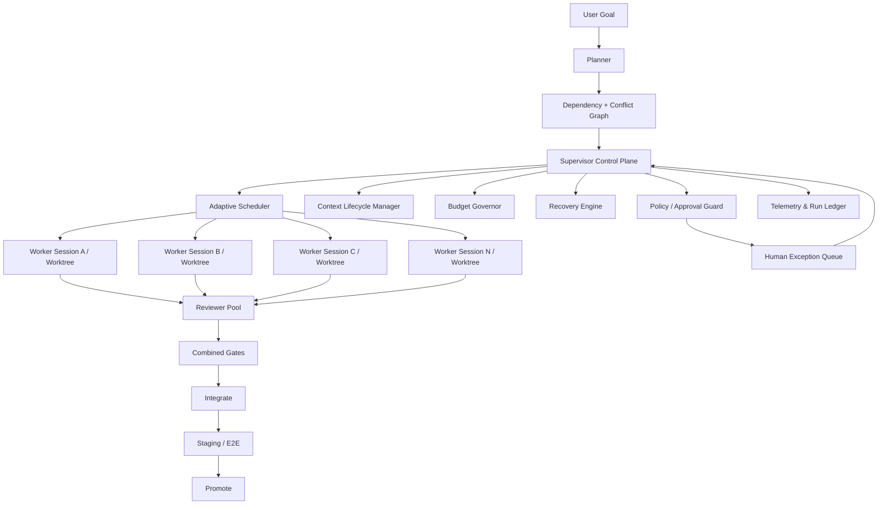

# 02. Target Architecture

## 목표: Autonomous Engineering Runtime



## 레이어

### L0. Evidence Layer — 기존 유지
- git worktree porcelain
- branch/commit
- `Split-Limb: done`
- test/build/gate outputs
- append-only events

### L1. Worker Layer
- 기존 Claude Code session / Agent Team / specialist agent
- 자기 worktree 안에서만 구현
- 구조화된 heartbeat/checkpoint/result를 남김

### L2. Session Orchestration
- 기존 `orchestrator.md`
- session 내 TaskCreate/TaskUpdate/SendMessage
- 한 lane 내부에서 필요 시 subagent/team fan-out

### L3. Cross-session Control Plane — 신규
- run 전체 상태머신
- lane 상태머신
- scheduler
- context lifecycle
- recovery
- budget
- exception queue

### L4. Delivery Plane — 확장
- combined gate
- staging
- real E2E
- release/promotion/rollback

## 정본 데이터 계층

### Event log = authoritative history
기존 NDJSON 패턴을 유지한다.

```text
runtime/split/{runId}.events.ndjson
```

### Derived state = rebuildable cache

```text
runtime/split/{runId}.state.json
runtime/split/{runId}.lanes/{limb}.json
runtime/split/{runId}.checkpoints/{limb}/{seq}.json
runtime/split/{runId}.metrics.json
```

`state.json`이 깨져도 events를 replay해 복구 가능해야 한다.

## 왜 처음부터 Temporal을 넣지 않는가

현재 Artibot은 local-first Claude plugin이다. 초기부터 workflow server를 요구하면:
- 설치 복잡도 증가
- daemon/DB 운영비 증가
- 개인 사용자 진입장벽 증가
- 기존 CLI plugin 장점 훼손

따라서 v5.0은 **local event-sourced runtime**, 필요 시 v5.5+에서 `RunStorePort` 구현체로 SQLite/Postgres/Temporal을 추가한다.

## Port 설계

```text
SupervisorEngine
 ├── RunStorePort
 ├── WorkerProviderPort
 ├── SessionObserverPort
 ├── SchedulerPort
 ├── ContextManagerPort
 ├── BudgetGovernorPort
 ├── ReviewerPort
 ├── GateRunnerPort
 └── ApprovalPort
```

기본 구현은 모두 local/Claude Code. 이후 Codex/GitHub Copilot runner를 붙일 때 Port만 추가한다.
