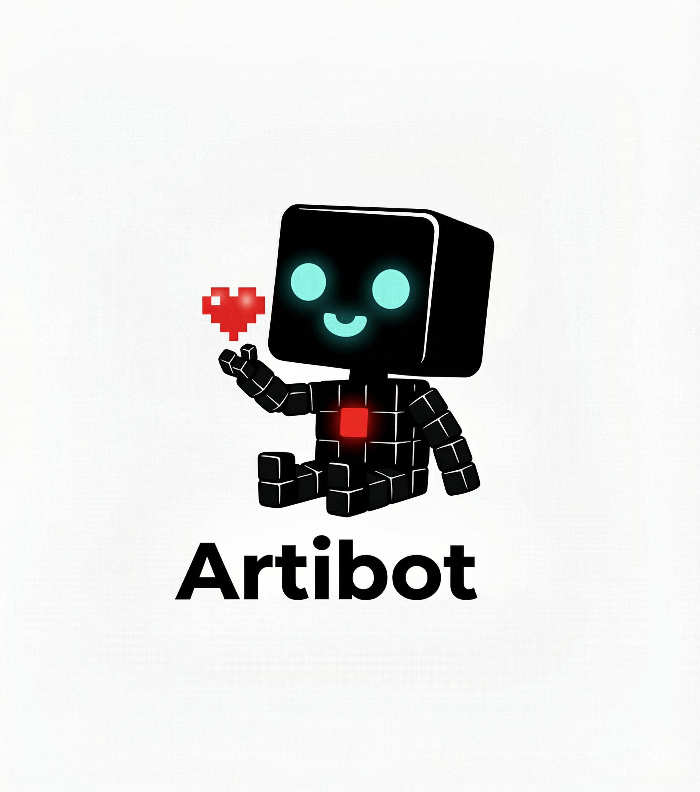

# Artibot


<p align="center">
  
</p>

A cognitive orchestration plugin for [Claude Code](https://github.com/anthropics/claude-code) powered by **dual-process routing**, **lifelong learning**, and the **native Agent Teams API**. Artibot uses a System 1/2 cognitive architecture to classify every request, assembles specialized agent teams with P2P communication, and continuously learns from session outcomes to improve routing accuracy over time.

## Overview

Most Claude Code plugins use simple sub-agent (`Task()`) delegation -- fire-and-forget with one-way result reporting. Artibot takes a fundamentally different approach by using Claude's **native Agent Teams API** as its core engine, enabling true team orchestration:

| Capability | Sub-Agent (Task) | Agent Teams (Artibot) |
|------------|------------------|----------------------|
| Communication | Return result to parent only | P2P bidirectional messaging (SendMessage) |
| Task Management | Parent manages everything | Shared task list (TaskCreate/TaskList) |
| Self-Assignment | Not possible | Teammates self-claim from task list |
| Peer Communication | Not possible | Direct DM + broadcast |
| Plan Approval | Not possible | plan_approval_response |
| Lifecycle | One-shot | Create -> Work -> Shutdown -> Cleanup |

## Key Features

- **Cognitive Architecture** -- Dual-process System 1/2 routing inspired by Kahneman's theory: fast intuitive responses for simple tasks, deep deliberative reasoning for complex ones
- **Lifelong Learning** -- GRPO-based batch learning from session outcomes with automatic knowledge transfer between System 1 and System 2 caches
- **CTO-Led Orchestration** -- `orchestrator` agent leads 25 specialist agents as a team coordinator (delegation mode: no direct coding)
- **Intelligent Delegation** -- Auto-selects Sub-Agent (simple) vs Agent Team (complex) based on cognitive complexity scoring
- **5 Orchestration Patterns** -- Leader, Council, Swarm, Pipeline, Watchdog
- **8 Playbooks** -- Feature, Bugfix, Refactor, Security + Marketing Campaign, Marketing Audit, Content Launch, Competitive Analysis
- **38 Slash Commands** -- `/sc` smart router, `/orchestrate`, `/spawn`, `/implement`, `/campaign`, `/seo`, and more
- **26 Specialized Agents** -- Architecture, security, frontend, backend, testing, DevOps, marketing, SEO, analytics, and more
- **77 Domain Skills** -- 11 persona skills, 8 core skills (incl. cognitive-routing, lifelong-learning), 16 language skills, 8 utility skills, 34 marketing skills
- **18 Event Hooks** -- Cognitive routing, lifelong learning, session lifecycle, dangerous command blocking, auto-formatting, team tracking
- **Cross-Platform Compatible** -- Works with Gemini CLI, OpenAI Codex, and Cursor via platform adapters
- **Zero Dependencies** -- Pure Node.js built-in modules only (`node:fs`, `node:path`, `node:os`)

## Get Started

### Prerequisites

**Enable Agent Teams** (required):

Add to `~/.claude/settings.json`:
```json
{
  "env": {
    "CLAUDE_CODE_EXPERIMENTAL_AGENT_TEAMS": "1"
  }
}
```

### Installation

**From Claude Code Marketplace (recommended):**
```bash
claude plugin install artibot
```

**Manual installation:**
```bash
git clone https://github.com/Yoodaddy0311/artibot.git
cp -r artibot/plugins/artibot ~/.claude/plugins/artibot
```

### Requirements

- [Claude Code](https://github.com/anthropics/claude-code) CLI
- Node.js >= 18.0.0
- `CLAUDE_CODE_EXPERIMENTAL_AGENT_TEAMS=1` environment variable

## Usage

### Smart Routing

The `/sc` command analyzes natural language intent and routes to the optimal command:

```
/sc implement login feature
-> routes to /implement -> TeamCreate -> spawns planner + architect + developer + reviewer
```

```
/sc analyze security vulnerabilities in auth module
-> routes to /analyze --focus security -> delegates to security-reviewer sub-agent
```

```
/sc launch email marketing campaign for product launch
-> routes to /campaign -> TeamCreate -> spawns marketing-strategist + data-analyst + ad-specialist
```

### Direct Commands

```bash
/implement user authentication API --type api --tdd
/code-review @src/auth/
/test --coverage
/git commit
/campaign product launch --channels email,social
/seo audit @website
```

### Team Orchestration

For complex tasks, Artibot assembles a full Agent Team:

```bash
/orchestrate payment system --pattern feature
```

This triggers the full team lifecycle:
1. `TeamCreate("payment-feature")` -- create the team
2. `Task(planner, team, "planner")` + `Task(architect, team, "architect")` + ... -- spawn teammates
3. `TaskCreate` per phase (plan -> design -> implement -> review) -- populate task list
4. `TaskUpdate` -- set dependencies and assign teammates
5. `SendMessage` -- P2P coordination between teammates
6. `shutdown_request` -> `TeamDelete` -- graceful cleanup

### Marketing Orchestration

```bash
/campaign product launch --channels email,social,ads
```

Uses the marketing-campaign playbook:
1. `[Leader]` marketing-strategist defines strategy
2. `[Council]` team plans channels and content
3. `[Swarm]` specialists create content in parallel
4. `[Council]` review and optimize
5. `[Leader]` launch coordination

### Parallel Execution

```bash
/spawn full codebase security audit --mode parallel --agents 5
```

Spawns 5 teammates that self-claim tasks from the shared task list and report findings via `SendMessage`.

## Architecture

```
+-------------------------------------------------+
|                  User Request                    |
+------------------+------------------------------+
                   |
                   v
+-------------------------------------------------+
|           /sc Router (Intent Analysis)           |
|       keyword 40% + context 40% + flags 20%      |
+------------------+------------------------------+
                   |
                   v
+-------------------------------------------------+
|       Delegation Mode (Complexity Scoring)        |
|    score < 0.6 -> Sub-Agent  |  >= 0.6 -> Team   |
+-------+---------------------------------+-------+
        |                                 |
        v                                 v
+---------------+         +-----------------------+
|   Sub-Agent   |         |   Agent Teams Engine   |
|   Task()      |         |                       |
|   one-way     |         |  TeamCreate           |
|               |         |    -> Task(spawn)     |
|               |         |    -> TaskCreate      |
|               |         |    -> SendMessage(P2P)|
|               |         |    -> TeamDelete      |
+---------------+         +-----------+-----------+
                                      |
                                      v
                          +-----------------------+
                          |  orchestrator (CTO)    |
                          |  Leader | Council |    |
                          |  Swarm | Pipeline |    |
                          |  Watchdog              |
                          +-----------+-----------+
                                      |
                                      v
                          +-----------------------+
                          |  25 Specialist Agents  |
                          |  TaskList -> self-claim|
                          |  SendMessage -> P2P    |
                          |  TaskUpdate -> report  |
                          +-----------------------+
```

## Cognitive Architecture

Artibot uses a dual-process cognitive model inspired by Daniel Kahneman's System 1/System 2 theory to classify and route every user request:

```
User Request
      |
      v
+-------------+
|  Cognitive   |    Complexity Score = weighted sum of:
|   Router     |      token estimate (0.25) + domain count (0.20)
| (hook-based) |      + step count (0.20) + ambiguity (0.20) + risk (0.15)
+------+------+
       |
       +--- score < 0.4 ---> System 1 (Fast / Intuitive)
       |                       - Pattern-matched from cached experience
       |                       - Target latency: < 100ms
       |                       - Keyword-based heuristic scoring
       |
       +--- score >= 0.4 ---> System 2 (Deep / Deliberative)
       |                       - Multi-step structured reasoning
       |                       - Full context + dependency analysis
       |                       - Sandbox verification for high-risk ops
       |
       +--- confidence < 0.6 or latency exceeded ---> Escalation
                                System 1 -> System 2 automatic fallback
```

### Escalation Rules
- System 1 confidence drops below 0.6
- Processing time exceeds 100ms
- No matching pattern in System 1 cache
- Security or production keywords detected
- Request spans 3+ domains
- Explicit `--think`, `--think-hard`, or `--ultrathink` flag

### Integration with Delegation

The cognitive router feeds directly into the orchestration delegation mode:

| Complexity Score | System | Delegation Mode |
|-----------------|--------|-----------------|
| < 0.4 | System 1 | Sub-Agent (Task tool) |
| 0.4 - 0.6 | System 2 | Sub-Agent + deep analysis |
| >= 0.6 | System 2 | Agent Team (Teams API) |

## Lifelong Learning

Artibot continuously improves its routing accuracy through a session-based learning pipeline:

```
Session Start                    Session Active                    Session End
     |                                |                                |
     v                                v                                v
Load thresholds              Record experiences              Batch learning (GRPO)
Load System 1 cache          (routing decisions +            Knowledge transfer
                              outcomes)                      Persist updated state
```

### GRPO (Group Relative Policy Optimization)

1. Group similar experiences (group size: 5)
2. Compare System 1 vs System 2 success rates per group
3. Compute relative advantage
4. Adjust routing threshold (step: 0.05, clamped to [-0.1, 0.1])

### Knowledge Transfer

| Direction | Condition | Action |
|-----------|-----------|--------|
| **Promote** (S2 -> S1) | 3 consecutive System 2 successes | Cache pattern in System 1 for fast retrieval |
| **Demote** (S1 -> S2) | 2 consecutive System 1 failures | Remove from System 1, flag for System 2 re-analysis |

### Learning Storage

```
~/.claude/artibot-learning/
  +-- experiences.jsonl      # Raw experience log (append-only)
  +-- system1-cache.json     # Promoted fast patterns
  +-- system2-cache.json     # Complex pattern registry
  +-- thresholds.json        # Adaptive threshold state
  +-- transfer-log.json      # Promotion/demotion history
```

### Agent Teams API Tools

| Tool | Purpose |
|------|---------|
| `TeamCreate` | Create a named team with description |
| `Task(type, team_name, name)` | Spawn teammates into the team |
| `TaskCreate` | Add work items to shared task list |
| `TaskUpdate` | Set status, owner, dependencies (blockedBy/blocks) |
| `TaskList` / `TaskGet` | View and read tasks |
| `SendMessage` | DM, broadcast, shutdown request/response, plan approval |
| `TeamDelete` | Clean up team resources |

### Team Levels

| Level | Mode | Agents | When |
|-------|------|--------|------|
| **Solo** | Sub-Agent | 0 | Single file edit, quick fix |
| **Squad** | Agent Team | 2-4 | Feature implementation, bugfix, refactoring |
| **Platoon** | Agent Team | 5+ | Large feature, architecture change, security audit, marketing campaign |

### Playbooks

**Feature:**
```
TeamCreate -> [Leader] plan -> [Council] design -> [Swarm] implement -> [Council] review -> [Leader] merge -> TeamDelete
```

**Bugfix:**
```
TeamCreate -> [Leader] analyze -> [Pipeline] fix -> [Council] verify -> TeamDelete
```

**Refactor:**
```
TeamCreate -> [Council] assess -> [Pipeline] refactor -> [Swarm] test -> [Council] review -> TeamDelete
```

**Security:**
```
TeamCreate -> [Leader] scan -> [Council] assess -> [Pipeline] fix -> [Council] verify -> TeamDelete
```

**Marketing Campaign:**
```
TeamCreate -> [Leader] strategy -> [Council] plan -> [Swarm] create -> [Council] review -> [Leader] launch -> TeamDelete
```

**Marketing Audit:**
```
TeamCreate -> [Leader] scan -> [Council] assess -> [Pipeline] optimize -> [Council] verify -> TeamDelete
```

**Content Launch:**
```
TeamCreate -> [Leader] plan -> [Swarm] create -> [Council] review -> [Leader] publish -> TeamDelete
```

**Competitive Analysis:**
```
TeamCreate -> [Council] research -> [Swarm] analyze -> [Council] synthesize -> [Leader] report -> TeamDelete
```

## Agents

### Orchestrator (Team Leader / CTO)

| Agent | Model | Role | Team API Tools |
|-------|-------|------|----------------|
| **orchestrator** | opus | CTO-level team leader. Coordination only (delegation mode). | TeamCreate, SendMessage, TaskCreate, TaskUpdate, TaskList, TaskGet, TeamDelete, Task() |

The orchestrator **never writes code directly**. It assembles the team, distributes tasks, coordinates between teammates, and synthesizes results.

### Specialist Agents (25 Teammates)

All teammates have their specialist tools + team collaboration tools (`SendMessage`, `TaskList`, `TaskGet`, `TaskUpdate`).

**Design & Analysis:**

| Agent | Model | Specialty |
|-------|-------|-----------|
| architect | opus | System architecture, ADR, trade-off analysis |
| planner | opus | Implementation planning, risk assessment |
| llm-architect | opus | LLM architecture, prompt design, RAG |

**Quality & Security:**

| Agent | Model | Specialty |
|-------|-------|-----------|
| code-reviewer | opus | Code review (4 severity levels, 5 dimensions) |
| security-reviewer | opus | OWASP Top 10, threat modeling |
| tdd-guide | opus | TDD (RED->GREEN->REFACTOR), 80%+ coverage |
| e2e-runner | opus | Playwright E2E testing |

**Development:**

| Agent | Model | Specialty |
|-------|-------|-----------|
| frontend-developer | sonnet | UI/UX, WCAG accessibility, Core Web Vitals |
| backend-developer | sonnet | API, database, services |
| database-reviewer | opus | SQL optimization, schema design |
| typescript-pro | sonnet | Advanced types, strict mode |
| build-error-resolver | opus | Build error diagnosis and auto-fix |

**Utilities:**

| Agent | Model | Specialty |
|-------|-------|-----------|
| refactor-cleaner | opus | Dead code removal, refactoring |
| doc-updater | haiku | Documentation sync, changelog |
| content-marketer | sonnet | Blog, SEO, social media |
| devops-engineer | sonnet | CI/CD, Docker, monitoring |
| mcp-developer | sonnet | MCP server development |

**Marketing:**

| Agent | Model | Specialty |
|-------|-------|-----------|
| marketing-strategist | opus | Campaign strategy, market positioning, brand architecture |
| data-analyst | opus | Marketing analytics, attribution modeling, KPI dashboards |
| presentation-designer | sonnet | Pitch decks, marketing collateral, visual storytelling |
| seo-specialist | sonnet | Technical SEO, keyword strategy, SERP optimization |
| cro-specialist | sonnet | Conversion optimization, A/B testing, funnel analysis |
| ad-specialist | sonnet | PPC campaigns, ad creative, ROAS optimization |
| repo-benchmarker | haiku | Repository analysis, competitive benchmarking |

**Performance & Infrastructure:**

| Agent | Model | Specialty |
|-------|-------|-----------|
| performance-engineer | sonnet | Performance profiling, bottleneck analysis |

## Commands

### Development

| Command | Description |
|---------|-------------|
| `/sc [request]` | Smart router entry point with auto-routing |
| `/build [target]` | Project builder with framework auto-detection |
| `/build-fix` | Build error auto-diagnosis and fix |
| `/implement [feature]` | Feature implementation pipeline |
| `/improve [target]` | Evidence-based code enhancement |
| `/design [domain]` | System design and architecture |

### Analysis & Debugging

| Command | Description |
|---------|-------------|
| `/analyze [target]` | Multi-dimensional code/system analysis |
| `/troubleshoot [symptoms]` | Root cause analysis |
| `/explain [topic]` | Educational explanations |

### Quality

| Command | Description |
|---------|-------------|
| `/code-review [target]` | Code review (CRITICAL/HIGH/MEDIUM/LOW) |
| `/test [type]` | Test runner with auto-detection |
| `/tdd [feature]` | TDD workflow (RED->GREEN->REFACTOR) |
| `/verify` | Validation pipeline (lint->type->test->build) |
| `/refactor-clean [target]` | Refactoring and dead code removal |

### Team Orchestration

| Command | Description |
|---------|-------------|
| `/orchestrate [workflow]` | Agent Teams multi-agent workflow |
| `/spawn [mode]` | Team spawn with parallel task execution |

### Workflow

| Command | Description |
|---------|-------------|
| `/plan [feature]` | Implementation planning |
| `/task [operation]` | Task management (CRUD) |
| `/git [operation]` | Git workflow automation |
| `/checkpoint` | State snapshot save/restore |

### Documentation & Content

| Command | Description |
|---------|-------------|
| `/document [target]` | Documentation generation |
| `/content [type]` | Content marketing and SEO |
| `/learn [pattern]` | Pattern extraction and memory storage |

### Marketing

| Command | Description |
|---------|-------------|
| `/campaign [name]` | Marketing campaign orchestration and management |
| `/seo [target]` | SEO audit, keyword research, and optimization |
| `/social-media [platform]` | Social media content strategy and scheduling |
| `/email-marketing [campaign]` | Email campaign design and automation |
| `/competitive [target]` | Competitive analysis and market intelligence |
| `/ad-campaign [platform]` | Paid advertising campaign management |
| `/content-calendar [period]` | Editorial calendar planning and management |
| `/ab-test [target]` | A/B testing design and analysis |
| `/analytics [report]` | Marketing analytics and performance reporting |
| `/funnel [stage]` | Conversion funnel analysis and optimization |

### Utilities

| Command | Description |
|---------|-------------|
| `/cleanup [target]` | Technical debt reduction |
| `/estimate [target]` | Evidence-based estimation |
| `/index [query]` | Command catalog search |
| `/load [path]` | Project context loading |

## Skills

77 auto-activating domain skills organized in five categories:

**Core Skills (8):** orchestration, cognitive-routing, lifelong-learning, token-efficiency, principles, coding-standards, security-standards, testing-standards

**Persona Skills (11):** architect, frontend, backend, security, analyzer, performance, qa, refactorer, devops, mentor, scribe

**Utility Skills (8):** git-workflow, tdd-workflow, delegation, mcp-context7, mcp-playwright, mcp-coordination, continuous-learning, strategic-compact

**Language Skills (16):** TypeScript, JavaScript, Python, Go, Rust, Java, Kotlin, Swift, C++, C#, Ruby, PHP, Scala, Elixir, R, Flutter/Dart

**Marketing Skills (34):** marketing-strategy, campaign-planning, seo-strategy, technical-seo, content-seo, social-media, email-marketing, competitive-intelligence, advertising, ab-testing, brand-guidelines, copywriting, customer-journey, data-analysis, data-visualization, lead-management, marketing-analytics, presentation-design, report-generation, segmentation, cro-page, cro-funnel, cro-forms, and more

## Hooks

18 automation scripts across 14 event types:

| Event | Script | Purpose |
|-------|--------|---------|
| SessionStart | `session-start.js` | Environment detection, config loading |
| PreToolUse (Write) | `pre-write.js` | Block writes to sensitive files (.env, .pem) |
| PreToolUse (Bash) | `pre-bash.js` | Block dangerous commands (rm -rf, force push) |
| PostToolUse (Edit) | `post-edit-format.js` | Auto-format suggestion for JS/TS |
| PostToolUse (Bash) | `post-bash.js` | Auto-detect PR URLs after git push |
| PreCompact | `pre-compact.js` | State snapshot before context compression |
| Stop | `check-console-log.js` | Detect leftover console.log statements |
| UserPromptSubmit | `user-prompt-handler.js` | Intent detection and agent suggestion |
| UserPromptSubmit | `cognitive-router.js` | System 1/2 cognitive routing classification |
| SubagentStart/Stop | `subagent-handler.js` | Teammate registration/deregistration tracking |
| TeammateIdle | `team-idle-handler.js` | Alert idle teammates about pending tasks |
| SessionEnd | `session-end.js` | Persist session state |
| SessionEnd | `nightly-learner.js` | Batch learning (GRPO) + knowledge transfer |

## MCP Integration

Artibot integrates with MCP servers for extended capabilities:

**Context7** -- Library and framework documentation lookup
```json
{
  "context7": {
    "command": "npx",
    "args": ["-y", "@upstash/context7-mcp@latest"]
  }
}
```

**Playwright** -- Cross-browser E2E testing, performance metrics, visual testing
```json
{
  "playwright": {
    "command": "npx",
    "args": ["-y", "@executeautomation/playwright-mcp-server"]
  }
}
```

## Cross-Platform Compatibility

Artibot includes platform adapters for use beyond Claude Code:

| Platform | Adapter | Status |
|----------|---------|--------|
| **Claude Code** | Native (no adapter needed) | Full support |
| **Gemini CLI** | `adapters/gemini-cli.js` | Agent mapping, command translation |
| **OpenAI Codex** | `adapters/openai-codex.js` | Tool mapping, prompt adaptation |
| **Cursor** | `adapters/cursor.js` | Extension integration, command bridging |

Each adapter translates Artibot's Agent Teams API calls into the target platform's native orchestration primitives while preserving the CTO-led coordination pattern.

## Plugin Structure

```
plugins/artibot/
+-- .claude-plugin/
|   +-- plugin.json              # Plugin manifest
+-- agents/                      # 26 agent definitions
|   +-- orchestrator.md          #   CTO / Team leader (Agent Teams API)
|   +-- [17 dev specialists].md  #   Development teammates
|   +-- [8 marketing agents].md  #   Marketing specialists
+-- commands/                    # 38 slash commands
|   +-- sc.md                    #   Smart router
|   +-- orchestrate.md           #   Team orchestration (TeamCreate)
|   +-- spawn.md                 #   Team spawn (parallel execution)
|   +-- [24 dev commands].md
|   +-- [10 marketing commands].md
+-- skills/                      # 77 skill directories
|   +-- orchestration/           #   Delegation mode + team routing
|   +-- cognitive-routing/       #   System 1/2 dual-process routing
|   +-- lifelong-learning/       #   GRPO batch learning + knowledge transfer
|   +-- delegation/              #   Sub-Agent/Team strategies
|   +-- [23 dev skills]/
|   +-- [23 marketing skills]/
+-- hooks/
|   +-- hooks.json               # Hook event mappings
+-- scripts/
|   +-- hooks/                   # 18 hook scripts (ESM)
|   +-- ci/                      # 4 CI validation scripts
|   +-- utils/
+-- lib/
|   +-- core/                    # Core modules (platform, config, cache)
|   +-- intent/                  # Intent detection (language, trigger)
|   +-- context/                 # Context management (hierarchy, session)
|   +-- adapters/                # Cross-platform adapters
+-- output-styles/               # 3 output styles
+-- templates/                   # 3 writing templates
+-- artibot.config.json          # Plugin config (Agent Teams settings)
+-- package.json                 # Node.js ESM runtime
+-- .mcp.json                    # MCP server configuration
```

## Configuration

Key settings in `artibot.config.json`:

| Setting | Description | Default |
|---------|-------------|---------|
| `version` | Plugin version | `1.4.0` |
| `cognitive.router.threshold` | System 1/2 boundary | `0.4` |
| `cognitive.router.adaptRate` | Per-feedback adjustment step | `0.05` |
| `cognitive.system1.maxLatency` | System 1 max response time (ms) | `100` |
| `cognitive.system1.minConfidence` | System 1 minimum confidence | `0.6` |
| `cognitive.system2.maxRetries` | System 2 max retry attempts | `3` |
| `cognitive.system2.sandboxEnabled` | Enable sandbox for high-risk ops | `true` |
| `learning.lifelong.batchSize` | Experiences per GRPO batch | `50` |
| `learning.lifelong.grpoGroupSize` | Experiences per comparison group | `5` |
| `learning.knowledgeTransfer.promotionThreshold` | Consecutive successes to promote | `3` |
| `learning.knowledgeTransfer.demotionThreshold` | Consecutive failures to demote | `2` |
| `team.engine` | Team engine | `claude-agent-teams` |
| `team.delegationMode` | Leader coordination-only mode | `true` |
| `team.maxTeammates` | Max concurrent teammates | `null` (unlimited) |
| `team.ctoAgent` | CTO agent name | `orchestrator` |
| `team.levels.squad` | Squad team size | `2-4` |
| `team.levels.platoon` | Platoon team size | `5+` |
| `automation.intentDetection` | Auto intent detection | `true` |
| `automation.supportedLanguages` | Supported languages | `en, ko, ja` |

## Validation

```bash
node scripts/validate.js              # Full validation
node scripts/ci/validate-agents.js    # Agent validation
node scripts/ci/validate-skills.js    # Skill validation
node scripts/ci/validate-commands.js  # Command validation
node scripts/ci/validate-hooks.js     # Hook validation
```

## Best Practices

- **Use `/sc` for auto-routing** -- Let the smart router pick the optimal command and delegation mode
- **Trust the delegation scoring** -- Simple tasks use fast sub-agents; complex tasks get full teams
- **Enable Agent Teams** -- Without `CLAUDE_CODE_EXPERIMENTAL_AGENT_TEAMS=1`, team features won't work
- **Let teammates self-claim** -- The Swarm pattern works best when teammates pick tasks from the shared list
- **Use playbooks for common workflows** -- 8 playbooks (4 dev + 4 marketing) provide proven team patterns
- **Leverage marketing specialists** -- Use `/campaign` and related commands for end-to-end marketing orchestration

## When to Use Artibot

**Use for:**
- Complex feature implementation spanning multiple files and domains
- Security audits requiring multi-perspective analysis
- Large-scale refactoring with coordinated testing
- Architecture decisions needing specialist input
- Marketing campaigns requiring strategy, content, SEO, and analytics coordination
- Competitive analysis with data-driven insights
- Any task benefiting from parallel agent collaboration

**Don't use for:**
- Single-line bug fixes
- Trivial edits or formatting changes
- Tasks where a single agent is sufficient
- Quick questions or explanations (unless you want team discussion)

## Troubleshooting

### Agent Teams not working

**Issue**: TeamCreate or SendMessage not available

**Solution**: Ensure the environment variable is set:
```json
// ~/.claude/settings.json
{
  "env": {
    "CLAUDE_CODE_EXPERIMENTAL_AGENT_TEAMS": "1"
  }
}
```

### Teammates not picking up tasks

**Issue**: Tasks stay in "pending" status

**Solution**:
- Verify tasks have no unresolved `blockedBy` dependencies
- Check that teammates are spawned with correct `team_name`
- Use `TaskUpdate` to explicitly assign if self-claim isn't working

### High token usage

**Issue**: Team orchestration consuming too many tokens

**Solution**:
- Use Sub-Agent mode for simpler tasks (score < 0.6)
- Reduce team size with `--agents` flag
- Enable token efficiency with `--uc` flag

## Contributing

1. Fork this repository
2. Create a feature branch
3. Follow the existing plugin structure and conventions
4. Test with `node scripts/validate.js`
5. Submit a pull request

## Author

**Artience** ([@Yoodaddy0311](https://github.com/Yoodaddy0311))

## Version

1.4.0 -- Intent Detection + Context Integration + Marketing Vertical + 16 Language Skills

## License

MIT License -- See [LICENSE](LICENSE) for details.
