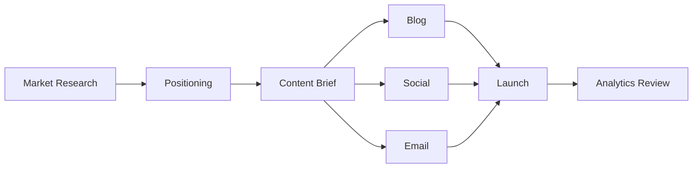

# /ultraplan

마케팅·콘텐츠 전략 기획을 위한 심층 플래닝 모드. 일반 플래닝보다 더 많은 리서치와 분석을 수행하고 실행 가능한 결과물을 생성합니다.

## Arguments

Parse $ARGUMENTS:
- `plan-type`: Optional. One of: `simple`, `visual`, `deep` (default: `deep`)
- `topic`: Required. 기획할 주제 또는 목표 (e.g. "Q3 growth campaign", "content calendar rebrand")
- `--weeks [n]`: 계획 기간 (default: 4 weeks)
- `--budget [tier]`: 예산 티어: bootstrap / growth / scale / enterprise (default: growth)

## 플랜 변형

### Simple Plan (빠른 브리프)
**사용 시**: 아이디어 검증, 1-페이지 요약, 빠른 방향 결정
**소요 시간**: ~3분
**출력**: 목표 + 채널 + 핵심 KPI + 다음 3가지 액션

```
Execution Steps:
1. 요청 파싱 → 핵심 목표 추출
2. 관련 스킬 1개 참조 (marketing-strategy 또는 campaign-planning)
3. 간결한 브리프 생성 (500자 이내)
4. Next Actions 3개 제시
```

### Visual Plan (시각화 플로우)
**사용 시**: 팀 공유, 스테이크홀더 보고, 플로우 이해
**소요 시간**: ~7분
**출력**: Mermaid 다이어그램 + 타임라인 + 담당자 매핑

```
Execution Steps:
1. 캠페인/콘텐츠 구조 분석
2. marketing-strategy 스킬로 채널 전략 수립
3. library-mermaid 스킬로 플로우 다이어그램 생성
4. 타임라인 + RACI 매트릭스 생성
```

**예시 출력:**


### Deep Plan (전략 기획 전체)
**사용 시**: 분기 캠페인, 신규 런치, 리브랜딩 등 전략적 결정
**소요 시간**: ~15분
**출력**: 시장 분석 + 포지셔닝 + 채널 전략 + 콘텐츠 캘린더 + KPI 프레임워크 + 예산 배분

```
Execution Steps:
1. WebSearch로 시장/경쟁사 현황 리서치 (3-5 소스)
2. marketing-strategy 스킬로 시장 분석 (TAM/SAM/SOM, 경쟁 포지셔닝)
3. campaign-planning 스킬로 채널 전략 + 타임라인 수립
4. content-seo 스킬로 SEO 키워드 전략 통합
5. data-visualization 스킬로 KPI 대시보드 명세
6. 실행 로드맵 생성 (주차별 마일스톤)
```

## Effort Level

Ultraplan은 **xhigh effort** 작업입니다:
- 복수 스킬 순차 호출
- WebSearch 리서치 포함 (Deep Plan)
- 마케팅 에이전트 팀 활용 권장 (Orchestrator → Strategist + Content + Data)

```
Effort Policy:
  simple:  medium  (단일 스킬, 단일 에이전트)
  visual:  high    (2-3 스킬, 시각화 포함)
  deep:    xhigh   (전체 스킬 체인, WebSearch, 팀 오케스트레이션 권장)
```

Deep Plan에서 팀 오케스트레이션 사용 시:
```
/ultraplan deep [topic]
```
→ orchestrator 에이전트가 `marketing-campaign` 플레이북으로 팀을 구성해 자동 실행

## Execution Flow

1. **Parse**: `plan-type`, `topic`, `--weeks`, `--budget` 파싱
2. **Scope Check**: 기간과 예산 티어 확인 → 현실적 채널 범위 설정
3. **Execute Plan Variant**: 위 변형별 단계 수행
4. **Output**: 플랜 문서 생성 (선택적으로 Write 툴로 파일 저장)
5. **Next Steps**: 후속 스킬/커맨드 제안

## Error Handling

- **topic 미제공**: "어떤 캠페인/전략을 기획할까요? 목표와 대상 시장을 알려주세요."
- **예산 티어 불명확**: `growth` 기본값 사용 후 "예산 티어를 지정하면 더 정확한 채널 배분이 가능합니다." 안내
- **Deep Plan에서 WebSearch 실패**: 기존 지식으로 진행 후 "최신 데이터 확인을 권장합니다." 안내

## Output Format

```
ULTRAPLAN: [topic]
==================
Plan Type:    [simple|visual|deep]
Period:       [n weeks]
Budget Tier:  [tier]

SITUATION ANALYSIS
------------------
[시장 현황, 경쟁 포지셔닝 (Deep Plan만)]

STRATEGY
--------
Positioning: [statement]
Channels:    [채널 목록 + 예산 배분 %]

CONTENT/CAMPAIGN PLAN
----------------------
[타임라인, 마일스톤, 콘텐츠 유형]

KPI FRAMEWORK
-------------
| Metric | Target | Tracking |
|--------|--------|---------|
| ...    | ...    | ...     |

NEXT STEPS
----------
| Week | Action | Owner | Skill |
|------|--------|-------|-------|
| ...  | ...    | ...   | ...   |
```

## Examples

```
/ultraplan Q3 B2B SaaS growth campaign
/ultraplan simple content calendar rebrand
/ultraplan visual product launch --weeks 8
/ultraplan deep 경쟁사 대응 마케팅 전략 --budget scale
```

## Connected Skills

| Step | Skill | Purpose |
|------|-------|---------|
| 시장 분석 | `marketing-strategy` | TAM/SAM/SOM, 포지셔닝 |
| 캠페인 설계 | `campaign-planning` | 채널 전략, 타임라인 |
| SEO 통합 | `content-seo` | 키워드 전략 |
| 비주얼 플로우 | `library-mermaid` | 다이어그램 생성 |
| KPI 설계 | `data-visualization` | 대시보드 명세 |
