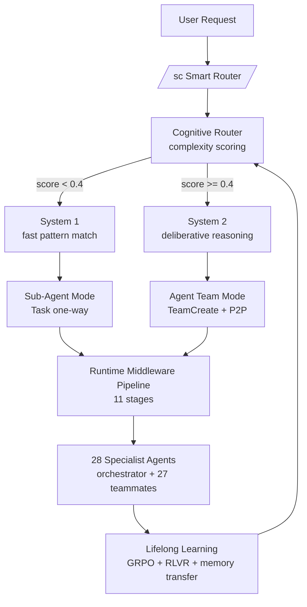

# Artibot

[](./CHANGELOG.md)
[](./LICENSE)
[](./package.json)
[](./tests/)
[](./eslint.config.js)
[](./tests/)
[](https://github.com/anthropics/claude-code)

> **Cognitive orchestration OS for Claude Code** — hierarchical memory, GRPO-RLVR self-learning, MCP server, and multi-platform agent teams.
>
> **Claude Code를 위한 인지 오케스트레이션 OS** — 계층 메모리, GRPO-RLVR 자가 학습, MCP 서버, 멀티 플랫폼 에이전트 팀.

Artibot은 Claude Code의 네이티브 **Agent Teams API**를 핵심 엔진으로 사용하여 28개 전문 에이전트, 100+ 도메인 스킬, 11단계 런타임 미들웨어, 37개 학습 모듈, 9개 스웜 모듈을 통합한 **5-layer 오케스트레이션 OS**입니다. System 1/2 인지 라우팅과 GRPO 기반 자가 학습으로 매 세션마다 라우팅 정확도가 향상됩니다.

---

## Quick Demo (30초 안에 결과 보기 / 30-Second First Win)

```bash
# 1. Install (Claude Code marketplace)
claude plugin marketplace add https://github.com/Yoodaddy0311/artibot
claude plugin install artibot@artibot

# 2. Smart-route a natural-language request
/sc 로그인 기능을 TDD로 구현해줘
#  → routes to /implement → Agent Team spawns planner + architect + backend + tdd-guide
#  → P2P coordination → result returned

# 3. Inspect what just happened
/daily       # auto-generated session retrospective with team metrics
```

That's it. No manual config. Agent Teams auto-enables on first session start.

---

## Why Artibot? (vs LangGraph / AutoGen / CrewAI / Agent Skills)

7 differentiators backed by file-level evidence (see `_reports/market-competitive-eval-2026-04-24.md`):

| # | Differentiator | Evidence |
|---|---|---|
| 1 | **Dual-Process Cognitive Router (System 1 / System 2)** — production implementation of 2026 DPA architecture | `lib/cognitive/router.js`, `system1.js`, `system2-core.js` |
| 2 | **Hierarchical Memory** — working / episodic / semantic with active curation | `lib/learning/memory-manager.js`, `lib/learning/lifelong.js` |
| 3 | **37-Module Lifelong Learning** — GRPO + RLVR + drift-detector + skill-lifecycle-autopilot | `lib/learning/` (auto-learning-*, evolution-loop, grpo-optimizer, ...) |
| 4 | **11-Stage Runtime Middleware** — router → subagents → tasks → checkpoint → memory → skills → guardrail → token-usage → summarization → lifecycle → plan-mode | `lib/runtime/middleware/` |
| 5 | **MCP Server (v3.8+)** — Artibot exposes its own MCP server so Claude Desktop/Code can consume Artibot inventory | `lib/mcp/server.js`, `bin/artibot-mcp.mjs` |
| 6 | **Data Sovereignty** — outbound to external DBs is hard-blocked. Memory, learning, swarm all stay on disk | `CLAUDE.md` DATA POLICY + `lib/privacy/` |
| 7 | **Native Agent Teams API** — TeamCreate / SendMessage / TaskCreate, not Task() one-shot delegation | `lib/runtime/middleware/subagents.js`, `lib/runtime/middleware/tasks.js` |

Competitive scoring (10-dim, see report Section 6.2):

| Framework | Total / 100 |
|---|---|
| **Artibot v4.13.0** | **89** |
| everything-claude-code | 87 |
| LangGraph 1.1.3 | 74 |
| AutoGen (AG2) | 65 |
| CrewAI | 60 |
| anthropics/skills (official) | 60 |

Inside the Claude Code plugin category, Artibot leads on **Self-improvement (10/10)**, **Safety (10/10)**, **Architecture (10/10)**, and **Observability (9/10)**.

---

## Architecture Overview



**5-Layer Architecture** (top-down dependency only):

| # | Layer | Directory | Responsibility |
|---|---|---|---|
| 5 | Runtime | `lib/runtime/` | 11-stage middleware, agent factory |
| 4 | Cognitive | `lib/cognitive/` | System 1/2 routing, EFFORT_POLICY |
| 3 | Learning | `lib/learning/` | GRPO, hierarchical memory, knowledge transfer |
| 2 | Auxiliary | `lib/{adapters,swarm,privacy,visual,mcp,observability,git,...}/` | Domain services |
| 1 | Core | `lib/core/` | Config, I/O, cache, event-bus, guards |

Detailed module map: `docs/ARCHITECTURE.md`.

---

## Key Features (Marketplace Summary)

| Pillar | What you get |
|---|---|
| **Cognitive Routing** | System 1 (fast pattern match, <100ms) vs System 2 (sandboxed deliberation), auto-escalation rules |
| **Hierarchical Memory** | working / episodic / semantic layers with promotion/demotion, MEMORY.md index, 3-scope (user / project / session) |
| **GRPO + RLVR Self-Learning** | Group-Relative Policy Optimization with verifiable rewards (test pass / typecheck / no-revisit) — no external reward model |
| **MCP Server** | Artibot publishes its own MCP server (skills, agents, memory, git bridges); also consumes Context7 + Playwright |
| **Multi-Platform Agent Teams** | Native Claude Code; auto-export adapters for Gemini CLI / Codex CLI / Cursor / Antigravity (graceful degradation) |
| **Observability** | OTEL exporter (opt-in, loopback-preferred), multi-session dashboard, token-usage middleware, hook event fan-out |
| **Sub-Plugin Pattern** | `artibot-cowork` 41-skill marketing/writing/Korean-market vertical, with isolated release cadence |
| **Zero External Dependencies** | Pure Node.js built-ins (`node:fs`, `node:path`, `node:os`); ESM-only |
| **DEV Protocol** | Decompose-Execute-Verify mandatory workflow; zero-skip policy; claim-validator CI gate |

Full feature breakdown is in [핵심 특징](#핵심-특징) below.

---

## Installation

### Claude Code (Recommended)

```bash
claude plugin marketplace add https://github.com/Yoodaddy0311/artibot
claude plugin install artibot@artibot
```

Agent Teams auto-enables on first session start. To uninstall: `claude plugin uninstall artibot`.

### Manual

```bash
git clone https://github.com/Yoodaddy0311/artibot.git
cd artibot/plugins/artibot
bash install.sh
```

### Other Platforms (auto-converted)

| Platform | Compatibility | Adapter |
|---|---|---|
| Claude Code | 10/10 | native (no adapter) |
| Gemini CLI | 9/10 | `lib/adapters/gemini.js` |
| Codex CLI | 8/10 | `lib/adapters/codex.js` |
| Antigravity | 8/10 | shares Gemini adapter |
| Cursor IDE | 6/10 | `lib/adapters/cursor.js` |

See [크로스 플랫폼 설치 가이드](#크로스-플랫폼-설치-가이드) for batch export and platform-specific notes.

---

## Usage Patterns (Top 5)

| # | Pattern | Example | What happens |
|---|---|---|---|
| 1 | **Smart Routing** | `/sc 로그인 기능 구현` | `/sc` analyzes intent → routes to `/implement` → spawns Agent Team |
| 2 | **Direct Command** | `/code-review @src/auth/` | invokes `code-reviewer` agent with strict severity ladder |
| 3 | **Team Orchestration** | `/orchestrate payment system --pattern feature` | full feature playbook (plan → design → implement → review → merge) |
| 4 | **Parallel Spawn** | `/spawn security audit --mode parallel --agents 5` | 5 teammates self-claim from shared TaskList, P2P findings via SendMessage |
| 5 | **Marketing** | `/campaign product launch --channels email,social,ads` | marketing-campaign DAG playbook with strategist + content + analytics |

Full command reference is in [커맨드 레퍼런스](#커맨드-레퍼런스) below.

---

## Configuration

Key fields in `artibot.config.json` (file is auto-validated against schema):

| Field | Default | Purpose |
|---|---|---|
| `version` | `4.8.0` | Synced across plugin.json / package.json / artibot.config.json |
| `cognitive.router.threshold` | `0.4` | System 1 ↔ System 2 boundary |
| `cognitive.system1.maxLatency` | `100` | ms — System 1 response cap before escalation |
| `learning.lifelong.batchSize` | `50` | Experiences per GRPO batch |
| `learning.grpoRouting.modelType` | `"linear"` | `"linear"` or `"mlp"` (v3.6+ neural policy) |
| `learning.grpoRouting.jointPolicy.enabled` | `false` | v3.7+ joint agent×skill correlation policy |
| `team.engine` | `"claude-agent-teams"` | Native Claude Code Agent Teams |
| `team.delegationMode` | `true` | Orchestrator coordinates only, never writes code |
| `team.autoApply` | `true` | Auto-trigger `/team` when 3 conditions met |
| `observability.otel.enabled` | `false` | v3.9+ OTEL exporter (opt-in, loopback warned) |
| `observability.sessionCapture.enabled` | `true` | v3.9+ multi-session aggregation |
| `automation.supportedLanguages` | `en, ko, ja, zh` | Intent detection languages |

Full configuration reference: [설정](#설정) section.

---

## Optional: Background Learning Schedules

Artibot ships five nightly trainers (GRPO, agent-policy, skill-policy, joint-policy, session-rollup). They are **opt-in** — the plugin works without them. Enabling them sharpens routing accuracy and feeds the swarm `quality` bucket session-over-session.

Generate the OS-specific install commands (printed only, never executed by this script):

```bash
node plugins/artibot/scripts/setup-nightly-trainers.js              # status + all guides
node plugins/artibot/scripts/setup-nightly-trainers.js --cron       # POSIX crontab lines
node plugins/artibot/scripts/setup-nightly-trainers.js --schtasks   # Windows schtasks lines
node plugins/artibot/scripts/setup-nightly-trainers.js --schedule   # `claude schedule` lines
node plugins/artibot/scripts/setup-nightly-trainers.js --dry-run    # preview without copy-paste prompt
```

Recommended schedules (UTC; 15-minute gaps avoid file lock contention):

| Job | Cron |
|---|---|
| `nightly-grpo-trainer` | `30 2 * * *` |
| `nightly-agent-policy-trainer` | `45 2 * * *` |
| `nightly-skill-policy-trainer` | `0 3 * * *` |
| `nightly-joint-policy-trainer` | `15 3 * * *` |
| `nightly-session-rollup` | `30 4 * * *` |

Full purpose / troubleshooting / disable instructions: [`docs/SCHEDULED-JOBS.md`](./docs/SCHEDULED-JOBS.md).

All trainer state stays on disk under `~/.claude/artibot/`. Nothing is uploaded unless `swarm.enabled: true`.

---

## Roadmap

**v4.6.0 (current, stable)** — **Goal-driven autopilot** (Codex `/goal` pattern adapted). 4-phase rollout in two PRs (#9, #11). **Phase 1 (Goal Contract slot)**: PRD now carries a machine-readable `## 2.5 Goal Contract` JSON block (`objective` / `stoppingCondition` / `validationCommand` / `forbiddenChanges` / `maxIterations`, hard cap 10). New modules `goal-schema.js` + `prd-parser.js`. **Phase 2 (Stopping Condition Evaluator)**: new EVALUATE phase inserted between IMPROVE and REPORT. `evaluateGoal` trusts ONLY the `validationCommand` exit code (no LLM judgment → no hallucination); `runPhaseGoalEvaluate` drives the iteration loop. Decision matrix: met → REPORT, not-met + under-cap → re-EXECUTE, cap reached / same-SHA-3x / confidence<0.8 → PAUSE. **Phase 3 (Goal-level Control Plane)**: `/autopilot:goal status|pause|resume|retry|clear <session-id>` — orthogonal to session-level pause. `state.goalPaused` lets users freeze evaluator while session continues. **Phase 4 (Progress Heartbeat)**: telemetry ticks gain a `progress` slot (`iteration/maxIterations/pct/met/exitCode`); `/autopilot:tail` renders a new `progress` column. Total +74 new tests (53 P1+P2 + 21 P3+P4). 100% backward compat — legacy PRDs without a Goal Contract continue the existing 7-phase flow.

**v4.5.12** — git-autopilot-close `mergeBase` resolution fix (prevents the Phase 3+4 branch-corruption incident class). Two-layer guard: (1) `lib/git/resolve-base.js` new step 2 — branch upstream tracking detects stacked-PR patterns (working branch tracking a parent feature branch rather than repo default); (2) new export `isMergeBaseFresh(mergeBase, cwd, maxAgeDays=30)` rejects any merge-base whose commit-time is older than 30 days from HEAD. `scripts/hooks/git-autopilot-close.js::squashWipCommits` calls the age gate BEFORE `git reset --soft <mergeBase>` so stale resolution → refuse to squash (preserves commits) instead of silent collapse. +14 tests (5 stacked-PR upstream + 7 age-gate + 2 invariants), 19/19 PASS in `resolve-base.test.js`, 11/11 regression in `git-autopilot-close.test.js`.

**v4.5.11** — Two isolation/race test flakes deferred from the v4.5.10 22-run matrix. `tests/hooks/autopilot-nlu-trigger.test.js` (2/11): the hook's top-level `main().catch(...)` fire-and-forget leaks microtasks INTO the next test's mockState under full-suite worker saturation, producing the canonical "opposite expectations fail together" signature. Fix: 100ms `afterEach` drain + deadline 1000→3000ms positive case + 200→1500ms flat-drain on negative case. `tests/autopilot/engine.mcp-verify.test.js` (1/11): `runPhase4Verify` mutates state in-memory then session-store writes to disk; under load the file write can lag the JS turn that re-reads via `getStatus()`. Fix: `vi.waitFor` poll (timeout 3000ms, interval 50ms) around re-read+assertion (same pattern as v4.5.10 case 3). Test-only changes — zero production-code modification.

**v4.5.10** — dev-verify-gate scope guard (global Stop hook fired in non-Artibot projects) + 7 test flake fixes from the v4.5.10 verification matrix. (1) `scripts/hooks/dev-verify-gate.js` — new `isArtibotRepo(repoRoot)` helper detecting Artibot via `plugins/artibot/CLAUDE.md` OR `artibot.config.json`, scope guard inserted in `main()` so non-Artibot repos silent-bail (no more confusing "Reference: plugins/artibot/CLAUDE.md (DEV Protocol section)" reminders in unrelated projects). +5 ground-truth scope-guard tests. (2) Flake fixes — 22-run combined matrix (1st + 2nd verification): `guardrails.test.js:74` 60→150ms threshold (Windows full-suite worker saturation), `decision-trail.test.js:303` setTimeout→`vi.waitFor` polling, `e2e/runtime-flow.test.js` 3 cases 15000→30000ms timeout, `scripts/validate.test.js:31` first it 60000ms timeout, `hooks/session-start.test.js:268,276` timeoutMs 2600→6000 + test timeout 5000→12000, `router-grpo-integration.test.js:59` 50→200ms threshold, `engine.execute-worktree.test.js` case 3 sync assertion→`vi.waitFor` polling (timeout 15000ms, interval 100ms — initial 5000ms was insufficient under Windows `git worktree remove` lag, 2/11 reproduction). Final standalone verification on case 3 used 15854ms — proving the OS-level git operation can legitimately take 10s+ under load. Three secondary flakes (`autopilot-nlu-trigger` 2/11 isolation, `engine.mcp-verify` 1/11) deferred to v4.5.11 as separate isolation work.

**v4.5.9** — Worktree pool race fix + decision-trail test artifact leak fix. (1) `vitest.config.js` migrated to vitest 4 `projects` workspace: `tests/autopilot/**` files pinned to a single fork (`pool: 'forks'`, `poolOptions.forks.singleFork: true`) so `worktree-manager.test.js` and `engine.execute-worktree.test.js` no longer race on the shared `.git/worktrees/` namespace under parallel workers. Eliminated the `engine.execute-worktree.test.js` case 3 flake (`expected true to be false`, ~50% repro rate in v4.5.8). Parent `test.include` removed because `projects` plus a parent include creates an implicit default project that double-counts every test (observed 7674 → 15168 regression during config iteration). `pool` and `poolOptions` placed at project root, not nested under `test:`, per vitest 4 migration. (2) `tests/core/decision-trail.test.js` env-restore bug: `process.env.CLAUDE_PLUGIN_ROOT = ORIGINAL_PLUGIN_ROOT` coerced `undefined` to the literal string `"undefined"`, leaking `undefined/runtime/decision-trail.json` into the repo root after every test pass. Fixed via a `restorePluginRoot()` helper that uses `delete` when the original was unset. 11-run full-suite verification: case 3 occurrences = 0. Worktree race RESOLVED; two pre-existing timing flakes (`guardrails.test.js:74`, `decision-trail.test.js:303`) documented as next pickup.

**v4.5.8** — DEV Verify Gate restored via main-agent edit marker. v4.5.6 hard-disabled `dev-verify-gate.js` because it fired on every Stop with uncommitted working-tree changes — including teammate-only edits during `/team` delegate flows, paralysing every orchestrator response. v4.5.8 reintroduces the gate with a marker-file pattern: a new PostToolUse hook (`mark-main-agent-edit.js`) writes `runtime/last-main-agent-edit.timestamp` ONLY when Edit/Write/MultiEdit fires from the main orchestrator (subagent contexts — detected via `subagent_id` / `subagent_type` / `parent_session_id` / `role: 'teammate'` — bail without touching the marker). The gate now compares marker mtime vs. its own fingerprint cache and bails when no main-agent edit has happened since the last fire — so teammate edits and HEAD drift no longer trigger spurious "Pending verification" asks. Also includes a P1 test fix for `git-autopilot-setup.test.js` (3 assertions migrated from stdout to stderr after v4.4.0 moved hook output off stdout to protect SessionStart's JSON parser). +27 tests (21 marker hook + 6 gate decision matrix).

**v4.5.7** — Turn Recap restoration. Restored two regressed UX features: (1) `/recap` slash command was a 12-line thin alias to `/daily` since v4.5 (model often skipped the full workflow); now inlined as the full 276-line dashboard so it self-executes consistently. (2) New `stop-recap.js` Stop hook emits a one-line gray summary after every assistant turn (e.g. `[artibot:recap] ✏ 3 files · ⚙ 2 cmds · 🌿 4 uncommitted`) — read-only, stderr-only, `stop_hook_active` loop-guarded, 4 MB transcript cap, 2 s git timeout, so it cannot regress to v4.5.6-class infinite-loop conditions. Empty turns (no tool uses, no dirty files) emit nothing.

**v4.5.6** — Stop hook 전수 감사 + 무한 루프 차단. 3-에이전트 병렬 감사로 9건 수정: `auto-review-trigger.js` 스키마 `additionalContext` (Stop ignored) → `decision: "block" + reason`, removed `HEAD~1..HEAD` (autopilot WIP commit infinite loop), added 256 KB DoS guard + agent allowlist + worktree-isolated fingerprint, `dev-verify-gate.js` neu + emergency disable, `stop-review-gate.js` fingerprint cache. CRITICAL discovery: install copy (`~/.claude/artibot/`) is a separate copy from source repo and source edits do NOT auto-propagate.

**v4.5.5** — Windows test stability + dev-deps security. `vitest.config.js` `testTimeout: 30_000` + `hookTimeout: 30_000` (Windows Node cold-start exceeded vitest 5 s default on 14 tests). Worktree path normalization fix + dev-deps `npm audit fix` (rollup high / vite high×3 / postcss moderate, all vitest@4 transitive) — 5 → 0 vulns.

**v4.5.4** — `/doctor` plugin error fix. Removed three Anthropic Agent SDK extension events (`on_handoff`, `on_llm_start`, `on_llm_end`) from `hooks/hooks.json` because Claude Code's native loader rejects snake_case event keys at startup. Stub scripts preserved as reserved SDK extension points.

**v4.5.3** — Security hardening + test coverage. `scripts/update.js` migrated all 5 `execSync` sites to `execFileSync` (eliminates theoretical shell injection via malicious branch names). 17-test coverage added for previously-untested update.js helpers.

**v4.5.2** — `release.yml` sed regex hardened (GNU sed `-E` `\|` alternation footgun). Restored history bullets damaged in v4.5.0/v4.5.1 sync.

**v4.5.1** — CI hygiene patch: SDK extension hook events whitelisted, GitHub Actions Node 24 force env added.

**v4.5.0** — Citation formatter (5 modes + lenticular bracket sanitization) + README claims CI validator.

**v4.4.1** — Capture-Only Mode + autopilot.enabled config kill-switch.

**v4.x candidates** (see `_reports/ai-ecosystem-research-2026-04-24.md` Section 8):

| Pick | Theme | Target | Detail |
|---|---|---|---|
| #1 | Hierarchical 3-layer memory (working / episodic / semantic) | v0.5 successor | promote / consolidate / retrieve API; weekly cron episodic→semantic |
| #2 | Voyager-style skill auto-curation loop | next | candidate skills in `skills-candidate/`, GRPO-shadow validation, auto-promote |
| #3 | Local federated swarm w/ GRPO-RLVR | long horizon | per-task-family routing weights, verifiable signals only, no cross-user data |

Detailed planning lives in `_reports/horizon-2-3-roadmap.md` (kept in `_reports/` to avoid bloating the README).

---

## Contributing

1. Fork, branch from `master`.
2. Follow DEV Protocol: **Decompose → Execute (read before write) → Verify (re-read after change)**.
3. Quality gates: functions < 50 lines, files < 800 lines, immutable patterns, 80%+ coverage target.
4. Run before PR:
   ```bash
   npm run ci           # validate + skill:check + lint + test + eval:runtime
   ```
5. Submit PR against `master`. CI runs `claim-validator` ("done without proof = not done"). (The previous `artibot/master` integration branch has been deprecated — see PR #20 v4.11 reunify notes.)

Full guide: [CONTRIBUTING.md](./CONTRIBUTING.md).

---

## Privacy & Data Policy

Artibot is **local-first by design**. All operational data — including learned
patterns, GRPO policy weights, hierarchical memory, swarm telemetry, command
history, hook checkpoints, and benchmark artifacts — is read from and written
to your own filesystem under the plugin root or `~/.claude/artibot/`. The
plugin never establishes outbound network connections to third-party telemetry,
analytics, or remote storage backends. The only network traffic Claude Code
itself makes is the Anthropic API calls you initiate; Artibot does not add to
that surface.

The hardened guarantees, enforced through code paths in `lib/privacy/`,
extension manifest validation, and CI gates:

| Surface | Enforcement |
|---|---|
| External DB / cross-org data egress | Hard-blocked. `agent-registry.js` rejects any extension whose `dataPolicy` is not `local` or `artibot-swarm` (see `tests/core/agent-registry.test.js`). |
| PII / secrets in prompts and logs | `lib/privacy/pii-scrubber.js` + `pii-detector.js` redact emails, tokens, IPs, and homoglyph attacks before any persisted write. |
| Cross-instance learning (Swarm) | Opt-in only. Anonymized hash-only signal exchange via `lib/swarm/`. Disable with `ARTIBOT_SWARM=0`. |
| Cache ROI / token usage tracking | Local JSON only at `runtime/cache-roi-session.json`. Disable with `ARTIBOT_CACHE_ROI=0`. |
| OpenTelemetry export | Disabled by default. Only emits when an OTEL collector endpoint is explicitly configured by the user. |

**Bug reports & contributions** — please open an issue at
<https://github.com/Yoodaddy0311/artibot/issues>. Issues are public; do not
include credentials, internal paths, or proprietary code.

**Author contact** — `artience.ads.team.tf@gmail.com`.

---

## License

MIT © Artience. See [LICENSE](./LICENSE).

---

Claude Code를 위한 **Agent Teams 기반** 지능형 오케스트레이션 플러그인. Claude의 네이티브 Agent Teams API를 핵심 엔진으로 사용하여 전문 에이전트 팀 구성, P2P 통신, 공유 태스크 관리를 통해 개발 생산성을 극대화합니다.

## 목차

- [핵심 특징](#핵심-특징)
- [설치](#설치)
- [크로스 플랫폼 설치 가이드](#크로스-플랫폼-설치-가이드)
- [시작하기 (Onboarding Guide)](#시작하기-onboarding-guide)
- [빠른 시작](#빠른-시작)
- [Agent Teams 아키텍처](#agent-teams-아키텍처)
- [인지 아키텍처 (Cognitive + Learning)](#인지-아키텍처-cognitive--learning)
- [커맨드 레퍼런스](#커맨드-레퍼런스)
- [자동 업데이트](#자동-업데이트)
- [에이전트 시스템](#에이전트-시스템)
- [스킬 시스템](#스킬-시스템)
- [훅 시스템](#훅-시스템)
- [MCP 통합](#mcp-통합)
- [설정](#설정)
- [디렉토리 구조](#디렉토리-구조)

---

## 핵심 특징

### Claude Agent Teams API 네이티브 통합

Artibot의 핵심 엔진은 Claude Code의 **Agent Teams API**입니다. 단순한 서브에이전트(Task) 패턴이 아닌, 진정한 팀 오케스트레이션을 제공합니다.

| 기능 | 서브에이전트 (기존) | Agent Teams (Artibot) |
|------|---------------------|----------------------|
| 통신 | 부모에게만 결과 반환 | P2P 양방향 메시징 (SendMessage) |
| 태스크 관리 | 부모가 전체 관리 | 공유 태스크 리스트 (TaskCreate/TaskList) |
| 자기 할당 | 불가 | 팀원이 스스로 태스크 선택 (TaskUpdate) |
| 팀원간 소통 | 불가 | 직접 DM + 브로드캐스트 |
| 계획 승인 | 불가 | plan_approval_response |
| 생명주기 | 일회성 | 생성 → 작업 → 종료 → 정리 |

**사용하는 Agent Teams API 도구:**
- `TeamCreate` - 팀 생성
- `SendMessage` - DM, 브로드캐스트, 셧다운 요청/응답, 계획 승인
- `TaskCreate` / `TaskUpdate` / `TaskList` / `TaskGet` - 공유 태스크 관리
- `Task(type, team_name, name)` - 팀원 스폰
- `TeamDelete` - 팀 리소스 정리

### CTO-Led 팀 오케스트레이션

- **orchestrator** 에이전트가 팀 리더(CTO)로서 27개 전문 에이전트를 팀으로 구성
- Delegation 모드: 리더는 조율만 담당, 직접 코드 작성 안함
- 5가지 오케스트레이션 패턴: Leader, Council, Swarm, Pipeline, Watchdog
- 3단계 팀 규모: Solo(0명), Squad(3명), Platoon(5명)
- 8가지 플레이북: feature, bugfix, refactor, security + 4 marketing

### 지능형 위임 모드 선택

복잡도에 따라 **Sub-Agent** vs **Agent Team** 자동 선택:
- **Sub-Agent Mode** (complexity < 0.4): 단순 작업. Task() 단방향 위임, UI 비가시
- **Agent Team Mode** (complexity >= 0.4): 복잡 작업. TeamCreate → P2P 협업, 공유 태스크 관리

#### Sub-Agent vs Agent Teams 핵심 차이

| 구분 | Sub-Agent | Agent Teams |
|------|-----------|-------------|
| **위임 방식** | Task() 1회 호출 | TeamCreate → Task(team_name) |
| **UI 표시** | 비가시 (백그라운드) | 프롬프트 하단에 팀원 표시 |
| **통신** | 단방향 (결과만 반환) | P2P 양방향 (SendMessage) |
| **태스크 관리** | 없음 | 공유 태스크 리스트 (TaskCreate/Update/List) |
| **지속성** | 일회성 | 세션 내 지속 |
| **속도** | 빠름 (오버헤드 낮음) | 상대적 느림 (API 호출 9회+) |
| **토큰 비용** | 1x | ~5x |
| **적합 작업** | 단일 파일 분석, 검색, 빠른 위임 | 복잡한 기능 구현, 멀티 에이전트 협업 |

### 71개 슬래시 커맨드

- `/sc`로 자연어 의도를 분석하여 최적 커맨드로 자동 라우팅
- 개발, 분석, 품질, 테스트, 문서화, 배포, 마케팅 전 영역 커버
- **비개발자도 자연어로 트리거 가능** — "ADR 작성해줘", "마이그레이션 전략 짜줘" 입력 시 자동으로 적합한 커맨드 제안

### 99개 도메인 스킬

- 11개 페르소나 스킬 (architect, frontend, backend, security 등)
- 6개 코어 스킬 (orchestration, principles, coding/security/testing standards)
- 1개 Git 통합 스킬 (git-unified — 9개 서브툴: autopilot, collab, conflict, guide, safe, strategy, sync, workflow, worktree 통합)
- 1개 언어 통합 스킬 (lang-reference — 16개 언어 통합 허브)
- 8개 유틸리티 스킬 (tdd, delegation, MCP 연동 등)
- 23개 마케팅 스킬 (SEO, CRO, A/B 테스트, 이메일 마케팅 등)
- 16개 기타 스킬 (cognitive-routing, platform, library, quality, auto-learning-pipeline, dynamic-context-injection 등)
- 10개 신규 스킬 (v2.1.0): load-testing, observability, ci-cd-pipelines, codex-integration, agent-memory-snapshot, compaction-survival, prompt-caching-strategy, hook-feedback-merge, api-security, event-sourcing

### 런타임 미들웨어 파이프라인 (v1.14.0+)

- 11단계 미들웨어 엔진: router → subagents → tasks → checkpoint → memory → skills → guardrail → token-usage → summarization → lifecycle → plan-mode
- GuardrailMiddleware: 런타임 안전 가드레일 (위험 패턴 차단, 리소스 제한)
- TokenUsageMiddleware: 토큰 사용량 추적 및 최적화 제안
- SummarizationMiddleware: 응답 자동 요약 및 컨텍스트 압축
- LifecycleMiddleware: Setup/Teardown 3-phase 에이전트 생명주기
- PlanModeMiddleware: 읽기 전용 guardrail로 안전한 분석 단계 보장

### 자동 학습 파이프라인 (v1.14.0+)

- 제로 설정 야간 자기 개선: self-scan → pattern-extract → knowledge-update → skill-refinement
- `autoLearning` 설정: 스케줄 (cron), 자동 커밋/푸시, 실행당 최대 변경 수 제한
- SessionStart 훅으로 스케줄 체크 및 자동 트리거

### Output Design System (v1.14.0+)

- 7개 출력 스타일: default, compressed, mentor, team-dashboard, tokens, narrative, statusline
- Design Token 시스템 (`tokens.md`): 일관된 포맷팅을 위한 디자인 토큰


### Codex 크로스체크 통합 (v2.1.0+)

- `/codex` 커맨드로 OpenAI Codex 기반 크로스 모델 리뷰 실행
- 3가지 모드: `review` (리뷰만), `dev` (리뷰+구현), `off` (비활성)
- codex-plugin-cc 연동으로 Claude ↔ Codex 교차 검증 자동화

### Context Efficiency (v2.1.0+)

- 구조화된 컴팩션 요약: pending work, key files, current work 메타데이터 보존
- 에이전트 메모리 스냅샷으로 위임 시 컨텍스트 손실 방지
- Instruction budget 모니터링 (개별 파일 4K, 전체 12K chars 제한)

### 품질 게이트 강화 (v2.1.0+)

- **Stop-Review-Gate**: 작업 완료 전 자동 품질 검증 (bracket mismatch, pattern violations, sensitive files, missing tests)
- **리뷰 출력 JSON Schema 강제**: code-review, adversarial-review 출력이 `review-output.schema.json` 준수
- **중앙 메트릭스 수집기**: `lib/core/metrics-collector.js` — 훅 실행, 에이전트 성능, 토큰 사용량 통합 추적

### Visual Progress Dashboard (v2.8.0+)

- **한-줄 Statusline**: `[artibot] /implement · effort=xhigh · budget=128K · tokens=45K · longCtx=on` 포맷으로 현재 명령·effort·토큰·long-context 상태를 한눈에 표시
- **Opt-in**: `artibot.config.json`의 `dashboard.enabled` 플래그 (기본 false). 섹션별 on/off: `showEffort`, `showTaskBudget`, `showTeammates`
- **Zero-crash**: runtime JSON 파일 누락/파손 시 해당 섹션만 생략. TTY가 아니거나 `NO_COLOR=1`이면 ANSI 색상 자동 비활성화
- 렌더러: `scripts/statusline.sh` / `scripts/statusline.js` → `lib/tui/dashboard.js`

### 지능형 훅 시스템

- 15개 이벤트에 39개 훅 등록 (HTTP webhook 알림 포함)
- **Guard Registry**: 중앙 집중식 가드 파이프라인 (`registerGuard()`/`executeChain()` API), 6개 내장 가드, 훅 코드 75% 감소
- **Advisory File Lock**: 동시 훅 실행 시 상태 파일 경합 방지 (spin-lock, fail-open)
- 위험 명령 차단, 민감 파일 보호, 자동 포맷, PR 감지, 팀원 생명주기 추적
- HTTP webhook 지원: Slack/Discord/generic 형식으로 세션 이벤트 외부 알림

### Zero External Dependencies

- Node.js 내장 모듈만 사용 (`node:fs`, `node:path`, `node:os`)

---

## 설치

### 설치

**방법 A: Plugin Marketplace (권장)**
```bash
claude plugin marketplace add https://github.com/Yoodaddy0311/artibot
claude plugin install artibot@artibot
```

**방법 B: 수동 설치**
```bash
git clone https://github.com/Yoodaddy0311/artibot.git
cd artibot/plugins/artibot
bash install.sh
```

에이전트, 커맨드, 스킬, 훅, MCP 설정을 `~/.claude/`에 복사합니다. Agent Teams는 첫 세션 시작 시 자동 활성화됩니다. 제거: `bash install.sh uninstall`

### 요구사항
- Claude Code CLI
- Node.js >= 18.0.0
- Agent Teams (Artibot이 자동 활성화, 또는 수동: `CLAUDE_CODE_EXPERIMENTAL_AGENT_TEAMS=1`)

---

## 크로스 플랫폼 설치 가이드

Artibot은 Claude Code 외에도 **Gemini CLI**, **OpenAI Codex CLI**, **Cursor IDE**, **Google Antigravity**를 지원합니다. 내장 어댑터가 스킬/에이전트/커맨드를 각 플랫폼 형식으로 자동 변환합니다.

> 아래 예제에서 `<your-project>`는 Artibot을 적용할 대상 프로젝트의 루트 디렉토리 경로입니다.

### 플랫폼별 기능 지원 현황

| 기능 | Claude Code | Gemini CLI | Codex CLI | Cursor IDE | Antigravity |
|------|:-----------:|:----------:|:---------:|:----------:|:-----------:|
| **호환성 점수** | 10/10 | 9/10 | 8/10 | 6/10 | 8/10 |
| Agent Teams (P2P 메시징) | ✅ | ❌ | ❌ | ❌ | ❌ |
| Sub-Agent (단방향 위임) | ✅ | ✅ | ✅ | ⚠️ 제한적 | ✅ |
| 27개 전문 에이전트 | ✅ | ✅ 자동변환 | ✅ 자동변환 | ✅ 자동변환 | ✅ 자동변환 |
| 117개 스킬 (SKILL.md) | ✅ | ✅ | ✅ | ✅ | ✅ |
| 슬래시 커맨드 | ✅ 70개 | ✅ TOML | → Workflows | → Prompts | → Workflows |
| Hooks 자동작동 | ✅ 15이벤트 | ✅ 동일패턴 | ⚠️ 제한적 | ❌ | ✅ Agent Manager |
| 인지 라우터 (System 1/2) | ✅ | ✅ | ✅ | ✅ | ✅ |
| 자가학습 (GRPO) | ✅ | ✅ | ✅ | ✅ | ✅ |
| 메모리 (3-scope) | ✅ | ✅ | ✅ | ✅ | ✅ |
| 집단지성 (Swarm) | ✅ | ✅ | ✅ | ✅ | ✅ |
| MCP: Context7 | ✅ 자동 | ⚠️ 수동설정 | ⚠️ 제한적 | ⚠️ 수동설정 | ⚠️ 수동설정 |
| MCP: Playwright | ✅ 자동 | ⚠️ 수동설정 | ⚠️ 제한적 | ⚠️ 수동설정 | ⚠️ 수동설정 |

> **참고**: Agent Teams API는 Claude Code 전용 실험적 기능입니다. 다른 플랫폼에서는 Sub-Agent 모드(단방향 위임)로 자동 폴백됩니다. 학습/메모리/집단지성은 Node.js 내장 모듈만 사용하므로 모든 플랫폼에서 동일하게 작동합니다.

### Gemini CLI 설치 (호환성: 9/10)

Gemini CLI는 Claude Code와 가장 유사한 구조를 가집니다.

**변환 매핑:**
| Artibot 원본 | Gemini CLI 변환 결과 |
|---|---|
| `CLAUDE.md` | `GEMINI.md` |
| `plugin.json` | `gemini-extension.json` |
| `commands/*.md` | `commands/*.toml` (TOML 형식) |
| `skills/*/SKILL.md` | `.agent/skills/*/SKILL.md` (직접 호환) |
| `agents/*.md` | `agents/*.md` (Agent Teams 참조 제거) |
| `hooks/hooks.json` | `hooks/hooks.json` (동일 패턴) |

**설치 단계:**

```bash
# 1. Artibot 저장소 클론
git clone https://github.com/Yoodaddy0311/artibot.git
cd artibot

# 2. Gemini CLI용 내보내기 (Node.js >= 18 필요)
node --input-type=module -e "
  import { exportForGemini } from './plugins/artibot/lib/core/skill-exporter.js';
  const result = await exportForGemini({ pluginRoot: './plugins/artibot' });
  console.log('Files:', result.files.length, '| Warnings:', result.warnings.length);
  // result.files 배열의 각 { path, content }를 프로젝트에 저장
"

# 3. 내보낸 파일을 프로젝트에 복사
# - GEMINI.md → 프로젝트 루트 또는 ~/.gemini/
# - gemini-extension.json → 프로젝트 루트
# - .agent/skills/ → 내보낸 .agent/skills/ 내용을 프로젝트 루트의 .agent/skills/에 복사
# - agents/ → 에이전트 정의
# - commands/*.toml → 커맨드 정의

# 4. lib/ 디렉토리 복사 (인지/학습/스웜 엔진)
cp -r plugins/artibot/lib/ <your-project>/.agent/lib/
cp plugins/artibot/artibot.config.json <your-project>/.agent/
```

**Gemini CLI 환경에서의 차이점:**
- **슬래시 커맨드**: Markdown 대신 TOML 형식으로 변환됨
- **Agent Teams**: 사용 불가 → Sub-Agent 모드로 자동 폴백
- **Hooks**: 동일한 JSON 패턴 지원, 이벤트명도 호환
- **MCP 서버**: Gemini CLI 설정에서 별도로 Context7/Playwright 구성 필요

### OpenAI Codex CLI 설치 (호환성: 8/10)

Codex CLI는 SKILL.md 형식의 원조 플랫폼으로, 스킬 호환성이 높습니다.

**변환 매핑:**
| Artibot 원본 | Codex CLI 변환 결과 |
|---|---|
| `CLAUDE.md` | `AGENTS.md` (통합 인스트럭션) |
| `plugin.json` | `agents/openai.yaml` |
| `commands/*.md` | `.agents/skills/cmd-*/SKILL.md` (Workflow) |
| `skills/*/SKILL.md` | `.agents/skills/*/SKILL.md` (직접 호환) |
| `agents/*.md` | `AGENTS.md` 내 섹션으로 통합 |

**설치 단계:**

```bash
# 1. Artibot 저장소 클론
git clone https://github.com/Yoodaddy0311/artibot.git
cd artibot

# 2. Codex CLI용 내보내기
node --input-type=module -e "
  import { exportForCodex } from './plugins/artibot/lib/core/skill-exporter.js';
  const result = await exportForCodex({ pluginRoot: './plugins/artibot' });
  console.log('Files:', result.files.length, '| Warnings:', result.warnings.length);
"

# 3. 내보낸 파일을 프로젝트에 복사
# - AGENTS.md → 프로젝트 루트
# - agents/openai.yaml → 에이전트 메타데이터
# - .agents/skills/ → 스킬 + 커맨드 워크플로우

# 4. lib/ 디렉토리 복사
cp -r plugins/artibot/lib/ <your-project>/.agents/lib/
cp plugins/artibot/artibot.config.json <your-project>/.agents/
```

**Codex CLI 환경에서의 차이점:**
- **에이전트**: 개별 `.md` 파일 대신 `AGENTS.md` 하나로 통합
- **슬래시 커맨드**: 없음 → SKILL.md 기반 Workflow로 변환
- **Agent Teams**: 사용 불가 → Sub-Agent 모드로 자동 폴백
- **MCP 서버**: 제한적 지원, 수동 구성 필요

### Cursor IDE 설치 (호환성: 6/10)

Cursor IDE는 구조적 차이가 크지만, 스킬과 인지 엔진은 완전히 작동합니다.

**변환 매핑:**
| Artibot 원본 | Cursor IDE 변환 결과 |
|---|---|
| `CLAUDE.md` | `.cursorrules` (플레인 텍스트 룰) |
| `agents/*.md` | `.cursor/modes.json` (JSON 모드 엔트리) |
| `commands/*.md` | `.cursor/prompts/*.md` (커스텀 프롬프트) |
| `skills/*/SKILL.md` | `.cursor/skills/*/SKILL.md` |

**설치 단계:**

```bash
# 1. Artibot 저장소 클론
git clone https://github.com/Yoodaddy0311/artibot.git
cd artibot

# 2. Cursor용 내보내기
node --input-type=module -e "
  import { exportForCursor } from './plugins/artibot/lib/core/skill-exporter.js';
  const result = await exportForCursor({ pluginRoot: './plugins/artibot' });
  console.log('Files:', result.files.length, '| Warnings:', result.warnings.length);
"

# 3. 내보낸 파일을 프로젝트에 복사
# - .cursorrules → 프로젝트 루트
# - .cursor/modes.json → 에이전트를 Cursor 모드로
# - .cursor/prompts/*.md → 커맨드를 커스텀 프롬프트로
# - .cursor/skills/ → 스킬 디렉토리

# 4. lib/ 디렉토리 복사
cp -r plugins/artibot/lib/ <your-project>/.cursor/lib/
cp plugins/artibot/artibot.config.json <your-project>/.cursor/
```

**Cursor IDE 환경에서의 차이점:**
- **슬래시 커맨드**: 없음 → `.cursor/prompts/` 커스텀 프롬프트로 변환
- **에이전트**: `modes.json`으로 변환, 각 에이전트가 Cursor "모드"가 됨
- **Hooks**: 지원 안 됨 → 인지 라우터가 프롬프트 내에서 인라인 동작
- **Agent Teams**: 사용 불가, Sub-Agent도 제한적 → 주로 직접 실행 모드

### Google Antigravity 설치 (호환성: 8/10)

Antigravity는 Gemini CLI 생태계를 공유하며, Agent Manager를 통한 병렬 오케스트레이션이 특징입니다.

**변환 매핑:**
| Artibot 원본 | Antigravity 변환 결과 |
|---|---|
| `CLAUDE.md` | `.antigravity/rules.md` + `~/.gemini/GEMINI.md` |
| `agents/*.md` | `.antigravity/agents/*.md` (Agent Manager용) |
| `commands/*.md` | `.antigravity/workflows/*.md` (워크플로우) |
| `skills/*/SKILL.md` | `.antigravity/skills/*/SKILL.md` (직접 호환) |

**설치 단계:**

```bash
# 1. Artibot 저장소 클론
git clone https://github.com/Yoodaddy0311/artibot.git
cd artibot

# 2. Antigravity용 내보내기 (현재 수동 변환)
# Antigravity 어댑터는 skill-exporter에 아직 통합되지 않았습니다.
# Gemini CLI 내보내기를 기반으로 수동 조정하세요:
node --input-type=module -e "
  import { exportForGemini } from './plugins/artibot/lib/core/skill-exporter.js';
  const result = await exportForGemini({ pluginRoot: './plugins/artibot' });
  console.log('Files:', result.files.length, '| Warnings:', result.warnings.length);
"

# 3. 디렉토리 구조 변환
mkdir -p <your-project>/.antigravity/{agents,skills,workflows}

# Gemini 내보내기 결과를 Antigravity 구조로 이동:
# - .agent/skills/ → .antigravity/skills/
# - agents/ → .antigravity/agents/
# - GEMINI.md → .antigravity/rules.md (+ ~/.gemini/GEMINI.md 글로벌 룰)

# 4. lib/ 디렉토리 복사
cp -r plugins/artibot/lib/ <your-project>/.antigravity/lib/
cp plugins/artibot/artibot.config.json <your-project>/.antigravity/
```

**Antigravity 환경에서의 차이점:**
- **Agent Manager**: Agent Teams API 대신 Antigravity의 Agent Manager로 병렬 오케스트레이션
- **글로벌 룰**: `~/.gemini/GEMINI.md`와 `.antigravity/rules.md` 이중 룰 시스템
- **Cursor 호환**: `.cursorrules`도 읽을 수 있음 (크로스 호환)
- **다중 모델**: Gemini 3 Pro, Claude, GPT 등 여러 AI 모델 지원

### 모든 플랫폼 일괄 내보내기

4개 플랫폼(gemini-cli, codex-cli, cursor, antigravity) 형식으로 일괄 변환합니다.

```bash
node --input-type=module -e "
  import { exportForAll } from './plugins/artibot/lib/core/skill-exporter.js';
  const results = await exportForAll({ pluginRoot: './plugins/artibot' });
  for (const [platform, result] of Object.entries(results)) {
    console.log(platform + ':', result.files.length, 'files,', result.warnings.length, 'warnings');
  }
"
```

### MCP 서버 수동 설정 (Claude Code 외 플랫폼)

Claude Code에서는 `.mcp.json`으로 자동 구성되지만, 다른 플랫폼에서는 수동 설정이 필요합니다.

**Context7** (라이브러리 문서 조회):
```bash
# 전역 설치
npm install -g @upstash/context7-mcp@latest

# 또는 프로젝트별 npx 사용
npx -y @upstash/context7-mcp@latest
```

**Playwright** (E2E 테스트):
```bash
npm install -g @executeautomation/playwright-mcp-server

# Playwright 브라우저도 설치 필요
npx playwright install
```

**Gemini CLI MCP 설정 예시:**
```json
// ~/.gemini/settings.json 또는 프로젝트 .gemini/settings.json
{
  "mcpServers": {
    "context7": {
      "command": "npx",
      "args": ["-y", "@upstash/context7-mcp@latest"]
    }
  }
}
```

Cursor, Codex CLI 등은 각 플랫폼의 MCP 설정 문서를 참고하세요.

### Graceful Degradation (단계적 기능 축소)

Artibot은 환경에 따라 자동으로 최적의 모드를 선택합니다:

```
Agent Teams (Full P2P)  →  Sub-Agent (단방향)  →  Direct (직접 실행)
  Claude Code + env var       모든 플랫폼            도구 제한 환경

감지 순서:
1. CLAUDE_CODE_EXPERIMENTAL_AGENT_TEAMS=1 → Agent Teams 모드
2. Task() 도구 사용 가능 → Sub-Agent 모드
3. 도구 없음 → Direct 모드 (오케스트레이터가 직접 실행)
```

---

## 시작하기 (Onboarding Guide)

> Claude Code를 위한 지능형 오케스트레이션 플러그인 — 28개 전문 에이전트가 팀으로 협업하여 개발 생산성을 극대화합니다.

### 핵심 개념 5가지

| # | 개념 | 설명 |
|---|------|------|
| 1 | **Agent Teams** | Claude의 네이티브 Agent Teams API로 전문 에이전트를 팀으로 구성. P2P 통신, 공유 태스크, 자기 할당 지원 |
| 2 | **Cognitive Routing** | System 1(직관적 빠른 판단) / System 2(심층 분석) 이중 프로세스로 요청 복잡도에 따라 자동 라우팅 |
| 3 | **Guard Registry** | 중앙 집중식 안전 파이프라인. 위험 명령 차단, 민감 파일 보호, Stop-Review-Gate로 코드 리뷰 강제 |
| 4 | **Skills** | 117개 도메인 스킬이 컨텍스트에 따라 자동 활성화. 페르소나, 코딩 표준, 언어별 패턴, 마케팅 전략 등 |
| 5 | **Hooks** | 15개 이벤트에 연결된 자동화 파이프라인. 포맷팅, 검증, 추적, 외부 알림을 코드 변경 없이 처리 |

### 최소 실행 흐름

```
설치 → 첫 실행 → /sc로 자연어 입력 → 인지 라우팅 → 최적 커맨드 자동 선택 → 결과 확인
```

1. **설치**: `bash install.sh` (에이전트, 커맨드, 스킬, 훅을 `~/.claude/`에 복사)
2. **첫 실행**: Claude Code 세션 시작 시 Artibot 자동 로드
3. **라우팅**: `/sc 로그인 기능 구현해줘` → 인지 라우터가 의도 분석 → `/implement`로 라우팅
4. **실행**: 복잡도에 따라 Sub-Agent 또는 Agent Team 자동 선택 → 결과 반환
5. **확인**: 구조화된 보고서 (GFM 테이블 형식)로 결과 확인

### 안전장치

| 장치 | 역할 |
|------|------|
| **Guard Registry** | `registerGuard()` / `executeChain()` API로 6개 내장 가드 중앙 관리 |
| **Stop-Review-Gate** | 코드 변경 후 자동 리뷰 트리거. CRITICAL 이슈 시 머지 차단 |
| **데이터 정책** | 외부 DB 접근 금지, 모든 데이터는 Artibot 자체 플러그인 내에서만 처리 |
| **PII Scrubber** | 스웜 동기화 시 개인정보 자동 제거 + 차등 프라이버시 노이즈 적용 |

### 확장 포인트

| 확장 | 방법 |
|------|------|
| **커스텀 스킬** | `skills/{name}/SKILL.md` 생성 → 자동 인식 |
| **커스텀 훅** | `hooks.json`에 이벤트 등록 → ESM 스크립트 자동 실행 |
| **MCP 서버** | `.mcp.json`에 서버 추가 → Context7, Playwright 등 외부 도구 연동 |
| **커스텀 에이전트** | `agents/{name}.md` 생성 → frontmatter로 모델, 도구, 스킬 설정 |

---

## 빠른 시작

### 0. 5분 시작 가이드

```bash
# Step 1: Clone
git clone https://github.com/Yoodaddy0311/artibot.git

# Step 2: Install (agents, commands, skills, hooks → ~/.claude/)
cd artibot/plugins/artibot && bash install.sh

# Step 3: 첫 번째 명령 실행 (Claude Code 실행 후)
/sc 로그인 기능 구현해줘
```

### 1. 자동 라우팅

```
/sc 로그인 기능을 구현해줘
→ /implement로 라우팅 → TeamCreate → planner + architect + developer + reviewer 팀 구성
```

```
/sc 이 코드의 보안 취약점을 분석해줘
→ /analyze --focus security → security-reviewer 서브에이전트 위임 (단순 작업)
```

### 2. 직접 커맨드

```
/implement 사용자 인증 API --type api --tdd
/code-review @src/auth/
/test --coverage
/git commit
```

### 3. 팀 오케스트레이션

복잡한 작업에는 Agent Teams를 활용합니다:

```
/orchestrate 결제 시스템 구현 --pattern feature
→ TeamCreate("payment-feature")
→ Task(planner, team_name, "planner") + Task(architect, team_name, "architect") + ...
→ TaskCreate per phase (plan → design → implement → review)
→ TaskUpdate로 의존성 설정 + 팀원 할당
→ SendMessage로 팀원간 조율
→ shutdown_request → TeamDelete
```

### 4. 팀 스폰 (병렬 작업)

```
/spawn 전체 코드베이스 보안 감사 --mode parallel --agents 5
→ TeamCreate("security-audit")
→ 5명 팀원 스폰 (각 디렉토리 담당)
→ 팀원이 TaskList에서 자기 할당 (self-claim)
→ SendMessage로 발견 사항 공유
→ 리더가 결과 종합
```

---

## Agent Teams 아키텍처

```
┌──────────────────────────────────────────────────────┐
│                     사용자 요청                         │
└──────────────┬───────────────────────────────────────┘
               ▼
┌──────────────────────────────────────────────────────┐
│            /sc 라우터 (의도 분석)                        │
│     keyword 40% + context 40% + flags 20%            │
└──────────────┬───────────────────────────────────────┘
               ▼
┌──────────────────────────────────────────────────────┐
│        위임 모드 선택 (complexity scoring)               │
│   score < 0.4 → Sub-Agent    score >= 0.4 → Team     │
└──────┬───────────────────────────────┬───────────────┘
       ▼                               ▼
┌──────────────┐            ┌──────────────────────────┐
│  Sub-Agent   │            │   Agent Teams Engine      │
│  Task() 위임  │            │                          │
│  결과 반환     │            │  TeamCreate              │
│              │            │    ↓                      │
│              │            │  Task(type, team, name)   │
│              │            │    ↓                      │
│              │            │  TaskCreate + TaskUpdate  │
│              │            │    ↓                      │
│              │            │  SendMessage (P2P)        │
│              │            │    ↓                      │
│              │            │  shutdown + TeamDelete    │
└──────────────┘            └──────────────────────────┘
                                       ▼
                            ┌──────────────────────────┐
                            │   orchestrator (CTO)      │
                            │  Leader|Council|Swarm|    │
                            │  Pipeline|Watchdog        │
                            └──────────┬───────────────┘
                                       ▼
                            ┌──────────────────────────┐
                            │   27개 전문 에이전트 (팀원)   │
                            │  TaskList → 자기할당        │
                            │  SendMessage → P2P 소통    │
                            │  TaskUpdate → 완료 보고     │
                            └──────────────────────────┘
```

### 역할 분리 원칙

| 계층 | 역할 | Agent Teams API |
|------|------|----------------|
| **Commands** | 인터페이스 (사용자 진입점) | TeamCreate 트리거 |
| **Agents** | 행동 (자율 실행 단위) | 팀원: SendMessage + TaskUpdate |
| **Skills** | 지식 (도메인 전문성) | 위임 모드 결정 기준 |
| **Hooks** | 자동화 (이벤트 반응) | SubagentStart/Stop, TeammateIdle |

### 팀 생명주기

```
1. TeamCreate(team_name, description)
2. Task(subagent_type, team_name, name) × N  -- 팀원 스폰
3. TaskCreate(subject, description, activeForm) × M  -- 태스크 생성
4. TaskUpdate(taskId, addBlockedBy)  -- 의존성 설정
5. TaskUpdate(taskId, owner)  -- 팀원 할당 (또는 self-claim)
6. [팀원 작업 수행]
   - TaskGet → 태스크 상세 확인
   - TaskUpdate(status: "in_progress") → 작업 시작
   - SendMessage(type: "message") → 리더/동료에게 보고
   - TaskUpdate(status: "completed") → 완료
7. SendMessage(type: "shutdown_request") × N  -- 종료 요청
8. TeamDelete  -- 팀 리소스 정리
```

### 오케스트레이션 패턴

| 패턴 | 용도 | Team API 구현 |
|------|------|---------------|
| **Leader** | 계획, 의사결정 | TaskCreate → TaskUpdate(owner) → collect results |
| **Council** | 설계, 검증 | 복수 팀원 → SendMessage로 토론 → 리더 결정 |
| **Swarm** | 대규모 구현 | TaskCreate(no blockedBy) → 팀원 self-claim from TaskList |
| **Pipeline** | 순차 의존성 | TaskCreate(addBlockedBy) → 자동 언블로킹 |
| **Watchdog** | 지속 모니터링 | 별도 팀원이 주기적 TaskList 확인 + SendMessage 알림 |

### 팀 레벨

| 레벨 | 모드 | 에이전트 수 | 적용 상황 |
|------|------|------------|-----------|
| **Solo** | Sub-Agent | 0 | 단일 파일 수정, 간단한 질문 |
| **Squad** | Agent Team | 최대 3 | 기능 구현, 버그 수정, 리팩토링 |
| **Platoon** | Agent Team | 최대 5 | 대규모 기능, 아키텍처 변경, 보안 감사 |

### 플레이북

#### Feature (기능 구현)
```
TeamCreate → [Leader] plan → [Council] design → [Swarm] implement → [Council] review → [Leader] merge → TeamDelete
```

#### Bugfix (버그 수정)
```
TeamCreate → [Leader] analyze → [Pipeline] fix → [Council] verify → TeamDelete
```

#### Refactor (리팩토링)
```
TeamCreate → [Council] assess → [Pipeline] refactor → [Swarm] test → [Council] review → TeamDelete
```

#### Security (보안 감사)
```
TeamCreate → [Leader] scan → [Council] assess → [Pipeline] fix → [Council] verify → TeamDelete
```

### 품질 게이트

| 게이트 | 위치 | 통과 기준 | 검증 방법 |
|--------|------|-----------|-----------|
| Scope Lock | 분석 → 계획 | 요구사항 명확, 범위 문서화 | TaskGet으로 deliverable 확인 |
| Design Approval | 계획 → 구현 | 아키텍처 리뷰 완료 | plan_approval_response |
| Build Pass | 구현 → 리뷰 | 컴파일 성공, 타입 오류 없음 | 팀원 Bash 실행 결과 |
| Review Clear | 리뷰 → 테스트 | CRITICAL/HIGH 이슈 해결 | SendMessage 보고 확인 |
| Test Pass | 테스트 → 배포 | 커버리지 >= 80%, 회귀 없음 | 팀원 결과 TaskUpdate |

---

## 인지 아키텍처 (Cognitive + Learning)

Artibot v1.3+부터 Kahneman의 이중 처리 이론에서 영감을 받은 인지 아키텍처가 추가되었습니다.

### 이중 처리 인지 시스템

```
사용자 요청
    ↓
Cognitive Router (threshold: 0.4)
    ├── confidence >= 0.6 → System 1 (빠른 직관 처리, <100ms)
    │       → 패턴 매칭 → 즉시 응답
    └── confidence < 0.6 → System 2 (심층 분석 처리)
            → Sandbox 평가 → 최대 3회 재시도 → 정밀 응답
```

| 시스템 | 방식 | 최대 지연 | 적용 상황 |
|--------|------|-----------|-----------|
| **System 1** | 직관적, 패턴 기반 | 100ms | 반복 작업, 명확한 의도 |
| **System 2** | 분석적, 샌드박스 | 제한 없음 | 복잡한 추론, 불확실한 의도 |

### 지속 학습 시스템

```
세션 종료 → Self Evaluator (응답 품질 평가)
    ↓
GRPO Optimizer (그룹 상대 정책 최적화)
    ↓
Knowledge Transfer (메모리 스코프 간 승격/강등)
    │   promotionThreshold: 3회 성공 → user 스코프로 승격
    │   demotionThreshold: 2회 실패 → 강등
    ↓
Memory Manager
    ├── user:    ~/.claude/artibot/     (영구, 모든 프로젝트)
    ├── project: .artibot/              (프로젝트별)
    └── session: 인메모리               (세션 종료 시 초기화)
```

### 개인정보 보호 (Privacy Architecture)

연합 학습(Federated Swarm)에서 패턴을 공유할 때 자동으로 PII가 제거됩니다:

```
학습 데이터
    ↓
PII Scrubber (43 정규식 패턴, indexOf 사전 필터 최적화)
    → 경로, API 키, 이메일, IP, 신용카드 등 자동 마스킹
    ↓
차분 프라이버시 노이즈 추가
    ↓
Federated Swarm 서버 (옵트인 필요)
```

모든 학습 데이터는 기본적으로 로컬에만 저장됩니다. 텔레메트리는 명시적 옵트인 없이는 수집되지 않습니다.

---

## 커맨드 레퍼런스

### 개발 커맨드

| 커맨드 | 설명 | 주요 옵션 |
|--------|------|-----------|
| `/sc [request]` | 자동 라우팅 엔트리포인트 | `--plan`, `--force [cmd]` |
| `/build [target]` | 프로젝트 빌드 (프레임워크 자동 감지) | `--optimize` |
| `/build-fix` | 빌드 오류 자동 진단/수정 | `--max-retries [n]` |
| `/implement [feature]` | 기능 구현 파이프라인 | `--type`, `--tdd`, `--framework` |
| `/improve [target]` | 증거 기반 코드 개선 | `--focus`, `--loop` |
| `/design [domain]` | 시스템 설계 | `--adr` |
| `/adr [title]` | 아키텍처 결정 기록(ADR) 작성 — 왜 이렇게 결정했는지 문서화 | `--status`, `--supersedes` |
| `/migrate [target]` | 무중단 DB/인프라 마이그레이션 전략 수립 및 실행 가이드 | `--phase`, `--rollback` |

### 분석/디버깅 커맨드

| 커맨드 | 설명 | 주요 옵션 |
|--------|------|-----------|
| `/analyze [target]` | 다차원 코드/시스템 분석 | `--focus [domain]`, `--scope` |
| `/troubleshoot [symptoms]` | 근본 원인 분석 | `--hypothesis` |
| `/explain [topic]` | 교육적 설명 | `--depth`, `--examples` |

### 품질 커맨드

| 커맨드 | 설명 | 주요 옵션 |
|--------|------|-----------|
| `/code-review [target]` | 코드 리뷰 (CRITICAL/HIGH/MEDIUM/LOW) | `--strict` |
| `/test [type]` | 테스트 실행 (러너 자동 감지) | `--coverage`, `--e2e` |
| `/tdd [feature]` | TDD 워크플로우 (RED→GREEN→REFACTOR) | `--coverage [n]` |
| `/verify` | 검증 파이프라인 (lint→type→test→build) | `--quick`, `--fix` |
| `/refactor-clean [target]` | 리팩토링/데드 코드 제거 | `--type [kind]` |

### 팀 오케스트레이션 커맨드

| 커맨드 | 설명 | 주요 옵션 |
|--------|------|-----------|
| `/orchestrate [workflow]` | Agent Teams 기반 멀티 에이전트 워크플로우 | `--pattern`, `--parallel` |
| `/spawn [mode]` | 팀 스폰 및 병렬 태스크 실행 | `--agents [n]`, `--mode` |

### 워크플로우 커맨드

| 커맨드 | 설명 | 주요 옵션 |
|--------|------|-----------|
| `/plan [feature]` | 구현 계획 수립 | `--phases`, `--risks` |
| `/task [operation]` | 태스크 관리 (CRUD) | `create`, `list`, `update` |
| `/git [operation]` | Git 워크플로우 | `commit`, `pr`, `branch` |
| `/checkpoint` | 상태 스냅샷 저장/복원 | `save`, `restore`, `list` |

### 문서/콘텐츠 커맨드

| 커맨드 | 설명 | 주요 옵션 |
|--------|------|-----------|
| `/document [target]` | 문서 생성 | `--type [api\|guide\|readme]` |
| `/content [type]` | 콘텐츠 마케팅 | `--blog`, `--social`, `--seo` |
| `/learn [pattern]` | 패턴 학습 및 메모리 저장 | `--scan`, `--category` |

### 마케팅 커맨드

| 커맨드 | 설명 | 주요 옵션 |
|--------|------|-----------|
| `/mkt [strategy]` | 마케팅 전략 | `--campaign`, `--audit` |
| `/email [campaign]` | 이메일 마케팅 | `--template`, `--sequence` |
| `/social [platform]` | 소셜 미디어 | `--calendar`, `--analytics` |
| `/ppt [topic]` | 프레젠테이션 생성 | `--template`, `--slides` |
| `/excel [data]` | 데이터 분석/시각화 | `--chart`, `--pivot` |
| `/ad [campaign]` | 광고 캠페인 | `--platform`, `--budget` |
| `/seo [target]` | SEO 최적화 | `--audit`, `--keywords` |
| `/cro [page]` | 전환율 최적화 | `--funnel`, `--ab-test` |
| `/analytics [report]` | 마케팅 분석 | `--dashboard`, `--kpi` |
| `/crm [operation]` | CRM 관리 | `--segment`, `--journey` |
| `/swarm [operation]` | 연합 학습 관리 | `--sync`, `--status` |

### 유틸리티 커맨드

| 커맨드 | 설명 | 주요 옵션 |
|--------|------|-----------|
| `/cleanup [target]` | 기술 부채 정리 | `--scope` |
| `/estimate [target]` | 증거 기반 작업 추정 | `--breakdown` |
| `/index [query]` | 커맨드 카탈로그 검색 | -- |
| `/load [path]` | 프로젝트 컨텍스트 로딩 | `--deep` |
| `/artibot:update` | 자동 업데이트 관리 | `--check`, `--force`, `--dry-run` |

---

## 자동 업데이트

### 세션 시작 알림

Artibot은 매 세션 시작 시 자동으로 최신 버전을 확인합니다. 새 버전이 있으면 다음과 같이 알림이 표시됩니다:

```
Artibot v1.5.0 initialized
⬆️ New version available: v1.6.0 (current: v1.5.0)
   Update: /artibot:update --force
```

### `/artibot:update` 커맨드

버전 확인 및 업데이트를 관리합니다.

**플래그 옵션:**

| 플래그 | 동작 |
|--------|------|
| `--check` | 버전 확인만 수행 (기본값) |
| `--force` | 캐시 삭제 후 강제 재설치 |
| `--dry-run` | 실행 없이 업데이트 계획만 표시 |

**동작 방식:**

- **GitHub Releases API** 를 통해 최신 버전 확인
- **24시간 캐싱** 으로 불필요한 API 호출 방지
- **네트워크 오류/오프라인** 시 세션 시작 차단 안 함 (graceful degradation)
- **Windows, macOS, Linux** 크로스 플랫폼 지원

**사용 예:**

```bash
# 버전 확인만
/artibot:update --check

# 강제 업데이트 (캐시 무효화)
/artibot:update --force

# 계획 확인 후 수동 실행
/artibot:update --dry-run
```

---

## 에이전트 시스템

### orchestrator (팀 리더 / CTO)

| 에이전트 | 모델 | 역할 | Team API 도구 |
|----------|------|------|--------------|
| **orchestrator** | opus | CTO급 팀 리더. 조율 전용 (delegation mode) | TeamCreate, SendMessage, TaskCreate, TaskUpdate, TaskList, TaskGet, TeamDelete, Task() |

orchestrator는 **코드를 직접 작성하지 않습니다**. 팀을 구성하고, 태스크를 분배하고, 팀원간 조율하고, 결과를 종합하는 역할만 수행합니다.

### 전문 에이전트 (27개 팀원)

모든 팀원은 자신의 전문 도구 + 팀 협업 도구를 가집니다:
- `SendMessage` - 리더/동료에게 DM, 셧다운 응답
- `TaskList` / `TaskGet` - 할당된 태스크 확인
- `TaskUpdate` - 태스크 자기 할당 + 완료 보고

#### 설계/분석 (3개)

| 에이전트 | 모델 | 역할 |
|----------|------|------|
| **architect** | opus | 시스템 아키텍처, ADR, 트레이드오프 분석 |
| **planner** | opus | 구현 계획, 위험 평가, 단계 분해 |
| **llm-architect** | opus | LLM 아키텍처, 프롬프트 설계, RAG |

#### 품질/보안 (4개)

| 에이전트 | 모델 | 역할 |
|----------|------|------|
| **code-reviewer** | opus | 코드 리뷰 (4단계 심각도, 5개 차원) |
| **security-reviewer** | opus | OWASP Top 10, 위협 모델링 |
| **tdd-guide** | opus | TDD (RED→GREEN→REFACTOR), 80%+ 커버리지 |
| **e2e-runner** | opus | Playwright E2E 테스트 |

#### 개발 (6개)

| 에이전트 | 모델 | 역할 |
|----------|------|------|
| **frontend-developer** | opus | UI/UX, WCAG 접근성, Core Web Vitals |
| **backend-developer** | opus | API, 데이터베이스, 서비스 |
| **database-reviewer** | opus | SQL 최적화, 스키마 설계 |
| **typescript-pro** | opus | 고급 타입, strict mode, 마이그레이션 |
| **build-error-resolver** | opus | 빌드 오류 자동 진단/수정 |
| **performance-engineer** | opus | 성능 분석, 병목 제거, 최적화 |

#### 유틸리티 (5개)

| 에이전트 | 모델 | 역할 |
|----------|------|------|
| **refactor-cleaner** | opus | 데드 코드 제거, 리팩토링 |
| **doc-updater** | sonnet | 문서 동기화, 변경 이력 |
| **content-marketer** | sonnet | 블로그, SEO, 소셜 미디어 |
| **devops-engineer** | opus | CI/CD, Docker, 모니터링 |
| **mcp-developer** | opus | MCP 서버 개발, 도구 오케스트레이션 |

#### 마케팅 (7개)

| 에이전트 | 모델 | 역할 |
|----------|------|------|
| **marketing-strategist** | opus | 마케팅 전략, 캠페인 기획 |
| **data-analyst** | sonnet | 데이터 분석, 시각화, KPI 추적 |
| **seo-specialist** | sonnet | SEO 전략, 키워드 분석, 기술 SEO |
| **cro-specialist** | sonnet | 전환율 최적화, A/B 테스트 |
| **ad-specialist** | sonnet | 광고 캠페인, 예산 최적화 |
| **presentation-designer** | sonnet | 프레젠테이션 디자인, 시각 자료 |
| **repo-benchmarker** | opus | 레포지토리 벤치마크, 비교 분석 |

### 모델 선택 기준

| 모델 | 용도 | 에이전트 수 |
|------|------|------------|
| **opus** | 깊은 추론, 아키텍처 결정, 보안 분석 | 19개 (73%) |
| **sonnet** | 콘텐츠, 분석, 디자인 | 7개 (27%) |

### 팀원 행동 프로토콜

모든 27개 팀원은 팀으로 실행될 때 다음 프로토콜을 따릅니다:

```
1. TaskList → 할당된 태스크 확인
2. TaskGet(taskId) → 상세 요구사항 확인
3. TaskUpdate(taskId, status: "in_progress") → 작업 시작
4. [전문 역할 수행]
5. SendMessage(type: "message", recipient: "team-lead") → 진행 보고
6. TaskUpdate(taskId, status: "completed") → 완료
7. TaskList → 다음 태스크 확인 (self-claim)
8. shutdown_request 수신 → shutdown_response(approve: true)
```

---

## 스킬 시스템

스킬은 에이전트에게 도메인 전문성을 부여하는 지식 계층입니다. 트리거 키워드가 감지되면 자동으로 활성화됩니다.

### 코어 스킬 (6개)

| 스킬 | 설명 |
|------|------|
| `orchestration` | 라우팅 인텔리전스, 위임 모드 선택 (Sub-Agent vs Team), 팀 편성 |
| `token-efficiency` | 5단계 압축, 심볼 시스템, 토큰 최적화 |
| `principles` | SOLID, DRY/KISS/YAGNI, 의사결정 프레임워크 |
| `coding-standards` | 불변성, 네이밍, 에러 핸들링, 파일 구조 |
| `security-standards` | 시크릿 관리, OWASP 체크리스트, 인증 패턴 |
| `testing-standards` | TDD, 테스트 피라미드, 커버리지 매트릭스 |

### 페르소나 스킬 (11개)

| 스킬 | 전문 영역 | 우선순위 |
|------|-----------|----------|
| `persona-architect` | 시스템 설계, 확장성 | 유지보수성 > 확장성 > 성능 |
| `persona-frontend` | UI/UX, 접근성 | 사용자 > 접근성 > 성능 |
| `persona-backend` | API, 신뢰성 | 신뢰성 > 보안 > 성능 |
| `persona-security` | 위협 모델링, 컴플라이언스 | 보안 > 컴플라이언스 > 신뢰성 |
| `persona-analyzer` | 근본 원인 분석 | 증거 > 체계성 > 철저함 |
| `persona-performance` | 최적화, 병목 제거 | 측정 > 크리티컬 패스 > UX |
| `persona-qa` | 품질, 테스팅 | 예방 > 탐지 > 교정 |
| `persona-refactorer` | 코드 품질, 기술 부채 | 단순성 > 유지보수성 > 가독성 |
| `persona-devops` | 인프라, CI/CD | 자동화 > 관측성 > 신뢰성 |
| `persona-mentor` | 지식 전달, 교육 | 이해 > 전달 > 교육 |
| `persona-scribe` | 문서화, 로컬라이제이션 | 명확성 > 독자 > 문화적 감수성 |

### 유틸리티 스킬 (8개)

| 스킬 | 설명 |
|------|------|
| `git-unified` | Git 통합 허브 (9개 서브툴: autopilot/collab/conflict/guide/safe/strategy/sync/workflow/worktree). 상세는 `skills/git-unified/references/*.md` |
| `tdd-workflow` | Red-Green-Refactor 사이클, 커버리지 목표 |
| `delegation` | Sub-Agent/Team 위임 전략, 모드 선택 매트릭스 |
| `mcp-context7` | Context7 라이브러리 문서 조회 |
| `mcp-playwright` | Playwright E2E 테스트, 크로스 브라우저 |
| `mcp-coordination` | MCP 서버 선택, 폴백, 캐싱 전략 |
| `continuous-learning` | 세션 간 패턴 추출 및 메모리 저장 |
| `strategic-compact` | 컨텍스트 압축 시 핵심 상태 보존 |

### 언어 스킬 (1개 통합)

| 스킬 | 설명 |
|------|------|
| `lang-reference` | 16개 언어 통합 허브 (TypeScript / JavaScript / Python / Go / Rust / Java / Kotlin / PHP / Ruby / C++ / C# / Scala / Swift / Elixir / Flutter·Dart / R). 언어별 상세는 `skills/lang-reference/references/{언어}.md` |

### 마케팅 스킬 (23개)

| 스킬 | 설명 |
|------|------|
| `seo-strategy` | SEO 전략, 키워드 리서치 |
| `technical-seo` | 기술 SEO, 사이트 구조 최적화 |
| `content-seo` | 콘텐츠 SEO, 온페이지 최적화 |
| `cro-funnel` | 전환 퍼널 최적화 |
| `cro-page` | 랜딩 페이지 최적화 |
| `cro-forms` | 폼 최적화, 전환율 개선 |
| `ab-testing` | A/B 테스트 설계, 통계 분석 |
| `email-marketing` | 이메일 캠페인, 시퀀스 설계 |
| `social-media` | 소셜 미디어 전략, 콘텐츠 캘린더 |
| `advertising` | 광고 캠페인, 플랫폼 최적화 |
| `copywriting` | 카피라이팅, 설득 기법 |
| `brand-guidelines` | 브랜드 가이드라인, 톤앤매너 |
| `campaign-planning` | 캠페인 기획, 예산 배분 |
| `competitive-intelligence` | 경쟁사 분석, 시장 인사이트 |
| `customer-journey` | 고객 여정 매핑, 터치포인트 분석 |
| `data-analysis` | 마케팅 데이터 분석 |
| `data-visualization` | 데이터 시각화, 대시보드 |
| `lead-management` | 리드 관리, 스코어링 |
| `marketing-analytics` | 마케팅 분석, ROI 측정 |
| `marketing-strategy` | 마케팅 전략 수립 |
| `presentation-design` | 프레젠테이션 디자인 |
| `report-generation` | 리포트 생성, 데이터 요약 |
| `segmentation` | 시장/고객 세그멘테이션 |

### 기타 스킬 (16개)

| 스킬 | 설명 |
|------|------|
| `cognitive-routing` | 인지 라우팅, System 1/2 분류 |
| `lifelong-learning` | 평생 학습, 경험 축적 |
| `memory-management` | 메모리 관리, 3-scope 시스템 |
| `self-evaluation` | 자기 평가, Meta Self-Rewarding |
| `self-learning` | 자기 학습, GRPO 최적화 |
| `swarm-intelligence` | 연합 지능, Federated Swarm |
| `quality-framework` | 품질 프레임워크, 게이트 관리 |
| `spec-format` | 스펙 포맷, 문서 표준 |
| `platform-auth` | 인증/인가 플랫폼 패턴 |
| `platform-deployment` | 배포 플랫폼 패턴 |
| `platform-database-cloud` | DB/클라우드 플랫폼 패턴 |
| `library-mermaid` | Mermaid 다이어그램 패턴 |
| `library-shadcn` | shadcn/ui 컴포넌트 패턴 |
| `auto-learning-pipeline` | 제로 설정 야간 자기 개선 파이프라인 |
| `dynamic-context-injection` | 런타임 동적 컨텍스트 주입 |

---

## 훅 시스템

15개 이벤트에 39개 훅이 등록되어 있습니다.

### 이벤트별 훅

| 이벤트 | 스크립트 | 동작 |
|--------|----------|------|
| **SessionStart** | `session-start.js` | 환경 감지, 설정 로드, 세션 상태 복원 |
| **PreToolUse** (Write/Edit) | `pre-write.js` | `.env`, `.pem`, `.key` 등 민감 파일 쓰기 차단 |
| **PreToolUse** (Bash) | `pre-bash.js` | `rm -rf`, `git push --force` 등 위험 명령 차단 |
| **PostToolUse** (Edit) | `post-edit-format.js` | JS/TS 파일 편집 후 Prettier 포맷 제안 |
| **PostToolUse** (Bash) | `post-bash.js` | git push 후 PR URL 자동 감지 |
| **PreCompact** | `pre-compact.js` | 컨텍스트 압축 전 상태 스냅샷 저장 |
| **Stop** | `stop-review-gate.js` | 세션 종료 시 리뷰 게이트 체크 |
| **UserPromptSubmit** | `user-prompt-handler.js` | 사용자 의도 감지, 관련 에이전트 제안 |
| **SubagentStart/Stop** | `subagent-handler.js` | 서브에이전트/팀원 등록/해제 추적 |
| **TeammateIdle** | `team-idle-handler.js` | 유휴 팀원에게 대기 태스크 할당 알림 |
| **SessionEnd** | `session-end.js` | 세션 상태 저장 |
| **SessionEnd** | `http-notify.js` | HTTP webhook 알림 (Slack/Discord/generic, opt-in) |

---

## MCP 통합

### Context7

라이브러리/프레임워크 공식 문서 조회 및 코드 패턴 추출.

```json
{
  "context7": {
    "command": "npx",
    "args": ["-y", "@upstash/context7-mcp@latest"]
  }
}
```

### Playwright

크로스 브라우저 E2E 테스트, 성능 측정, 시각적 검증.

```json
{
  "playwright": {
    "command": "npx",
    "args": ["-y", "@executeautomation/playwright-mcp-server"]
  }
}
```

---

## 설정

### artibot.config.json 주요 항목

| 항목 | 설명 | 기본값 |
|------|------|--------|
| `team.engine` | 팀 엔진 | `claude-agent-teams` |
| `team.envVar` | 활성화 환경변수 | `CLAUDE_CODE_EXPERIMENTAL_AGENT_TEAMS` |
| `team.delegationMode` | 리더 조율 전용 모드 | `true` |
| `team.maxTeammates` | 최대 동시 팀원 수 | `null` (무제한) |
| `team.ctoAgent` | CTO 역할 에이전트 | `orchestrator` |
| `team.delegationModeSelection` | Sub-Agent/Team 자동 선택 | complexity 기반 |
| `automation.intentDetection` | 의도 자동 감지 | `true` |
| `automation.supportedLanguages` | 지원 언어 | `en, ko, ja, zh` |

### 팀 저장소

| 경로 | 용도 |
|------|------|
| `~/.claude/teams/{team-name}/config.json` | 팀 구성 (멤버 목록) |
| `~/.claude/tasks/{team-name}/` | 공유 태스크 리스트 |

---

## 디렉토리 구조

```
plugins/artibot/
├── .claude-plugin/
│   └── plugin.json              # 플러그인 매니페스트
├── agents/                      # 28개 에이전트 정의 (orchestrator 1 + 팀원 27)
│   ├── orchestrator.md          #   CTO / 팀 리더 (Agent Teams API)
│   └── [27개 전문 에이전트].md    #   팀원 (SendMessage + TaskUpdate)
├── commands/                    # 71개 슬래시 커맨드
│   ├── sc.md                    #   메인 라우터
│   ├── orchestrate.md           #   팀 오케스트레이션 (TeamCreate)
│   ├── spawn.md                 #   팀 스폰 (병렬 실행)
│   └── [47개 커맨드].md
├── skills/                      # 127개 스킬 디렉토리 (forked context 격리)
│   ├── orchestration/           #   위임 모드 선택 + 팀 라우팅
│   ├── delegation/              #   Sub-Agent/Team 위임 전략
│   ├── auto-learning-pipeline/  #   제로 설정 야간 자기 개선
│   └── [114개 스킬]/
├── hooks/
│   └── hooks.json               # 훅 이벤트 매핑
├── scripts/
│   ├── hooks/                   # 37개 훅 스크립트 (ESM, file-lock 포함)
│   ├── ci/                      # 6개 CI 검증 스크립트
│   ├── evals/                   # 런타임 eval 스위트
│   └── utils/
├── lib/                         # 79개 모듈
│   ├── core/                    # 코어 (27): platform, config, cache, lifecycle, extension, auto-fixer, error-codes, hook-utils, quickstart, style-registry, guard-registry, file-lock, event-bus, blocked-patterns 등
│   ├── runtime/                 # 런타임 (14): create-artibot-agent, evaluator, middleware/ (11: router, subagents, tasks, checkpoint, memory, skills, guardrail, token-usage, summarization, lifecycle, plan-mode)
│   ├── cognitive/               # 인지 엔진 (8): router, system1, system2 (core+strategies), sandbox, loop-detector
│   ├── learning/                # 학습 (15): memory, grpo, knowledge-transfer, knowledge-demotion, lifelong, tool-learner, self-evaluator, vault 등
│   ├── adapters/                # 멀티모델 어댑터 (7): base, gemini, codex, cursor, antigravity, adapter-utils
│   ├── swarm/                   # 연합 지능 (6): swarm-client, pattern-packager, sync-scheduler, swarm-persistence, swarm-config
│   ├── intent/                  # 의도 감지 (4): language, trigger, ambiguity
│   ├── privacy/                 # 프라이버시 (6): pii-scrubber, pii-detector, homoglyph-detector, token-rotation, differential-privacy
│   ├── system/                  # 시스템 (2): lsp-client
│   └── context/                 # 컨텍스트 (2): session
├── output-styles/               # 7개 출력 스타일 (default, compressed, mentor, team-dashboard, tokens, narrative, statusline)
├── templates/                   # 5개 작성 템플릿
├── artibot.config.json          # 플러그인 설정 (Agent Teams 포함)
├── package.json                 # Node.js ESM 런타임
└── .mcp.json                    # MCP 서버 설정
```

---

## 검증

```bash
node scripts/validate.js              # 통합 검증
node scripts/ci/validate-agents.js    # 에이전트 검증
node scripts/ci/validate-skills.js    # 스킬 검증
node scripts/ci/validate-commands.js  # 커맨드 검증
node scripts/ci/validate-hooks.js     # 훅 검증
```

---

## v2.1.0 주요 변경사항

### 크로스 모델 검증 (v2.1.0)
OpenAI Codex CLI와의 크로스체크 통합으로 AI 모델 간 교차 검증 도입:
- `/codex` 커맨드: review/dev/off 3가지 모드, codex-plugin-cc 연동
- Stop-Review-Gate 훅: 작업 완료 전 자동 품질 게이트 (bracket mismatch, pattern violations, sensitive files, missing tests)
- 리뷰 출력 JSON Schema 강제: `schemas/review-output.schema.json` 준수

### Context Efficiency 엔진 (v2.1.0)
컨텍스트 윈도우 효율성을 체계적으로 관리:
- `pre-compact.js` 훅: 구조화된 컴팩션 요약 (scope, tools, pending work, key files)
- Instruction budget 모니터링: 개별 4K, 전체 12K chars 제한
- `compaction-survival` / `strategic-compact` 스킬 역할 분리 및 상호 참조

### 품질 인프라 강화 (v2.1.0)
- **중앙 메트릭스 수집기** — `lib/core/metrics-collector.js`: 훅 실행, 에이전트 성능, 토큰 사용량 통합
- **5-Layer Architecture 문서화** — CLAUDE.md에 계층도 + 의존 방향 명시
- **온보딩 가이드** — README에 핵심 개념 5가지 + 최소 실행 흐름 추가

### 신규 스킬 10개 (v2.1.0)
- **인프라**: load-testing, observability, ci-cd-pipelines
- **통합**: codex-integration, agent-memory-snapshot
- **최적화**: compaction-survival, prompt-caching-strategy
- **개발자**: hook-feedback-merge
- **참조**: api-security (references), event-sourcing (references)

### 전수검수 결과 (v2.1.0)
- 44 files changed, +4,395 lines
- 코드 중복 제거: strategic-compact ↔ compaction-survival 트리거 충돌 해소
- 함수 리팩토링: `system1.js:fastResponse` 100줄 → 49줄 분할
- 훅 시스템 감사: 34/34 등록 정합성 PASS, 미등록 4건 확인
- `disable-model-invocation`: spawn, swarm, orchestrate 위임 디스패처에 적용

---

## v1.15.0 주요 변경사항

### 하네스 엔지니어링 도입 (v1.15.0)
Claude Code 하네스 아키텍처에서 영감받은 13개 신규 모듈 도입:

#### 오케스트레이션 엔진
- **DAG 기반 태스크 오케스트레이션** — 자동 의존성 관리, 순환 감지, 스킵 전파
- **세분화된 상태 머신** — 8종 태스크 상태 (PENDING→RUNNING→SUCCESS/FAILURE/ERROR/KILLED/SKIPPED)
- **Graceful Cancellation** — 실행 중 안전 취소 + 하류 자동 중단
- **복잡도 기반 에이전트 분할** — 줄 수/서브태스크/파일 수 기반 자동 분할 제안

#### 방어적 안전장치
- **Write-Before-Read Guard** — Read 없이 파일 수정 시 자동 차단
- **Edit Error Recovery** — Edit 실패 시 패턴 감지 → 자동 복구 안내
- **File Checkpoint** — 파일 변경 전 자동 스냅샷 + 복원
- **Plan Mode** — 읽기 전용 guardrail로 안전한 분석 단계 보장

#### 모니터링 & 복구
- **Context Token Tracker** — 매 턴 토큰 사용량 + 70%/90% 임계치 경고
- **Context Recovery** — 컨텍스트 초과 시 자동 점진적 truncation

#### 런타임 & 도구
- **Lifecycle 미들웨어** — Setup/Teardown 3-phase 에이전트 생명주기
- **AST-aware Code Search** — ast-grep 기반 구조적 코드 검색/치환 (25개 언어)
- **Plan Tracker** — 플랜 체크박스 파싱 + 진행률 추적 + 세션 히스토리

---

## v1.14.0~v1.14.1 주요 변경사항

### 자동 학습 파이프라인 (v1.14.0)
- `autoLearning` 설정: 크론 스케줄 기반 야간 자기 개선 (self-scan → pattern-extract → knowledge-update → skill-refinement)
- `auto-learning-check.js` SessionStart 훅: 스케줄 확인 및 자동 트리거
- `auto-learning-pipeline` 스킬: 파이프라인 설정 및 운영 가이드

### 런타임 미들웨어 엔진 (v1.14.0)
- 9단계 미들웨어 파이프라인: router → subagents → tasks → checkpoint → memory → skills → guardrail → token-usage → summarization
- `GuardrailMiddleware`: 런타임 안전 가드레일 (위험 패턴 차단, 리소스 제한)
- `TokenUsageMiddleware`: 토큰 사용량 추적 및 최적화 제안
- `SummarizationMiddleware`: 응답 자동 요약 및 컨텍스트 압축
- `artibot.config.json`에 `runtime.middleware` 배열 등록

### Output Design System (v1.14.0)
- `output-styles/tokens.md`: 디자인 토큰 시스템 (색상, 간격, 타이포그래피 토큰)
- `output-styles/artibot-narrative.md`: 내러티브 스타일 템플릿
- 7개 출력 스타일로 확장 (기존 4개 + tokens, narrative, statusline)

### SKILL.md 검증 파이프라인 (v1.14.0)
- `scripts/gen-skill-docs.js`: 117개 스킬 SKILL.md 유효성 검증 및 리포트 생성
- `npm run skill:check` / `npm run skill:report` 스크립트 추가

### 제로 설정 자동 학습 (v1.14.1)
- autoCommit/autoPush 기본 활성화
- maxChangesPerRun 제한으로 안전한 자동 변경
- 멀티플랫폼 호환성 개선

---

## v1.13.0 주요 변경사항

### 다국어 Intent 확장 (중국어 추가)
- `lib/intent/language.js` — 중국어(Simplified Chinese) 키워드 32개 추가, 일본어 키워드 18개 강화
- `detectLanguage()` 함수 신규: 한국어 > 일본어 > 중국어 > 영어 우선순위 감지
- `lib/cognitive/router.js` — DOMAIN_KEYWORDS 7개 도메인 모두에 중국어/일본어 키워드 동기화
- 지원 언어: `en, ko, ja` → `en, ko, ja, zh`

### Playbook DAG 시스템
- 기존 문자열 기반 플레이북 → DAG(Directed Acyclic Graph) 구조로 전환
- `parseDagPlaybook()`, `validateDagPlaybook()`, `detectCycle()`, `topologicalSort()`, `getExecutionOrder()`, `getParallelGroups()` 함수 추가
- 8개 플레이북 DAG 변환: 병렬 노드(feature: FE/BE 동시구현, marketing-campaign: 콘텐츠/광고 동시제작 등)
- 기존 문자열 형식 하위 호환 유지 (`playbooksLegacy`)

### Git Autopilot 훅 시스템
- 5개 git-autopilot 훅 등록: setup(SessionStart), session(SessionStart), guard(PreToolUse), save(UserPromptSubmit), close(Stop)
- WIP 인터벌 자동 커밋(기본 120분), 원격 미병합 파일 쓰기 경고, 세션 종료 시 스쿼시+푸시
- **v4.11.3부터**: `close(Stop)` 의 turn-end 자동 commit/squash/push는 **opt-in**. 매 agent turn마다 `chore: artibot session close` commit이 누적되던 노이즈 폭주 차단. 이전 동작 복원: `.git/autopilot.json` 또는 `artibot.config.json` 의 `git.autopilot.closeOnStop: true` 토글. **WIP interval save(작업 분실 방지)는 영향 없음.**

### Worktree 격리 모드
- `team.worktreeIsolation` 설정 추가 (`enabled: false` 기본, opt-in)
- `/team --worktree` 플래그로 병렬 팀원 격리 실행 지원
- `delegation` 스킬에 Sub-Agent worktree 옵션 안내 추가

### hooks.json 동기화
- 버전 `v1.9.2` → `v1.12.0` → `v1.13.0` 동기화
- 39개 훅 등록, 15개 이벤트 타입

---

## v1.12.0 주요 변경사항

### Runtime Middleware Pipeline
- `runtime-prompt.js` — UserPromptSubmit 훅으로 매 프롬프트마다 런타임 컨텍스트(eval 점수, 인지 모드, 세션 상태)를 주입하는 미들웨어
- `lib/runtime/` — 런타임 데이터 수집 및 집계 모듈

### Eval Quality Gate
- `scripts/evals/run-runtime-task-suite.js` — 런타임 태스크 스위트 평가 실행기
- `scripts/ci/validate-runtime-evals.js` — CI eval 품질 검증 (임계값 미달 시 실패)
- `scripts/ci/publish-runtime-eval-summary.js` — GitHub Actions에 eval 결과 요약 게시
- CI 파이프라인에 `eval:runtime:check` 자동 적용

### Full Platform Export (Codex CLI 개선)
- `.agents/` 디렉토리: `exportForCodex()` 호출 시 생성되는 Codex 전용 에이전트 내보내기
- `AGENTS.md`: Codex CLI용 에이전트 컨텍스트 파일
- `install-artibot-codex-global.ps1`: Windows PowerShell용 전역 Codex 설치 스크립트

### Statusline 스크립트
- `scripts/hooks/statusline.sh` — Claude Code 세션에서 Artibot 상태를 2줄로 표시하는 bash 스크립트
  - Line 1: `[model] 📁 dir  🌿 branch  ✎dirty  | 🤖 agent`
  - Line 2: `ctx_bar %  | 💰 cost ⏱ elapsed  | artibot vX.Y.Z ✓eval  | ⚡ cog_mode`
  - ANSI 색상 (green/yellow/red 컨텍스트 임계값), jq/Node.js 이중 파싱, Git 5초 캐시

### `InstructionsLoaded` 이벤트 지원
- `scripts/ci/validate-hooks.js` 및 `scripts/validate.js`에 신규 Claude Code 훅 이벤트 `InstructionsLoaded` 화이트리스트 추가

---

## 기여하기

기여를 환영합니다! [CONTRIBUTING.md](CONTRIBUTING.md)에서 에이전트, 스킬, 커맨드 추가 방법과 코드 스타일 가이드를 확인하세요.

- 버그 리포트 / Bug reports: [GitHub Issues](https://github.com/Yoodaddy0311/artibot/issues)
- 보안 취약점 / Security vulnerabilities: [SECURITY.md](SECURITY.md)
- 변경 이력 / Changelog: [CHANGELOG.md](CHANGELOG.md)

---

## 라이선스

MIT License - Artience
