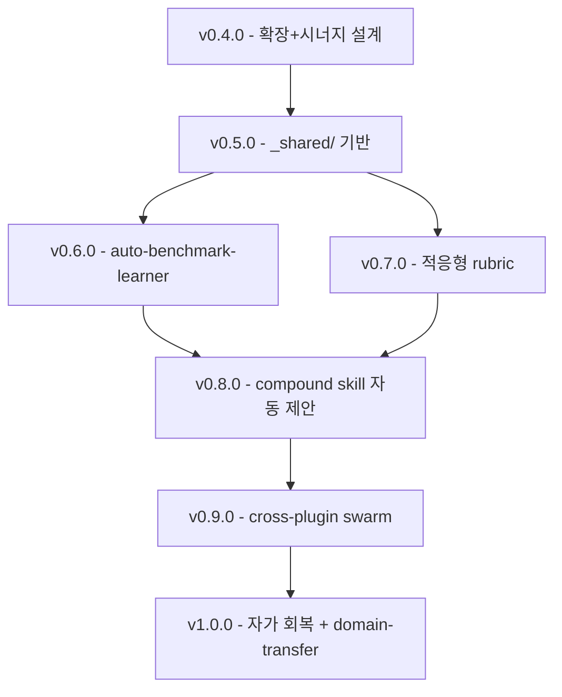

# Cross-Plugin Synergy Architecture

## Executive Summary

`artibot-cowork` v0.3.0→v0.4.0 진화 과정에서 만들어진 다섯 축 — (1) AI slop 탐지 루브릭, (2) Declared vs Demonstrated voice 이분법, (3) 다차원 100점 품질 루브릭, (4) 벤치마크 주도 패턴 합성, (5) `references/` 서브디렉터리 컨벤션 — 은 도메인이 "콘텐츠"에서 "코드"로 치환되어도 형태가 보존된다. 즉 이들은 도메인 로직이 아니라 **품질 관리 프리미티브**다.

**핵심 질문**: cowork의 어떤 강점을 core artibot에 이식하면 plugin 간 시너지 최대화 + AGI-like 진화 가능한가?

**한 줄 답**: 품질 평가 프리미티브(severity tier, category floor, declared vs demonstrated, auto-flag)를 `plugins/_shared/`로 승격시키고 양 plugin이 subclass하도록 만드는 것. 이 기반 위에서만 cross-plugin macro learning과 swarm emergent skill 진화가 성립한다.

---

## Section 1: cowork 강점 인벤토리 (10종)

### 1.1 ai-slop-reviewer — AI 패턴 탐지 + 0-100 severity 스코어링

**정의**: 25개 한국어 + 15개 영어 slop 패턴 딕셔너리와 10종 구조적 slop 패턴(bullet dump, topic announcement opener, hollow summary closer 등)을 입력 텍스트에 적용, 0-100 severity 점수와 5단계 tier(Clean/Acceptable/Needs Work/Heavy Slop/Reject)를 산출.

**기능**: (a) 패턴-교체 사전, (b) 구조 audit (bullet 비율, emoji 밀도, hedge stack), (c) severity-기반 publish gate(70점 미만 차단, 50점 미만 hard block).

**core artibot 이식 시 가치**: `code-reviewer` 에이전트에 동일 severity 프레임 적용 시 "LLM이 짠 방어적 try-catch 도배", "미사용 import", "주석만 많고 내용 없는 boilerplate" 등 **AI 생성 코드의 slop**를 탐지할 수 있다. 현 core `code-reviewer`는 기능 검토에 집중하고 있어 이 층이 비어 있다.

### 1.2 voice-reference — Declared vs Demonstrated 이분법

**정의**: 브랜드/저자 voice를 (a) 선언된 profile(NNGroup 4축 + 어휘 리스트) (b) 실제 샘플 2-3편 두 채널로 동시 저장. ai-slop-reviewer는 두 채널 불일치를 drift로 감지.

**기능**: calibration anchor를 제공하는 정적 파일 세트, 네트워크 호출 없음, 6-12개월 주기 refresh.

**core artibot 이식 시 가치**: `code-style` 영역에서 "프로젝트가 선언한 style(lint rule)"과 "실제 커밋 샘플에서 입증된 style"을 분리하면 — lint는 통과하지만 팀 관습과 어긋나는 PR을 잡아낼 수 있다. 현재 core `refactor-cleaner`, `code-reviewer`는 lint 기준만 본다.

### 1.3 long-form-quality-rubric — 5-카테고리 100점 + Severity + Auto-flag

**정의**: Content 30 / SEO 25 / E-E-A-T 15 / Technical 15 / AI Citation 15 = 100점. 각 카테고리별 floor. 12종 auto-flag(AI slop phrase, Q&A 비율, 문단 길이, hedge stack 등) 기반 자동 심사.

**기능**: (a) 다차원 스코어링, (b) category floor 메커니즘(한 축 폭망 시 총점 무력화), (c) Severity tier(Critical/Major/Minor) + 조치 매핑.

**core artibot 이식 시 가치**: core는 `npm run ci`로 단일 pass/fail만 알려준다. 다차원 루브릭(Correctness 30 / Readability 20 / Performance 15 / Security 15 / Tests 20) + category floor를 도입하면, 예를 들어 테스트 통과하지만 보안 축 6/15 인 PR은 자동 block된다.

### 1.4 벤치마크 주도 설계 — claude-blog / claudecode-writer 패턴 차용

**정의**: cowork v0.3.0 writing pack은 처음부터 설계된 게 아니라 GitHub에서 유사 OSS(claude-blog, claudecode-writer 등)를 스캔 → 반복 패턴 추출 → 재조합한 결과다. STAR, BAB, AIDA, PAS, Princeton GEO 등 공개 표준을 명시적으로 수집.

**기능**: 외부 프레임워크 inventory → 패턴 정규화 → 기존 skill에 추가(`references/` 형태).

**core artibot 이식 시 가치**: core는 `repo-benchmarker` 에이전트가 있지만 결과를 스킬로 자동 피드백하지는 않는다. "자동 벤치마크 → skill 후보 생성" 루프를 만들면 core가 자기 확장 가능.

### 1.5 ad-compliance — PIPA/FTC/GDPR 컴플라이언스 프레임워크

**정의**: 한국(표시광고법, PIPA, 전자상거래법) + 글로벌(FTC, GDPR, ASA) 법규를 카피/랜딩/이메일/SNS 콘텐츠에 체계적으로 매핑. 업종별 필수 표시 항목, 인플루언서 고지 의무 등.

**기능**: 규제 도메인 적용 체크리스트. 발행 전 legal gate.

**core artibot 이식 시 가치**: 코드에 동일 패턴 적용 → "license-compliance-reviewer"(OSS 라이선스 감사), "export-control-reviewer"(US EAR 준수), "PII-logging-reviewer"(개인정보 로깅 감지). 현 core의 `security-reviewer`는 vulnerability 중심, 컴플라이언스 도메인은 공백.

### 1.6 aeo-geo-2026 — AI answer engine 최적화 forward-looking

**정의**: 2026 AEO(Answer Engine Optimization) / GEO(Generative Engine Optimization) 원칙 — 120-180 word citable passage, Q-style H2 60-70%, statistics density 8/2000w, FAQPage schema.

**기능**: AI 인용 가능성을 content-level 품질 지표로 변환.

**core artibot 이식 시 가치**: 내부 코드 문서(API docs, README)가 AI 코딩 보조도구에 잘 인용되게 — `doc-aeo-optimizer` 가 JSDoc/README에 structured summary block, Q-style section, 코드 예제 density를 삽입. 이는 Artibot이 자기 문서 생성 시 자기 사용성 부트스트랩.

### 1.7 NNGroup 4-dim voice — 다차원 스코어링 프로필

**정의**: Humor↔Serious, Formality, Respect, Enthusiasm 각 -2~+2 스코어. 독립 축 4개로 voice 프로필을 벡터화.

**기능**: 정성적 "톤" 개념을 수치화하여 drift 탐지 가능.

**core artibot 이식 시 가치**: 코드 스타일도 다축 벡터로 — Idiomatic↔Defensive, Terse↔Verbose, Functional↔Imperative, Strict↔Pragmatic. 프로젝트마다 선언된 벡터가 있으면 reviewer가 "이 PR은 팀 벡터에서 얼마나 벗어났나"를 정량화.

### 1.8 kr-marketing — 지역 시장 특화

**정의**: 네이버 C-Rank/DIA, Kakao Moment, PIPA, 한국 플랫폼 가이드. Global-first default 위에 region-aware 층을 겹치는 패턴.

**기능**: 지역별 우선순위 override.

**core artibot 이식 시 가치**: core 에이전트도 region-aware 옵션. 예: `security-reviewer`가 KISA-ISMS 체크리스트를 옵션으로 지원, `devops-engineer`가 KT/Naver Cloud 배포 템플릿 지원.

### 1.9 references/ 서브디렉터리 컨벤션 — skill 본문 경량화

**정의**: SKILL.md는 concise (level 3, ~3-5K tokens), 심화 자료는 `references/*.md`로 분리. copywriting이 anti-ai-writing.md + long-form-quality-rubric.md를 참조하는 구조.

**기능**: 스킬 로딩 토큰 감소 + 심화 자료 공유 가능.

**core artibot 이식 시 가치**: core skills 중 200+ line 짜리가 다수 (testing-standards, production-code-audit 등). 본문은 trigger + 핵심 규칙, 나머지는 `references/`로 뺄 여지. lazy-loading 설정(`skills.lazyLoading.enabled: true`)과 자연스럽게 결합.

### 1.10 패턴 추출 방법론 — 공개 표준 재조합

**정의**: STAR(Situation-Task-Action-Result), BAB(Before-After-Bridge), AIDA, PAS(Problem-Agitate-Solution), Princeton GEO 등 공개 표준을 수집 → 각 스킬 안에 reusable framework로 내장.

**기능**: 스킬이 "지시"가 아니라 "공개 표준 라이브러리 + 적용 가이드" 형태로 구성.

**core artibot 이식 시 가치**: core가 언어별 public standard(SOLID, DRY, YAGNI, Clean Code Ch.X, Google Style Guide)를 동일한 `references/` 포맷으로 모으면 — 팀원이 에이전트 출력에 대해 "이건 SOLID-SRP 위반"이라고 공유 표준으로 반박 가능.

---

## Section 2: core artibot 이식 매핑 테이블

| # | cowork pattern | core artibot 대응 | 이름 제안 | 구현 복잡도 | 즉시 이득 |
|---|---|---|---|---|---|
| 1 | ai-slop-reviewer | AI 생성 코드 slop 탐지 (defensive try/catch 도배, 미사용 import, boilerplate 주석, owner 없는 TODO) | `code-slop-reviewer` | M | H |
| 2 | voice-reference | 코드 스타일 calibration (선언 = lint rules / 입증 = 최근 커밋 샘플) + drift 감지 | `code-style-calibration` | M | M |
| 3 | long-form-quality-rubric | 코드 품질 다차원 루브릭 (Correctness 30 / Readability 20 / Performance 15 / Security 15 / Tests 20) + floor | `code-quality-rubric` | S | H |
| 4 | 벤치마크 주도 설계 | 외부 OSS 스캔 → 패턴 합성 → skill 후보 자동 생성 | `auto-benchmark-learner` | L | H |
| 5 | ad-compliance → 코드 컴플라이언스 | OSS 라이선스 감사 / export control / PII 로깅 감지 | `license-compliance-reviewer`, `pii-logging-reviewer` | M | M |
| 6 | aeo-geo-2026 | 코드 문서 AEO(JSDoc/README가 AI 보조도구에 인용되기 쉽게) | `doc-aeo-optimizer` | S | M |
| 7 | NNGroup 4-dim voice | 코드 스타일 4축 프로필 (Idiomatic↔Defensive, Terse↔Verbose, Functional↔Imperative, Strict↔Pragmatic) | `code-profile` | M | M |
| 8 | kr-marketing | region-aware agent options (KISA, KT Cloud 등) | `region-aware-reviewer` | S | L |
| 9 | references/ 컨벤션 | core skill lean화: 200+ lines SKILL.md를 <120 line + references/*.md 로 분리 | `skill-ref-refactor` | L | H |
| 10 | 패턴 추출 방법론 | 공개 표준 라이브러리(SOLID, Clean Code 원칙)를 `references/`로 수집 | `public-standards-pack` | M | M |

### 2.1 매핑 원칙

1. **도메인 치환만**: 프레임은 건드리지 않고 어휘 사전만 바꾼다. slop 패턴 → 코드 smell 패턴, voice 축 → 스타일 축, SEO 점수 → 성능 점수.
2. **Severity 일원화**: 모든 reviewer가 Critical/Major/Minor 3-tier를 공유. IDE 통합 시 균일한 색상 매핑 가능.
3. **Category floor 채택**: 단일 축 폭망 방어는 콘텐츠든 코드든 동일하게 유효.
4. **Auto-flag 우선**: 결정론적 체크는 automation, 판단이 필요한 체크는 human/AI review. 비율은 루브릭마다 조정.

---

## Section 3: 공유 인프라 제안

### 3.1 `plugins/_shared/` 디렉터리 신설

현재는 각 plugin이 자기 skill/agent/reference를 독립 보유. 공유 프리미티브가 점점 늘어날 것이므로:

```
plugins/
├─ _shared/
│  ├─ rubrics/
│  │  ├─ severity-tiers.md          # Critical/Major/Minor 정의
│  │  ├─ category-floor.md          # floor 메커니즘 스펙
│  │  └─ auto-flag-schema.md        # auto-flag YAML 포맷
│  ├─ memory/
│  │  └─ cross-plugin-index.md      # cross-plugin reference 인덱스
│  ├─ profiles/
│  │  ├─ declared-vs-demonstrated.md  # voice + code 공통 메타패턴
│  │  └─ multidim-axes.md           # 다차원 프로필 스키마
│  └─ standards/
│     ├─ star-bab-aida.md           # 콘텐츠 프레임
│     └─ solid-dry-yagni.md         # 코드 프레임
├─ artibot/                         # core
└─ artibot-cowork/                  # fork
```

원칙: `_shared/`는 도메인 중립. 콘텐츠/코드 중 하나에만 해당하는 내용 금지.

### 3.2 Cross-plugin skill triggers

cowork skill이 core skill을 호출할 수 있게 — 예: `content-marketer`가 발행 전 core의 `security-reviewer`(코드 예제 XSS 감사용)를 skill-trigger로 invoke. 현재는 plugin 경계가 격리되어 있음.

구현: skill frontmatter에 `crossPluginCalls: ["artibot/security-reviewer"]` 필드 추가, runtime middleware(`subagents.js`)가 cross-plugin 호출 resolve.

### 3.3 통합 Quality Gate

단일 gate가 code + content 양쪽 검증. 예: 블로그 포스트에 코드 스니펫이 포함되면 `long-form-quality-rubric`(콘텐츠 축) + `code-quality-rubric`(코드 축)을 동시 실행, 둘 다 90+ 일 때만 publish-ready.

### 3.4 통합 거버넌스 계층 — marketing-audit ↔ security-audit 상호 호출

`artibot.config.json` playbook `marketing-audit`와 `security` playbook을 연결. 예: marketing 캠페인이 "개인정보 수집" 동의 플로우를 건드리면 자동으로 security-audit playbook이 병행.

구현: playbook nodes에 `crossPlaybook: ["security:scan"]` 필드.

### 3.5 Cross-plugin swarm learning

현재 `artibot-swarm`은 core 단일 plugin 대상 federated learning. 스키마에 `pluginScope: "core" | "cowork" | "cross"` 태그 추가 → 여러 유저가 cowork+core 동시 사용 시 "cowork voice profile → core code comment tone" 같은 cross-plugin 패턴 학습 가능.

데이터 정책 준수: 모든 데이터는 `artibot-swarm` (`https://artibot-swarm-...`)만 경유. 외부 DB 금지.

---

## Section 4: 창발적 시너지 시나리오 5종

### 시나리오 A — voice→code-comments

| 항목 | 내용 |
|---|---|
| Trigger | 유저가 voice-reference에 저장한 4-dim voice 프로필 + 2-3 샘플 |
| 참여 스킬 | `voice-reference`(cowork) → `code-style-calibration`(core) |
| 산출물 | 코드 주석과 commit message가 유저의 선언 voice를 따름 (예: Formality -1, Enthusiasm -1 이면 `// Fixed.` 스타일, +1/+1 이면 `// Huge win: cut latency 3x!`) |
| 가치 | 블로그 톤과 코드 주석 톤이 한 사람처럼 일관됨 |

### 시나리오 B — security→compliance

| 항목 | 내용 |
|---|---|
| Trigger | core `security-reviewer`가 하드코딩된 개인정보(이메일, 주민번호) 패턴 탐지 |
| 참여 스킬 | `security-reviewer`(core) → `ad-compliance`(cowork) |
| 산출물 | 탐지된 패턴이 cowork의 PIPA 체크리스트에 자동 편입. 마케팅 콘텐츠에서 동일 정규식으로 검사 강화 |
| 가치 | 보안 발견이 법무 리스크 감사를 강화; 패턴 한 번 정의하면 두 도메인 보호 |

### 시나리오 C — rubric-cross-pollination

| 항목 | 내용 |
|---|---|
| Trigger | cowork `long-form-quality-rubric`의 category-floor 구조가 승격 |
| 참여 스킬 | `long-form-quality-rubric` → `code-quality-rubric` |
| 산출물 | 두 루브릭이 공통 schema를 공유. `plugins/_shared/rubrics/severity-tiers.md` |
| 가치 | IDE/CI에서 콘텐츠/코드 PR을 균일한 Critical/Major/Minor로 표시 |

### 시나리오 D — AEO-for-devdocs

| 항목 | 내용 |
|---|---|
| Trigger | core `doc-updater`가 README 개선 시 |
| 참여 스킬 | `aeo-geo-2026`(cowork의 citable-passage 원칙) → `doc-aeo-optimizer`(core 신규) |
| 산출물 | JSDoc/README에 120-180 word self-contained block, Q-style H2, FAQPage schema 삽입 |
| 가치 | AI 코딩 보조도구가 이 플러그인 문서를 더 정확히 인용 → 외부 유저 증가 → swarm 데이터 증가 → self-reinforcing |

### 시나리오 E — swarm-emergent-skills

| 항목 | 내용 |
|---|---|
| Trigger | 여러 유저가 반복적으로 같은 skill 조합 사용 (예: `long-form-writing` + `ai-slop-reviewer` + `schema-generator`) |
| 참여 스킬 | `artibot-swarm` + `macroLearning`(이미 `suggest-only` 모드로 활성화) |
| 산출물 | compound skill 후보 `publish-ready-article` 제안 (frontmatter에 `composedOf: [...]`) |
| 가치 | 유저 사용 패턴이 skill 카탈로그에 역방향 압력으로 작용, AGI-like self-organization 단초 |

---

## Section 5: AGI-like 진화 로드맵

### 5.1 버전별 테마

| Version | 핵심 테마 | 주요 기능 | 예상 규모 |
|---|---|---|---|
| v0.4.0 (current sprint) | 확장 + 시너지 설계 | content-pipeline, schema-generator, 2 specialist agents, smoke tests, 본 설계 문서 | S |
| v0.5.0 | 공유 인프라 착수 | `plugins/_shared/rubrics/`, code-slop-reviewer, cross-plugin skill triggers 실험 | M |
| v0.6.0 | 자기 개선 벤치마크 루프 | auto-benchmark-learner(외부 OSS 스캔→패턴 합성→skill 후보 staging), 통합 rubric 표준화 | L |
| v0.7.0 | 적응형 품질 게이트 | 루브릭이 accepted/rejected 피드백으로 자가 조정, voice drift 자동 감지 + 알림 | M |
| v0.8.0 | 스킬 자동 추천/생성 | 유저 사용 패턴에서 compound skill 후보 제안(suggest-only→review-mode), macroLearning 자동 승격 | M |
| v0.9.0 | 크로스 플러그인 swarm intelligence | artibot-swarm에 cross-plugin tag 추가, 여러 유저 집단 지성이 skill 우선순위에 반영 | L |
| v1.0.0 | 자기 진단 + 자가 회복 | self-benchmark 주간 실행 → 자동 리팩토링 제안, domain-transfer 학습, policy-aware autonomy | XL |

### 5.2 흐름 다이어그램



### 5.3 각 단계 성공 지표

| Version | 성공 지표 |
|---|---|
| v0.5.0 | `_shared/rubrics/severity-tiers.md` 양 plugin 참조, code-slop-reviewer 실제 PR에서 slop 3건 이상 탐지 |
| v0.6.0 | auto-benchmark-learner가 월 1회 이상 staging에 skill 후보 생성 |
| v0.7.0 | rubric threshold가 유저 reject 패턴에 의해 월 단위 자동 조정 |
| v0.8.0 | compound skill 후보 중 10% 이상 승격 (유저 승인 기반) |
| v0.9.0 | cross-plugin 학습으로 core 스킬 품질 점수 5% 이상 상승 |
| v1.0.0 | self-benchmark 주간 리포트가 자동 PR 생성, merge rate 30% 이상 |

---

## Section 6: 리스크·제약

### 6.1 데이터 정책 엄수 (CRITICAL)

user memory에 명시: **외부 플러그인 연결, 외부 DB 접근, 남의 DB로 데이터 전송 절대 금지. 모든 데이터는 Artibot 자체 플러그인 & 서버 내에서만 오갈 수 있어야 함.**

적용:
- auto-benchmark-learner는 public GitHub 읽기만, 유저 코드/콘텐츠 외부 전송 금지.
- artibot-swarm 경유 데이터는 현재 DP(ε=1, δ=1e-5) + 자체 서버(`artibot-swarm-154860486472.asia-northeast3.run.app`). 이 경계 유지.
- Cross-plugin skill trigger는 로컬 프로세스 내부 통신만.

### 6.2 과공학 방지

각 단계별 실제 유저 시그널 확인 후 진행. v0.5.0 `_shared/rubrics/`는 싼 투자이므로 진행, 그러나 v0.6.0 auto-benchmark-learner 같은 큰 투자는 v0.5.0 결과를 보고 결정.

feedback memory "Team Idle UX"에서 "프롬프트 입력 시에만 일하는 것처럼 보인다"는 시그널이 이미 존재 — auto-benchmark-learner의 background 실행이 오히려 이 지각 문제를 완화할 수도 있다.

### 6.3 유저 동의 경계

현 `ago.autoSpawn` 패턴 재활용:

| 자동화 수준 | 옵션 | 기본값 |
|---|---|---|
| suggest-only | 스킬/매크로 후보 제안만 | default |
| review-mode | 유저 승인 시 승격 | v0.7.0 default |
| autonomous | 신뢰점수 임계 시 자동 승격 | opt-in only |

`ago.macroLearning.mode`가 이미 "suggest-only"로 세팅됨 — 이 설계 철학 계승.

### 6.4 Compaction 생존

context 압축 시 어떤 정보 유지할지 명시 필요. 현 CLAUDE.md "Context Efficiency" 섹션("front-load critical info in first 160 chars")이 기본 원칙. 추가로:

- `_shared/rubrics/*`는 lazy-loaded: rubric 실행 시에만 적재.
- cross-plugin reference index는 session memory에 cache (`importCacheTTL: 30000`).

### 6.5 그 외 리스크

- **정합성 drift**: 양 plugin이 `_shared/` 버전 불일치 시 어떻게 감지? → v0.5.0에 `_shared/VERSION` 파일 + plugin manifest에 `sharedVersion` 필드 검증.
- **스킬 카탈로그 폭발**: auto-benchmark-learner가 과도한 후보 생성 → staging 14일 cooldown, 최대 후보 수 월 10개 제한.
- **루브릭 고착화**: 적응형 rubric이 잘못된 피드백 루프에 갇힐 위험 → v0.7.0에 "rubric rollback" 메커니즘 필수.

---

## Section 7: 구체 구현 로드맵 (10 액션)

각 항목: 제목 / 선행 조건 / 예상 노력(S/M/L) / 기대 가치 / 위험.

### A1. `plugins/_shared/rubrics/` 디렉터리 신설

- **선행 조건**: 없음 (즉시 착수 가능)
- **노력**: S (2-3일)
- **기대 가치**: H — cross-plugin 정합성의 출발점
- **위험**: L — 디렉터리 생성 + 3개 파일(severity-tiers.md / category-floor.md / auto-flag-schema.md)
- **결과물**: 양 plugin이 import 가능한 공통 schema

### A2. `code-slop-reviewer` 스킬 신설 (core)

- **선행 조건**: A1
- **노력**: M (1-2주)
- **기대 가치**: H — AI 생성 코드의 실제 유저 페인 포인트
- **위험**: M — false positive 가능성, 초기엔 suggest-only
- **결과물**: `plugins/artibot/skills/code-slop-reviewer/SKILL.md` + `references/code-slop-patterns.md` (JS/TS/Python 언어별)

### A3. core skill의 `references/` 컨벤션 적용 (첫 10개)

- **선행 조건**: A1
- **노력**: M (2주)
- **기대 가치**: H — 토큰 효율 + 가독성
- **위험**: L — 기존 skill 재구조화, 하지만 lazy-loading 기반에서 자연
- **결과물**: 상위 10개 긴 skill(testing-standards, production-code-audit 등)이 SKILL.md <120 line + references/ 구조로

### A4. Cross-plugin shared memory 디렉터리

- **선행 조건**: A1
- **노력**: S (3-5일)
- **기대 가치**: M — cross-plugin reference 인덱스
- **위험**: L
- **결과물**: `plugins/_shared/memory/cross-plugin-index.md`, runtime middleware에 resolver 추가

### A5. artibot-swarm federated learning 스키마에 `pluginScope` 태그 추가

- **선행 조건**: A4
- **노력**: M (1주)
- **기대 가치**: M — cross-plugin 학습 기반
- **위험**: M — schema migration, 기존 데이터 호환성
- **결과물**: swarm sync payload에 `pluginScope` 필드, git backend 스키마 업데이트

### A6. macroLearning 승격 임계값 cross-plugin 공유

- **선행 조건**: A4, A5
- **노력**: S (3-5일)
- **기대 가치**: M — compound skill 경계 확장
- **위험**: L — 기존 `ago.macroLearning.minOccurrences: 3` 그대로 유지, scope만 확장
- **결과물**: 매크로 제안이 core+cowork 양쪽 skill 조합 포함

### A7. `doc-aeo-optimizer` 스킬 신설 (core)

- **선행 조건**: A1
- **노력**: S (1주)
- **기대 가치**: M — 외부 가시성
- **위험**: L — cowork의 aeo-geo-2026 패턴 차용
- **결과물**: `plugins/artibot/skills/doc-aeo-optimizer/SKILL.md`, `doc-updater` 에이전트가 reference로 연결

### A8. `code-quality-rubric` 스킬 신설 (core)

- **선행 조건**: A1
- **노력**: M (1-2주)
- **기대 가치**: H — 다차원 코드 품질 gate
- **위험**: M — 기존 `code-reviewer` 에이전트와 역할 정리 필요
- **결과물**: `plugins/artibot/skills/code-quality-rubric/SKILL.md`, `code-reviewer` 에이전트가 이를 참조하도록 업데이트

### A9. `code-style-calibration` 스킬 — Declared vs Demonstrated 이식

- **선행 조건**: A1
- **노력**: M (1-2주)
- **기대 가치**: M — lint-pass 지만 관습 어긋나는 PR 탐지
- **위험**: M — "관습" 정의가 모호, 초기엔 suggest-only
- **결과물**: `.lintrc` 파싱 + 최근 커밋 샘플링 → drift 리포트

### A10. Cross-plugin skill trigger 실험

- **선행 조건**: A1, A4
- **노력**: M (1-2주)
- **기대 가치**: M — runtime 층 cross-plugin 연결
- **위험**: M — middleware 확장, 테스트 커버리지 필수
- **결과물**: skill frontmatter `crossPluginCalls: [...]` 필드 지원, `subagents.js` middleware 업데이트, 최소 1 use case(content-marketer → security-reviewer) 실증

### 7.1 sprint 할당 제안

| Sprint | 액션 | 이유 |
|---|---|---|
| v0.4.0 (현재, 종료 직전) | 본 문서 포함 디자인 산출물, 실장착 0 | 설계 단계 |
| v0.5.0 | A1, A2, A3 (첫 5개), A7 | `_shared/` 기반 + 즉시 이득 높은 skill 2개 |
| v0.5.x patch | A4, A6 | 공유 메모리 + 매크로 확장 |
| v0.6.0 | A5, A8, A9 | swarm 스키마 + 다차원 rubric + style calibration |
| v0.6.x | A3 (잔여), A10 | skill refactor 마무리 + cross-plugin trigger 실증 |

---

## 부록: 현재 관찰 가능한 증거

### A.1 파일별 근거 (본 문서 작성에 참조됨)

| 주장 | 근거 파일 |
|---|---|
| ai-slop-reviewer는 25+15 slop 패턴 + 0-100 severity | `plugins/artibot-cowork/skills/ai-slop-reviewer/SKILL.md:59-178` |
| voice-reference의 Declared vs Demonstrated 이분법 | `plugins/artibot-cowork/skills/voice-reference/SKILL.md:41-47` |
| long-form-quality-rubric 5-cat 100점 + floor + auto-flag | `plugins/artibot-cowork/skills/copywriting/references/long-form-quality-rubric.md:17-121` |
| content-marketer에 Quality Gate 내장 | `plugins/artibot-cowork/agents/content-marketer.md:58` |
| ad-compliance PIPA+FTC+GDPR 프레임 | `plugins/artibot-cowork/skills/ad-compliance/SKILL.md:36-59` |
| core의 5-layer + modelPolicy + macroLearning suggest-only | `plugins/artibot/artibot.config.json:1-945` |
| core에 `code-slop-reviewer` 부재 (역할 공백) | `plugins/artibot/agents/*.md` glob 결과에서 해당 파일 없음 |
| 데이터 정책 (user memory) | `memory/MEMORY.md` User Preferences 섹션 |

### A.2 미확인/가정 항목

- core skill 중 정확히 몇 개가 200+ lines 인지 (A3 스코프 산정용) — 실측 필요.
- artibot-swarm 현 schema 세부 (A5 migration cost 산정용) — `plugins/artibot/lib/swarm/` 추가 조사 필요.
- cross-plugin skill trigger가 현 subagents middleware에서 어느 정도 지원되는지 (A10 착수 전 필수) — `plugins/artibot/lib/runtime/middleware/subagents.js` 읽어야 함.

이상 항목은 v0.5.0 sprint kickoff 시 1-2일 discovery로 해소 권장.

---

## 마무리

본 문서는 cowork의 품질 관리 프리미티브가 core artibot에서도 **도메인 치환만으로 작동**한다는 가설을 중심으로 작성되었다. 10개 매핑, 5개 시너지 시나리오, 7-버전 로드맵, 10개 액션 아이템으로 구조화하였으며, 각 단계는 유저 시그널 확인 후 진행하는 **증분 투자** 모델을 따른다.

최우선은 `plugins/_shared/rubrics/` 신설(A1)과 `code-slop-reviewer` 착수(A2). 이 두 개가 cross-plugin 아키텍처의 초석이며, v0.5.0 sprint 1주 내 완료 가능하다.
