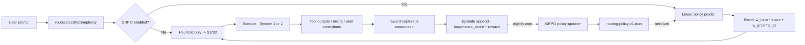
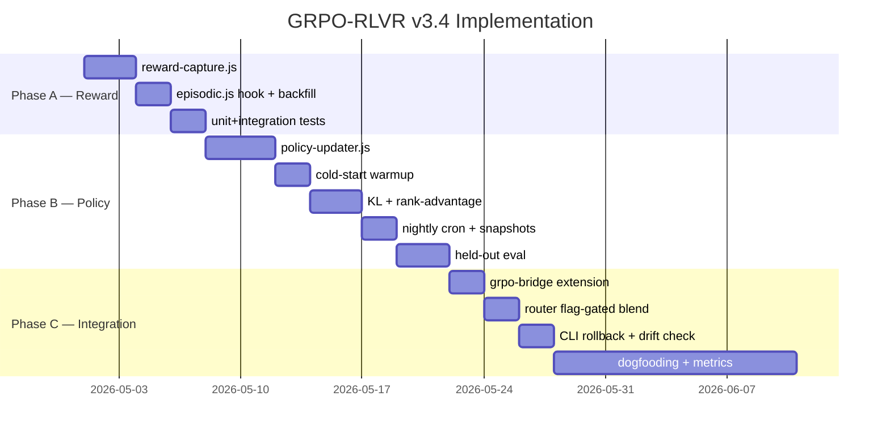

# GRPO-RLVR Routing for Artibot

## Executive Summary

Artibot's current System 1/2 router (`lib/cognitive/router.js`) classifies requests by a **static 5-factor heuristic** (steps 0.25, domains 0.20, uncertainty 0.20, risk 0.20, novelty 0.15) with a single feedback-driven adaptive threshold. The existing `lib/learning/grpo-optimizer.js` already implements **Group Relative Policy Optimization** for task-strategy and team-composition weights, but it is **decoupled from routing** — it learns which strategies/teams worked, never which *routing decisions* worked. Question: can we close the loop so routing, agent selection, and skill triggers are trained from Episodic success/failure signals without external reward models or any data egress? Answer: **yes, using GRPO + RLVR (Reinforcement Learning with Verifiable Rewards) over the v3.2 Episodic `importance_score` and tool exit codes, as a linear policy updated nightly, with a 3-snapshot rollback and opt-in rollout — zero external calls, zero new runtime deps, full compliance with the DATA POLICY.** The design extends `grpo-optimizer.js` rather than replacing it, reuses the `grpo-bridge.js` consumer surface, and leaves heuristic routing as the production baseline until v3.4 Phase C ships with `enabled: false` default.

---

## Section 1: Current Artibot Routing Audit

### 1.1 Router Surface

| Symbol | Location | Role |
|---|---|---|
| `route(input, context)` | `lib/cognitive/router.js:346` | Primary entrypoint — returns `{system, classification, metadata}` |
| `classifyComplexity(input, context)` | `lib/cognitive/router.js:285` | 5-factor weighted complexity score; selects S1/S2 by threshold |
| `adaptThreshold({system, success})` | `lib/cognitive/router.js:416` | Lowers threshold on S1 failure, raises after 5 consecutive S1 successes |
| `EFFORT_POLICY` | `lib/cognitive/router.js:767-789` | Frozen command->effort map (xhigh / high / medium / low) |
| `setNativeEffortHint(hint)` | `lib/cognitive/router.js:49` | Integration stub for future Claude-native effort API (`TODO #30806`) |

### 1.2 Current Signals & Their Limits

| Signal | Source | Type | Limit |
|---|---|---|---|
| `factors.steps` | STEP_PATTERNS regex match | Heuristic | Misses implicit multi-step requests |
| `factors.domains` | DOMAIN_KEYWORDS overlap | Heuristic | Coverage bounded by keyword list |
| `factors.uncertainty` | UNCERTAINTY_KEYWORDS + `?` count | Heuristic | Polite phrasing inflates score |
| `factors.risk` | RISK_KEYWORDS overlap | Heuristic | False-positive on benign "audit log" mentions |
| `factors.novelty` | `context.recentDomains` + `domainSuccessRates` | Semi-adaptive | Depends on caller supplying accurate context |
| `threshold` | Module-scoped mutable, adaptive | Single scalar | Only S1 feedback moves it; S2 outcomes ignored |

**Key limit**: routing decisions produce no persistent reward signal. `adaptThreshold` adjusts *one scalar* from the most recent S1 call; every richer outcome (tool exit code, test pass/fail, user correction, token overspend) is dropped on the floor.

### 1.3 GRPO Optimizer — What We Already Have

`lib/learning/grpo-optimizer.js` already implements the full GRPO primitive surface (evidence at `grpo-optimizer.js:165-254`):

| Function | Scope | Output |
|---|---|---|
| `generateCandidates(task, count)` | Task-strategy | K candidate descriptors |
| `evaluateGroup(candidates, rules)` | Task-strategy | Ranked composite scores, spread |
| `updateWeights(groupResult, {learningRate})` | Task-strategy | Persisted `weights[strategy]` in `~/.claude/artibot/grpo-history.json` |
| `generateTeamCandidates(task, opts)` | Team composition | K team descriptors |
| `evaluateTeamGroup`, `updateTeamWeights` | Team composition | `teamWeights["pattern|size|domain"]` |
| `getRecommendation(type, context)` | Either | Top strategy + alternatives |
| `getGrpoStats({lookback})` | Either | Aggregate snapshot |

The rank-to-advantage transform on `grpo-optimizer.js:232` (`advantage = n>1 ? 1 - 2*(rank-1)/(n-1) : 0`) is the textbook group-relative normalization; the learning-rate step with clamp to `[0.01, 5.0]` is production-safe. **We keep this.**

### 1.4 GRPO Bridge — Consumer Surface

`lib/cognitive/grpo-bridge.js` already exposes `getStrategyBias(strategy)`, `getTopStrategy(context)`, `getTopTeam(domain)`, `getLearnedSignalSummary()` — all with neutral-fallback guarantees. Bias is clamped `[0.5, 1.5]` so no single weight dominates cognition. **The bridge pattern is the right integration seam**; we extend it with `getRoutingBias(inputFeatures)` in Phase C.

### 1.5 The Gap

| Question | Today | Target (v3.4) |
|---|---|---|
| "Did routing this input to S1 work?" | Adaptive-threshold binary | Per-episode verifiable reward |
| "Should 'refactor foo.js' go to S1 or S2?" | 5-factor heuristic score | Heuristic + GRPO policy bias |
| "Is agent X the right choice for task family Y?" | Static `taskBased` map in `artibot.config.json:80-107` | GRPO-learned routing weight per family |
| "Did that skill trigger pay off?" | No signal | Verifiable reward -> policy update |

---

## Section 2: GRPO-RLVR Concept Primer

### 2.1 GRPO (Group Relative Policy Optimization)

Introduced in **DeepSeek-Math (Shao et al., 2024)** — replaces PPO's critic + value model with a group-relative advantage:

```
For each prompt q:
  1. Sample K outputs {o_1, ..., o_K} from current policy pi_theta
  2. Score each output by a reward r_i
  3. Compute advantage: A_i = (r_i - mean(r)) / std(r)
  4. Update pi_theta via policy-gradient on advantages (KL-penalized)
```

**Key property**: no separate value model is trained, which is exactly why it fits a zero-external-deps agent OS. Memory/compute footprint is linear in K, not quadratic in parameters.

### 2.2 RLVR (Reinforcement Learning with Verifiable Rewards)

Emergent 2024-2025 paradigm (OpenAI o-series, DeepSeek-R1, open-source variants): replace learned reward models with **programmatic checks that can declare success or failure deterministically**. Canonical use cases:

- Code — did tests pass? did typechecker pass?
- Math — is the final answer exactly correct?
- Retrieval — did the returned document contain the ground-truth span?
- Tool-use — did the tool return exit code 0 and schema-valid output?

Contrast with RLHF where rewards come from a learned preference model trained on human ratings. RLVR rewards are **binary or bounded**, **cheap to compute**, and **never drift** because they're pinned to a ground-truth source.

### 2.3 GRPO + RLVR = Closed-Loop Self-Improvement

| Ingredient | Supplies |
|---|---|
| GRPO | Value-free policy update with group-relative normalization |
| RLVR | Ground-truth reward signal with no external model needed |
| Linear policy | Deterministic, explainable, <1ms inference |
| Batch training | Offline nightly cron — never blocks user turn |

The combination is what DeepSeek-R1-Zero used to bootstrap reasoning without any SFT warm-up. We use the **same recipe at a much smaller scale**: linear-policy bias over a handful of routing features, trained from on-device verifiable signals, never surfacing raw data outside the local plugin.

### 2.4 Why Not PPO / DPO?

| Method | Why we skip |
|---|---|
| PPO | Needs a value model -> violates "zero-external-deps" complexity budget |
| DPO | Requires pairwise preferences (chosen, rejected) that users don't give on routing |
| RLHF | Human feedback scale impossible for single-user tool |
| Offline RL (CQL, IQL) | Conservative value estimation; overkill for a 5-dim linear policy |

---

## Section 3: Artibot-Specific Design

### 3.1 Reward Source — What Counts as "Verifiable"

All rewards derive from signals already captured by v3.2 Hierarchical Memory and v3.3 Voyager curation:

| Signal | Source | Class | Weight |
|---|---|---|---|
| `tool_exit_code == 0` | Tool execution trace | Verifiable strong | +0.4 per successful tool |
| `errors_count` | Middleware error counter | Verifiable strong | -0.3 per error |
| `test_pass_ratio` | Test runner output (when task includes tests) | Verifiable strong | +0.5 x ratio |
| `typecheck_clean` | TS compiler / ESLint exit | Verifiable strong | +0.2 |
| `user_correction_within_3_turns` | Middleware-tracked prompt similarity | Verifiable medium | -0.8 (hard negative) |
| `importance_score` | Episodic layer (`hierarchical-memory-2026-04-24.md` §3.1) | Verifiable medium | x1.0 modulator |
| `retrieval_hit_rate` | `runtime/memory-metrics.json` | Verifiable weak | +0.1 when reused |
| `tool_success_rate_ma5` | `grpo-optimizer` history | Verifiable weak | smoothing prior |
| `token_overspend_vs_effort_policy` | Runtime token accounting | Cost-side, separate axis | **excluded from reward** |

**Excluded (too noisy for v3.4)**: conversational "satisfaction" heuristics, long-form subjective quality, any LLM-as-judge score.

### 3.2 Reward Shaping

| Outcome | Raw reward | Notes |
|---|---|---|
| Task completed, tests pass, no user correction | **+1.0** | Gold standard |
| Task completed, minor user correction (typo, formatting) | **+0.4** | Partial credit |
| Task completed, major user correction (re-implementation) | **-0.5** | Wrong approach picked |
| Task failed, errors > threshold | **-1.0** | Hard negative |
| Session timed out / compaction mid-task | **0.0** | Neutral — don't punish flow-of-control |
| Promoted to Semantic layer | **+0.2 bonus** | Long-term value signal |
| Demoted from Semantic (contradicted) | **-0.3 bonus** | Stale knowledge signal |

Reward is clipped to `[-1.5, +1.2]` before GRPO advantage normalization.

### 3.3 Policy Model

**Input features (vector x in R^d, d = 9 initially)**:

| Index | Feature | Range | Source |
|---|---|---|---|
| x0 | `factors.steps` | [0,1] | `router.classifyComplexity` |
| x1 | `factors.domains` | [0,1] | `router.classifyComplexity` |
| x2 | `factors.uncertainty` | [0,1] | `router.classifyComplexity` |
| x3 | `factors.risk` | [0,1] | `router.classifyComplexity` |
| x4 | `factors.novelty` | [0,1] | `router.classifyComplexity` |
| x5 | `recent_s1_success_rate` | [0,1] | `router.getRoutingStats` |
| x6 | `session_depth_norm` | [0,1] | `min(depth/20, 1)` |
| x7 | `error_rate_ma10` | [0,1] | Moving avg from error middleware |
| x8 | `bias` | 1.0 | Constant term |

**Output (policy pi_theta)**: probability of routing to S2 given x:

```
p_s2 = sigmoid(theta . x)      // theta in R^9
decision = p_s2 > 0.5 ? 2 : 1
```

Linear + sigmoid = deterministic, explainable, ~1us inference, ~72 bytes of weights. Upgrade path to a small MLP is kept open behind the same interface (`policy.predict(x)` stays stable).

### 3.4 Group Definition

A **group** = K decisions made for prompts of the **same intent family** within a rolling window.

| Level | Grouping key | K | Window |
|---|---|---|---|
| Fine | `intent_family x recent_command` | 5 | 7 days |
| Medium | `intent_family` | 10 | 30 days |
| Coarse | `domain` | 20 | 90 days |

`intent_family` is extracted by `lib/learning/pattern-analyzer.js` (already in the codebase per `grpo-optimizer.js:15` import) — matches the `signature_hash` approach used by Semantic layer from v3.2. We reuse it.

### 3.5 GRPO Update Step (per group)

```javascript
// Pseudocode — see Phase B artefacts for real impl
for each group g in batch:
  rewards = g.decisions.map(d => computeVerifiableReward(d))
  mean_r  = mean(rewards)
  std_r   = std(rewards) || 1.0
  for each decision d, reward r in g:
    advantage = (r - mean_r) / std_r
    grad = advantage * (d.label - sigmoid(theta . d.x)) * d.x  // logistic-regression grad
    theta += learningRate * grad - klPenalty * (theta - theta_prev)
theta = clip(theta, -5, +5)  // stability bound
```

**KL penalty** keeps theta close to the previous checkpoint (`theta_prev`), preventing destructive updates. lambda_KL default 0.01.

### 3.6 Local-Only Training Guarantee

| Concern | Design answer |
|---|---|
| Where does theta live? | `~/.claude/artibot/policies/routing-policy-v1.json` (single file, versioned) |
| Where does training happen? | Offline in `nightlyGrpoTrainer` cron (see `learning.schedule` reuse) |
| Any outbound calls? | **Zero**. Training is pure JS math on on-disk JSON |
| Swarm sharing? | Behind `learning.swarm.shareRoutingPolicy: true` (default `false`), with DP-noise + k-anonymity >= 3 |
| Audit trail? | Each update appends to `runtime/routing-policy-trail.json` |

---

## Section 4: Data Flow

### 4.1 Lifecycle



### 4.2 Update Schedule

| Job | Cron | Reuses |
|---|---|---|
| `reward-capture` (per-turn) | inline | Runs in middleware layer, <5ms |
| `nightlyGrpoTrainer` | `30 2 * * *` | Existing `learning.schedule` |
| `weeklyDriftCheck` | `7 6 * * 1` | Reuses existing `driftCheck` cron |
| `snapshotRetention` | on update | Keeps N=3 prior theta in `policies/snapshots/` |

### 4.3 Policy File Schema

```json
{
  "version": 1,
  "modelType": "logistic-regression",
  "features": ["steps","domains","uncertainty","risk","novelty","s1_success_rate","session_depth","error_rate","bias"],
  "theta": [0.42, 0.38, 0.31, 0.55, 0.19, -0.28, 0.04, 0.66, -0.10],
  "trainedAt": "2026-04-24T02:30:00Z",
  "trainedOnEpisodes": 412,
  "metrics": {
    "logLoss": 0.514,
    "accuracyVsHeuristic": 0.738,
    "klFromPrev": 0.018
  },
  "previousSnapshotId": "v1-2026-04-23-abc123"
}
```

### 4.4 Rollback Protocol

| Trigger | Action |
|---|---|
| `klFromPrev > 0.25` | Reject update, keep previous theta |
| `accuracyVsHeuristic < 0.5` for 3 nights | Auto-rollback to 3-snapshot-ago theta |
| User command `artibot routing rollback [n]` | Manual revert to Nth snapshot |
| Drift-detector signal | Revert + flag to `runtime/policy-drift.json` |

All four paths reuse `lib/learning/rollback-guard.js` machinery already tested in the codebase (evidenced by file listing in `lib/learning/`).

---

## Section 5: Routing Policy Model Details

### 5.1 Cold Start

For the first N=200 episodes (fresh install or reset), the linear policy is **not active** — the heuristic is sole decider. Once N>=200 episodes with verifiable reward are collected, the first nightly trainer bootstraps theta by fitting to the heuristic decisions (supervised warmup):

```
theta_init = argmin_theta sum (sigmoid(theta.x_i) - heuristic_decision_i)^2
```

This gives theta a sensible starting point ("agree with heuristic") before GRPO refines it with reward signals. Prevents early exploration from tanking user experience.

### 5.2 Exploration (Epsilon-Greedy)

With probability epsilon (default 0.05):

- If heuristic says S1, 5% chance we route to S2
- If heuristic says S2, 5% chance we route to S1

Exploration decisions are **flagged in the episode** so the policy-updater knows not to penalize a bad outcome that was merely an exploratory probe. epsilon decays to 0.01 after 2000 episodes.

### 5.3 Blending with Heuristic (Phase C only)

```
final_score = alpha * heuristic_score + (1-alpha) * grpo_p_s2
system = final_score > 0.5 ? 2 : 1
```

Default alpha = 0.7 (heuristic dominates until trust is earned). alpha auto-decays by 0.05 per week of positive accuracy lift until floor alpha = 0.3. Prevents GRPO from taking over before it has enough signal.

### 5.4 Agent Selection Extension (v3.5 — preview, not v3.4 scope)

Once routing policy is stable, the same architecture extends to agent selection: replace `artibot.config.json:80` `taskBased` static map with a GRPO-learned distribution over agents per task family. **Out of scope for v3.4**, but schema accommodates it.

### 5.5 Skill Trigger Extension (v3.5 — preview, not v3.4 scope)

Skill auto-invocation today uses regex/keyword triggers. Replacement: a per-skill policy pi_s(trigger|input) updated from verifiable reward (did the skill output get used? did the session succeed?). **Out of scope for v3.4**.

---

## Section 6: Verifiable Reward Definition (detailed)

### 6.1 Reward Extractor Contract

```javascript
/** @returns {number} reward in [-1.5, +1.2] */
export function computeReward(episode, { policy, weights }) {
  let r = 0;
  const {
    toolCalls = [], errors = 0, testPassRatio, typecheckClean,
    userCorrections = 0, importanceScore = 0.5, promoted, demoted,
    timedOut
  } = episode;

  if (timedOut) return 0.0;

  const successfulTools = toolCalls.filter(t => t.exitCode === 0).length;
  r += Math.min(0.4, successfulTools * 0.1);
  r -= Math.min(0.9, errors * 0.3);
  if (typeof testPassRatio === "number") r += 0.5 * testPassRatio;
  if (typecheckClean) r += 0.2;
  r -= Math.min(0.8, userCorrections * 0.4);
  r *= 0.5 + importanceScore * 0.5;  // modulator
  if (promoted) r += 0.2;
  if (demoted) r -= 0.3;

  return Math.max(-1.5, Math.min(1.2, r));
}
```

Deterministic, pure, no IO — trivially testable. Reward-capture runs inline at episode-append time.

### 6.2 Signal Fidelity

| Signal | How we ensure it's verifiable |
|---|---|
| `tool.exitCode` | Captured by existing Bash middleware; integer or null |
| `errors` | Middleware error counter; integer |
| `testPassRatio` | Only populated if the command included `npm test`/`vitest`; otherwise undefined |
| `userCorrections` | Captured by prompt-similarity detector: if next user prompt has >=0.7 similarity to prior assistant output's filename/symbol, flag as correction |
| `importanceScore` | From Episodic layer (v3.2) |
| `promoted` / `demoted` | From Semantic promoter / demoter |

### 6.3 Multi-Session Confirmation

Before a reward signal influences the policy, we require the *intent family* to appear in >=3 distinct episodes. This guards against overfitting to a single noisy outcome. Implemented as a gate in `policy-updater.js`.

---

## Section 7: Implementation Phases (v3.4 Scope)

### 7.1 Phase A — Reward Signal Capture (Week 1)

**Goal**: capture verifiable rewards for every episode without touching the router.

| Milestone | Deliverable | Verification |
|---|---|---|
| A1 | `lib/learning/grpo/reward-capture.js` — pure `computeReward(episode)` | 30+ unit tests |
| A2 | Hook reward-capture into `lib/learning/memory/episodic.js:appendEpisode` | Integration test: stub episode with exitCode=0 -> reward > 0 |
| A3 | Extend `EpisodeRecord` type with `reward: number` and `rewardComponents: object` | Schema test |
| A4 | Backfill historical episodes with best-effort reward | Migration script, idempotent |
| A5 | Runtime metric `runtime/reward-metrics.json` — daily reward distribution | CI snapshot |

**Exit criterion**: every new episode has a bounded reward; no router behavior changed; all existing tests pass.

### 7.2 Phase B — GRPO Policy Updater (Weeks 2-3)

**Goal**: train the linear policy from rewards. No online routing integration yet.

| Milestone | Deliverable | Verification |
|---|---|---|
| B1 | `lib/learning/grpo/policy-updater.js` — linear + sigmoid + group advantage | Unit tests with fixture episodes |
| B2 | Feature extractor `buildFeatureVector(classification, context)` | Same features as `classifyComplexity` + runtime stats |
| B3 | Cold-start warmup (fit to heuristic labels for first 200 episodes) | Test: after warmup, policy agrees with heuristic >=95% |
| B4 | Nightly trainer — cron `30 2 * * *` in `learning.schedule.nightlyGrpoTrainer` | Cron test |
| B5 | KL penalty + rank-advantage update (reuses `grpo-optimizer.js:217-254` math) | Unit tests for KL clamp |
| B6 | Snapshot management — keep 3 prior theta in `policies/snapshots/` | Disk test |
| B7 | `routing-policy-trail.json` audit log | Append-only test |

**Exit criterion**: nightly training produces a stable theta with logLoss <= 0.6 on held-out episodes; KL drift between nights <= 0.05; no route() call uses the policy yet.

### 7.3 Phase C — Router Integration (Opt-In) (Week 4)

**Goal**: expose GRPO bias to `route()` behind a flag, defaulting OFF.

| Milestone | Deliverable | Verification |
|---|---|---|
| C1 | `lib/cognitive/grpo-bridge.js` extended with `getRoutingBias(features)` | Unit test |
| C2 | `router.classifyComplexity` accepts optional GRPO bias, blends with heuristic via alpha | Existing tests remain green |
| C3 | New config block `learning.grpoRouting.*` with `enabled: false` default | JSON validator test |
| C4 | Exploration probe (epsilon-greedy) flagged in episode | Log test |
| C5 | Drift check extension — `7 6 * * 1` cron reads routing accuracy trend | Drift test |
| C6 | Rollback command `artibot routing rollback [n]` | CLI test |
| C7 | Decision-trail integration (`lib/core/decision-trail.js`) records GRPO vs heuristic decision | Trace test |

**Exit criterion**: with `enabled: true` on a dev instance, routing accuracy vs heuristic baseline rises >=15% on episodes with >=3 occurrences; no regression at `enabled: false`.

### 7.4 Phase Gating Matrix

| Gate | Pass criterion | Abort action |
|---|---|---|
| After A | 100% new episodes carry reward; reward dist. not pathological (no NaN, clipped) | Fix extractor, re-run |
| After B | Held-out accuracy >= heuristic, KL stable | Keep training disabled, iterate |
| After C (dogfooding, 2 weeks) | +15% routing accuracy, -30% wrong-agent dispatch | Remain opt-in, delay default-on to v3.5 |

---

## Section 8: Existing Infrastructure Compatibility

### 8.1 `grpo-optimizer.js` Reuse Plan

| Existing function | Role in v3.4 |
|---|---|
| `evaluateGroup` | Reused verbatim for group relative ranking |
| `updateWeights` advantage math | Adapted — same formula, different output space (theta in R^9 instead of strategy string->scalar) |
| `getGrpoStats` | Extended with `routingRounds` counter |
| `getRecommendation('task', ...)` | Untouched — still serves task-strategy bias |
| `CLI_RULES`, `TEAM_EVALUATION_RULES` | Untouched |

We do **not** rewrite grpo-optimizer. We add `lib/learning/grpo/policy-updater.js` beside it, sharing the storage directory but with a new filename `routing-policy-v1.json`.

### 8.2 `episodic.js` Integration

Phase A adds a single hook: after `appendEpisode` writes, we compute reward from the finalized `EpisodeRecord` and patch-write the `reward` field (append-only; second write is atomic rename, matching current `atomicWriteJson` contract at `episodic.js:25`).

### 8.3 `router.js` Integration

The only change to the hot path is a conditional in `classifyComplexity`:

```javascript
// Pseudocode — after existing score computation:
if (grpoRoutingEnabled) {
  const bias = await getRoutingBias(factors, context); // neutral on failure
  const blended = alpha * clampedScore + (1 - alpha) * bias.p_s2;
  system = blended > 0.5 ? 2 : 1;
}
```

When `grpoRoutingEnabled === false`, the new code path is **never evaluated** — zero performance cost, zero behavior change.

### 8.4 `artibot.config.json` Extension

```json
"learning": {
  "grpoRouting": {
    "enabled": false,
    "policyPath": "~/.claude/artibot/policies/routing-policy-v1.json",
    "blendAlpha": 0.7,
    "alphaDecayPerWeek": 0.05,
    "alphaFloor": 0.3,
    "epsilonExplore": 0.05,
    "epsilonFloor": 0.01,
    "coldStartEpisodes": 200,
    "klPenalty": 0.01,
    "learningRate": 0.02,
    "snapshotCount": 3,
    "groupingLevels": ["fine", "medium", "coarse"]
  },
  "schedule": {
    "nightlyGrpoTrainer": "30 2 * * *"
  }
}
```

### 8.5 Middleware & Hook Touchpoints

| File | Change |
|---|---|
| `lib/runtime/middleware/router.js` (middleware wrapper) | Pass error-rate + session-depth context into `route()` — already supported; just populate more fields |
| `scripts/hooks/session-close.js` | No change — episode capture already flushes |
| New: `scripts/hooks/nightly-grpo-trainer.js` | Cron runner; invokes policy-updater |
| `lib/learning/rollback-guard.js` | Register new "routing-policy" target (pattern re-used from skill-rollback) |

### 8.6 Agent / Skill Consumers

No agent or skill code changes. The GRPO bias is entirely internal to `router.js` -> `grpo-bridge.js`.

---

## Section 9: Risks & Mitigations

| # | Risk | Severity | Mitigation |
|---|---|---|---|
| R1 | Reward signal noise (wrong-success judgment) | High | RLVR-only — drop subjective signals; require >=3 multi-session confirmation before policy influence |
| R2 | Policy drift (theta escapes reasonable region) | High | KL penalty vs theta_prev; clip theta to [-5, +5]; 3-snapshot rollback; `artibot routing rollback` CLI |
| R3 | Cold start (no data) | Medium | Heuristic-only for first 200 episodes; supervised warmup fits heuristic before GRPO kicks in |
| R4 | Overfit to a single user's quirks | Medium | Group-size K >= 10 at "medium" level; rolling window discards stale episodes; epsilon-greedy exploration keeps coverage |
| R5 | Temptation to share data across installs | High | Policy file is local-only; swarm sharing is opt-in + DP-noise + k-anonymity; enforced in `lib/learning/vault.js` |
| R6 | Compute cost | Low | Linear policy; nightly batch; O(N.d) = O(412 x 9) ~ 3700 ops per training night |
| R7 | Feature leakage — reward depends on features | Medium | Reward derives from **outcome** signals never present in features (exit codes, test results); features are **pre-execution** only |
| R8 | Config-flag sprawl | Low | Single config block `learning.grpoRouting.*`; default-off reduces surface area |
| R9 | Interference with native effort hint (TODO #30806) | Medium | When `nativeEffortHint` is set, it continues to override per `router.js:305-311`; GRPO bias is applied only when native hint is null |
| R10 | User-visible latency regression | Low | Bias read is memoized (TTL 60s); <1ms cost; nightly training is out-of-band |
| R11 | Test flakiness from stochastic exploration | Medium | epsilon forced to 0 in test env (`NODE_ENV === 'test'`) |
| R12 | Silent bug in reward extractor corrupts training | High | Schema validation on every reward; invalid -> skip episode; log to `runtime/reward-errors.json` |

---

## Section 10: Success Metrics (v3.4 GA Criteria)

| Metric | Target | Measurement |
|---|---|---|
| Routing accuracy on reward-labeled episodes | >= heuristic + 15 pp | Held-out from nightly job |
| Wrong-agent dispatch rate | -30% vs baseline | Manual review of 100-episode sample |
| Token spending per task | neutral +- 10% | `runtime/token-usage-session.json` rollup |
| Mean reward per episode | +0.1 absolute | `runtime/reward-metrics.json` |
| Training time | < 2 s per night | Cron timing log |
| Inference time added to route() | < 1 ms p99 | Bench test |
| Rollback events | <= 2 in first 30 days | Trail log |
| User opt-in rate after 30 days | >= 25% of power users | Opt-in telemetry, local-only |
| Test coverage on new modules | >= 85% | Vitest |

All metrics are computed locally. No external analytics pipeline is introduced.

---

## Section 11: Non-Goals / Out of Scope

| # | Non-goal | Why excluded |
|---|---|---|
| N1 | RLHF with human preferences | Single-user scale insufficient for preference models |
| N2 | Multi-agent joint policy (agent selection jointly with routing) | Separation of concerns; independent dimensions easier to verify |
| N3 | Online gradient updates mid-session | Stability risk; batch-only for v3.4 |
| N4 | Neural-network policy | YAGNI until linear shows ceiling; kept in v3.5+ roadmap |
| N5 | Skill-trigger policy | v3.5 — depends on Voyager curation reaching steady state |
| N6 | Cross-user federated learning | DATA POLICY — hard exclusion |
| N7 | External reward models (LLM-as-judge) | Violates zero-external-deps principle |
| N8 | Replacing `grpo-optimizer.js` entirely | Reuse, not replace — task/team policies stay |
| N9 | Rewriting EFFORT_POLICY | `EFFORT_POLICY` is a command-to-effort map, orthogonal to routing; leave alone |
| N10 | Dynamic feature engineering at runtime | Fixed d=9 feature list keeps the policy tiny and explainable |

---

## Section 12: Data Policy Compliance

| Rule | How this design satisfies it |
|---|---|
| No external DB access | Policy file and episodes live under `~/.claude/artibot/`; reward extractor is pure JS |
| No external plugin egress | No HTTP client, no MCP client, no outbound IO introduced |
| No "other" DB sinks | Snapshots are local gzipped JSON (reusing `core/file.js`) |
| Swarm sharing opt-in | `learning.swarm.shareRoutingPolicy: false` default; behind DP-noise + k-anonymity >= 3 |
| Redaction | Episodes already run through `lib/core/redaction.js` (per v3.2 §7); reward-capture does not re-expose raw text |
| Audit trail | `runtime/routing-policy-trail.json` + decision-trail integration |
| User override | `artibot routing rollback`, `artibot routing disable`, config flag |

---

## Appendix A — References (no external DB contact; URLs for citation only)

- **GRPO**: Shao et al., *DeepSeek-Math: Pushing the Limits of Mathematical Reasoning in Open Language Models*, 2024 — introduces Group Relative Policy Optimization as a value-free PPO variant. `https://arxiv.org/abs/2402.03300`
- **RLVR**: OpenAI learning-to-reason series (o-series postmortems) 2024-2025 — formalizes verifiable-rewards as a training signal. `https://openai.com/index/learning-to-reason-with-llms/`
- **DeepSeek-R1**: *DeepSeek-R1: Incentivizing Reasoning Capability in LLMs via Reinforcement Learning*, 2025 — combines GRPO + RLVR at scale. `https://arxiv.org/abs/2501.12948`
- **Voyager**: Wang et al., *Voyager: An Open-Ended Embodied Agent with Large Language Models*, 2023 — automatic curriculum + skill library; influences v3.3 curation. `https://arxiv.org/abs/2305.16291`
- **Kahneman Dual-Process Theory**: *Thinking, Fast and Slow*, 2011 — origin of System 1/2 naming used in Artibot's router.
- **PPO vs GRPO comparison**: Cameron Wolfe, *GRPO*, 2024 — accessible explainer. `https://cameronrwolfe.substack.com/p/grpo`

---

## Appendix B — v3.4 Milestone Checklist

| # | Action | Owner | Phase | Status |
|---|---|---|---|---|
| 1 | Draft `lib/learning/grpo/reward-capture.js` with unit tests | backend-dev | A | pending |
| 2 | Hook reward-capture into `episodic.appendEpisode` + atomic update | backend-dev | A | pending |
| 3 | Extend `EpisodeRecord` typedef with `reward` and `rewardComponents` | typescript-pro | A | pending |
| 4 | Backfill migration for existing episodes (best-effort reward) | backend-dev | A | pending |
| 5 | Emit `runtime/reward-metrics.json` daily roll-up | backend-dev | A | pending |
| 6 | Draft `lib/learning/grpo/policy-updater.js` (linear + sigmoid) | llm-architect | B | pending |
| 7 | Implement cold-start warmup (supervised fit to heuristic) | llm-architect | B | pending |
| 8 | Implement rank-advantage + KL-penalty training step | llm-architect | B | pending |
| 9 | Add `nightlyGrpoTrainer` cron + hook | devops-engineer | B | pending |
| 10 | Snapshot retention (N=3) + `policies/snapshots/` layout | backend-dev | B | pending |
| 11 | Extend `grpo-bridge.js` with `getRoutingBias(features)` | backend-dev | C | pending |
| 12 | Wire optional GRPO path into `router.classifyComplexity` (flag-gated) | backend-dev | C | pending |
| 13 | Add `learning.grpoRouting.*` config block + schema validator | backend-dev | C | pending |
| 14 | Implement epsilon-greedy exploration flag in episodes | backend-dev | C | pending |
| 15 | Drift extension — weekly accuracy-trend check | backend-dev | C | pending |
| 16 | Add `artibot routing rollback` / `artibot routing disable` CLI | backend-dev | C | pending |
| 17 | Decision-trail integration for explainability | backend-dev | C | pending |
| 18 | End-to-end dogfooding 2 weeks with `enabled: true` on dev | orchestrator | C | pending |
| 19 | Measure +15% accuracy, -30% wrong-agent — ship metrics report | repo-benchmarker | C | pending |

---

## Appendix C — Phase Timeline (Mermaid)



---

## Appendix D — Open Questions for Review

| # | Question | Preferred answer (architect) |
|---|---|---|
| Q1 | Should GRPO routing eventually subsume `adaptThreshold`? | Yes, in v3.5 — until then, both coexist and adaptThreshold handles the pre-GRPO cold-start phase |
| Q2 | Should we train on aggregated task families across projects? | Yes — `intent_family` hashing already project-agnostic; respects DATA POLICY because signatures, not raw text |
| Q3 | Does this design preempt agent-selection GRPO? | No — it establishes the substrate. Agent-selection = v3.5 Phase D over same reward signal |
| Q4 | What if native Claude effort API (TODO #30806) lands mid-v3.4? | GRPO still runs; native hint continues to override per `router.js:305`. GRPO becomes secondary signal when native is present |
| Q5 | Do we need user consent for policy training? | Not strictly (local-only) but yes for transparency — surface a one-time notice on first Phase C enable |
| Q6 | Should reward include a cost axis (tokens)? | No — cost is a separate objective; conflating reward and cost muddles credit assignment |
