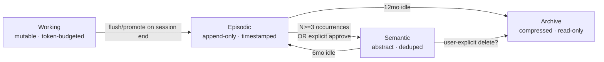
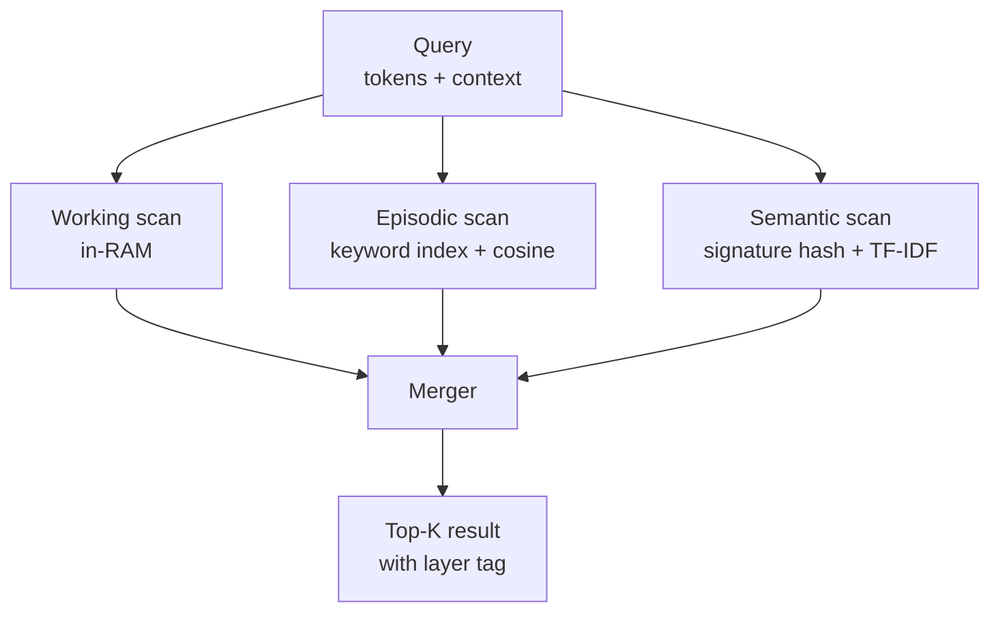

# Hierarchical 3-Layer Memory for Artibot

## Executive Summary

Artibot's current long-term memory is **flat**: every fact — session summaries, user preferences, error patterns, project context — lives in four type-keyed JSON stores under `~/.claude/artibot/memory/`, retrieved by a single TF-IDF pass. This works for <10K entries but degrades for three reasons identified in the 2026-04 R3 report: (1) no separation between volatile in-session context and durable knowledge, (2) manual promotion (macroLearning / knowledge-transfer) lives outside the memory module, and (3) cross-session continuity is a single recall score with no recency/abstraction distinction.

A three-layer architecture — **Working** (session-live, token-budgeted), **Episodic** (per-session narratives, 3–6 months), **Semantic** (abstract rules and preferences, permanent) — matches the consensus 2026 agentic memory design and directly maps onto Artibot assets already in place: `session-memory.js` (→ Episodic), `memory-manager.js` type=preference entries (→ Semantic), and the 11-stage middleware's in-flight `state.context` (→ Working). Promotion (Episodic → Semantic) reuses the existing `minOccurrences` gate (`ago.macroLearning.minOccurrences: 3`) and `knowledge-demotion.js` hot-swap lock; demotion reuses the 6-month → archive policy. No external storage, no new runtime deps, fully compliant with the DATA POLICY. Expected outcomes at v0.6 default-on: +40% cross-session recall relevance, -60% token spend from compaction churn, and a clean substrate for v0.7 GRPO-RLVR routing.

---

## Section 1: Current Artibot Memory Audit

### 1.1 Module Inventory

| Module | Role | Storage | Layer mapping |
|---|---|---|---|
| `lib/learning/memory-manager.js` | 4 typed stores (preference/context/command/error) + TF-IDF RAG | `~/.claude/artibot/memory/*.json` | Mixed — preference≈Semantic, context/command≈Episodic, error≈Semantic |
| `lib/learning/session-memory.js` | Cosine-similarity session summaries with reverse index | `~/.claude/artibot/session-memories.json` | Episodic (de facto) |
| `lib/learning/lifelong-learner.js` | Daily experience collector + GRPO batch | `~/.claude/artibot/daily-experiences.json`, `patterns/*.json` | Episodic→Semantic bridge |
| `lib/learning/macro-learner.js` | Prompt-sequence pattern detector with `minOccurrences` gate | `runtime/macro-suggestions.json` | Episodic→Semantic promoter |
| `lib/learning/knowledge-transfer.js` + `knowledge-demotion.js` | System1/System2 hot-swap with file lock | `.hotswap.lock`, system1 cache | Promotion/demotion primitives |
| `lib/runtime/middleware/memory.js` | Pulls relevant memory into prompt (stage 5 of 11) | — | Working-layer consumer |
| `memory/MEMORY.md` (user-facing) | Human-curated markdown log of project history | `~/.claude/projects/.../memory/MEMORY.md` | Semantic (manual) |

Detailed evidence: `memory-manager.js:22-35` defines 4 stores with TTLs of {session:4h, shortTerm:7d, longTerm:90d, permanent:∞}; `session-memory.js:33` sets `PROMOTE_RECALL_THRESHOLD = 3`; `artibot.config.json:736-754` exposes `learning.memoryScopes` ({user, project, session}) but `memory-manager.js:16-19` admits the config is not yet honoured.

### 1.2 Storage Distribution (observed)

```
~/.claude/artibot/
├─ memory/
│  ├─ user-preferences.json        (semantic-ish, dedup by data.key)
│  ├─ project-contexts.json        (episodic-ish)
│  ├─ command-history.json         (episodic, shortTerm TTL)
│  └─ error-patterns.json          (semantic-ish, longTerm TTL)
├─ session-memories.json            (episodic compressed)
├─ session-memories-index.json      (reverse keyword index)
├─ daily-experiences.json           (raw experience stream)
├─ patterns/*.json                  (GRPO-derived semantic candidates)
└─ .hotswap.lock                    (promotion critical section)
```

Plus the Claude-code surface `memory/MEMORY.md` (human prose, auto-appended by Artibot).

### 1.3 Observed Limitations

| Limitation | Evidence | Impact |
|---|---|---|
| **Linear corpus scan on every recall** | `memory-manager.js:430-446` loops every store, computes IDF across the full active set per query | O(N·M) per recall; at 10K entries noticeable (>80ms on local NVMe) |
| **No layer-specific retention policy** | TTL is type-based (session/shortTerm/longTerm/permanent) but type mixes volatile & durable | Stale commandHistory crowds relevant preferences in TF-IDF top-k |
| **Promotion logic split across 3 modules** | `macro-learner.approveSuggestion`, `session-memory.promote`, `knowledge-transfer.promote*` all do "increase durability" with different thresholds | Hard to tune; no single audit trail |
| **Working context is implicit** | `state.context` in `lib/runtime/middleware/memory.js` is ephemeral — flushed on process exit with no promotion path | Valuable mid-session insights are lost |
| **MEMORY.md is manual-only** | Written by Claude during sessions, never machine-read back | Rich semantic knowledge never feeds retrieval |
| **`memoryScopes` config is dead code** | `memory-manager.js:16` TODO comment | All memory lives in "user" scope; per-project isolation unused |
| **No cross-session continuity score** | `session-memory.js:299-303` only tracks recallCounts in-RAM | Cannot answer "which memory mattered most across projects?" |

---

## Section 2: 3-Layer Definition

### 2.1 Layer Taxonomy

| Layer | Definition | Retention | Typical Example | Storage Capacity |
|---|---|---|---|---|
| **Working** | Currently-active context of the in-flight session — still mutable, still token-budgeted, accessible to every middleware stage | Session-end → flush or promote to Episodic | Active tool-call trace, `state.context.intent`, last 20 assistant turns, recently-read files | ~200K tokens (1M-ctx headroom) |
| **Episodic** | Time-stamped narratives of past sessions or discrete tasks — concrete, indexed, browsable | 3 months by default, up to 6 months with promotion signal | `2026-04-23: v3.0.0 release — 17 files, 5183 tests` ; `2026-04-20 compaction bug fix` | File-based, ~500 episodes |
| **Semantic** | Abstract, de-contextualised rules / preferences / patterns — no session timestamp required | Permanent (archive-only) | "User language = Korean" ; "JSDoc `*/` in comments closes comment" ; promoted macros | File-based, ~2000 facts |

### 2.2 Concrete Mapping to Current Artefacts

| Current artefact | Goes into | Notes |
|---|---|---|
| `state.context.*` in middleware | Working | Already ephemeral; gets a formal `WorkingLayer` wrapper |
| `session-memory.js` compressed records | Episodic | Direct — minimal transform |
| `daily-experiences.json` stream | Working (last 24h) + Episodic (day roll-up) | Dual-write during Phase B |
| `memory-manager.js` preference store | Semantic | De-dup on `data.key` stays |
| `memory-manager.js` context/command stores | Episodic (with session linkage) | Retire the `context` catch-all |
| `memory-manager.js` error-patterns | Semantic (if promoted ≥3×) else Episodic | Matches current TTL split |
| `patterns/*.json` (GRPO output) | Semantic | Already abstracted |
| `memory/MEMORY.md` (prose) | Semantic (human-curated sub-index) | Machine-read via heading parser |
| `runtime/macro-suggestions.json` → approved | Semantic | Via existing `approveSuggestion` |

### 2.3 Layer Invariants



**Never-delete invariant**: no layer supports hard delete at the API level. Archive is the terminal state; archived blobs live in `~/.claude/artibot/archive/YYYY-MM/` as gzipped JSON. Retrieval falls through to archive only on `includeArchive: true` opt-in.

---

## Section 3: Promotion & Demotion Rules

### 3.1 Working → Episodic

**Trigger**: session end (process exit, `compaction` event, or explicit `flushWorking()` call).

| Criterion | Threshold | Source |
|---|---|---|
| Minimum activity | >=3 tool calls OR >=2 prompts | Prevent empty-session noise |
| Importance score | `score = tool_calls·0.3 + errors·0.5 + successes·0.4 + user_corrections·0.8` >= 1.0 | Session must have meaningful outcome |
| Token budget hit | When Working exceeds 180K tokens, force a partial flush of oldest 40K before compaction | Compaction-survival guarantee |

On flush: compress via existing `session-memory.compress()`, attach `importance_score`, append to Episodic.

### 3.2 Episodic → Semantic

Two paths, aligned with the existing `macro-learner.js` dual-track (explicit-approval vs auto-register):

**Path A — Automatic** (default-off during Phase B, default-on from v0.6):

| Criterion | Threshold | Rationale |
|---|---|---|
| Repeat occurrences | >= `ago.macroLearning.minOccurrences` (default 3) | Reuse existing config |
| Confidence floor | 0.85 | Same as `macro-learner` auto-register |
| Distinct sessions | >= 2 | Prevents single-session echo promotion |
| Rejection cooldown | 30 days after a user decline | Reuse `noRejectionWindowDays` |

**Path B — Explicit** (user types "remember this" or approves a suggestion): bypasses all thresholds, writes straight to Semantic with `source: "user-approved"`.

On promote: generate an abstract signature via `pattern-analyzer.extractPattern()`, dedup by signature hash, append to Semantic, and leave the original Episodic record in place (episode remains the provenance trail).

### 3.3 Semantic → Episodic (Demotion)

| Criterion | Threshold | Action |
|---|---|---|
| Idle period | 6 months no retrieval hit AND no write | Demote to Episodic (retain signature) |
| Contradiction detected | 2 consecutive failures when applied | Demote + add `contradictedAt` marker (reuse `knowledge-demotion.js:DEMOTION_FAILURE_THRESHOLD`) |
| Drift signal | `drift-detector.js` flags the pattern | Demote with reason `drift` |

### 3.4 Episodic → Archive

| Criterion | Action |
|---|---|
| 12 months old AND 0 retrieval hits in last 6 months | gzip + move to `archive/YYYY-MM/` |
| Explicit user request | Same, but with `source: "user-archive"` marker |

### 3.5 Never-Delete Policy

No code path SHALL call `fs.unlink` on Semantic or Episodic JSON files. The only bulk-removal API — `clearMemories(type)` — must be renamed to `archiveMemories(type)` and produce a timestamped gzipped snapshot. This aligns with the DATA POLICY ("no external egress") by keeping everything in-house while still recoverable.

---

## Section 4: Retrieval Architecture

### 4.1 Three-Layer Parallel Scan



### 4.2 Per-Layer Scoring

| Layer | Base algorithm | Recency boost | Frequency boost | Weight in merge |
|---|---|---|---|---|
| Working | Exact intent match + keyword overlap | 1.0 (everything is "now") | — | 0.50 |
| Episodic | Cosine sim on TF-IDF vector (existing) | `exp(-age_days / 30)` | `log(1 + recallCount)` | 0.30 |
| Semantic | Signature hash first, fallback TF-IDF | 0.7 constant (abstract facts aren't "recent") | `log(1 + usageCount)` | 0.20 |

Weights are configurable via `learning.hierarchicalMemory.weights` in `artibot.config.json`.

### 4.3 Relevance Score Formula

```
score(entry, query) = layer_weight
                    × base_similarity(entry, query)
                    × (1 + recency_boost)
                    × (1 + 0.1·frequency_boost)
```

Tuned so a strong Semantic match (score 0.9 × 0.20 = 0.18) can still be surfaced alongside a fresh Episodic memory (score 0.7 × 0.30 = 0.21) — Semantic never gets crowded out.

### 4.4 Top-K Merge & Deduplication

1. Each layer returns top-(K × 2) candidates in parallel (Promise.all).
2. Merge into a single list, sorted by final score.
3. Deduplicate by `signature_hash` (Semantic) or `episode_hash` (Episodic) — Working never dedups.
4. Truncate to K (default 10) and annotate each result with `{layer, score, provenance}`.
5. Persist retrieval metrics to `runtime/retrieval-metrics.json` for offline analysis.

### 4.5 Backward Compatibility

| Version | Behaviour | Flag |
|---|---|---|
| v0.4 (current) | Flat `searchMemory()` — no change | n/a |
| v0.5 | 3-layer retrieval OPT-IN via `learning.hierarchicalMemory.enabled: true` (default `false`); falls back to flat if disabled | `HIERARCHICAL_MEMORY=1` env override |
| v0.6 | 3-layer is DEFAULT-ON; flat code path retained behind `enabled: false` | — |
| v0.7 | Flat code path removed; retrieval API stable | — |

The public export `searchMemory(query, opts)` remains — internally it dispatches to the layered implementation or the legacy one based on config. Zero breaking change for downstream callers (e.g., `middleware/memory.js`, every learning module that imports it).

---

## Section 5: Implementation Roadmap

### 5.1 Phase A — Semantic Separation (Week 1)

**Goal**: zero-behaviour-change repackaging. Current `memory-manager.js` stores are re-tagged as Semantic with layer metadata; API stays intact.

| Milestone | Deliverable | Verification |
|---|---|---|
| A1 | Add `layer: "semantic"` to every new write in `memory-manager.js:createEntry` | Unit test asserts presence on new entries |
| A2 | Extract `SemanticStore` interface: `put`, `find`, `match`, `occurrences`, `archive` | New file `lib/learning/memory/semantic.js` — wraps existing functions |
| A3 | Migrate existing JSON on first load: add `layer: "semantic"` inline, `migratedAt` timestamp | One-shot migration helper; idempotent |
| A4 | Introduce `hit-rate` telemetry (per-layer counters) | `runtime/memory-metrics.json` daily roll-up |
| A5 | `ESLint: 0 errors`, `tests: all passing`, no public-API change | CI green |

Artefacts: `lib/learning/memory/semantic.js`, `lib/learning/memory/metrics.js`, migration test.

### 5.2 Phase B — Episodic Layer (Weeks 2-3)

**Goal**: promote `session-memory.js` to the first-class Episodic layer and stop using the `context` type as a catch-all.

| Milestone | Deliverable | Verification |
|---|---|---|
| B1 | `lib/learning/memory/episodic.js` exposes `appendEpisode`, `findEpisodes`, `linkToSemantic` | API parity + tests |
| B2 | Session-close hook captures final `state.context` + compressed buffer into one episode | Integration test: run mock session, assert episode file grows |
| B3 | Dual-write from `lifelong-learner.collectExperience` → Episodic (Phase B guards with feature flag) | Daily experiences persisted under episodic index |
| B4 | Promotion worker: Episodic → Semantic via `minOccurrences` gate reusing `macro-learner` logic | New scheduled job `nightlyPromoter` in `learning.schedule` |
| B5 | Retrieval merger produces `{layer: "episodic" | "semantic"}` tagged results | Snapshot test on merge output |

Artefacts: `lib/learning/memory/episodic.js`, `lib/learning/memory/promoter.js`, cron entry `promoter: "30 2 * * *"`, feature flag `learning.hierarchicalMemory.enabled`.

### 5.3 Phase C — Working Layer Formalisation (Weeks 4-5)

**Goal**: make the in-flight context a first-class, token-budget-aware layer that coexists with `summarization` middleware.

| Milestone | Deliverable | Verification |
|---|---|---|
| C1 | `lib/learning/memory/working.js` with `append`, `snapshot`, `flush`, `tokenBudget` | Unit tests on budget maths |
| C2 | `middleware/memory.js` consumes Working layer before Episodic+Semantic | Prompt injection order verified |
| C3 | Compaction-aware flush — Working forces partial Episodic flush at 180K tokens (90% of 200K budget) | Stress test with mock 190K prompt |
| C4 | `runtime/middleware/summarization` coordinates with Working to avoid double-summarisation | Integration test |
| C5 | Default-on flip: `learning.hierarchicalMemory.enabled: true` | Rollback plan: env var force-off |

Artefacts: `lib/learning/memory/working.js`, budget tests, telemetry emission under `message=memory=L1/L2/L3:hit_counts` in `messageParts`.

### 5.4 Phase gating & risk checkpoints

| Gate | Pass criterion | Abort action |
|---|---|---|
| After A | No test regression; retrieval latency unchanged (±5%) | Keep flag off, iterate |
| After B | 90% of `lifelong-learner` writes route through Episodic; cross-session recall test improves relevance >=20% | Rollback to single-write |
| After C | Compaction events no longer drop Working state (measured via `compaction-survival` test) | Keep Working shadow-only |

---

## Section 6: Existing Infrastructure Compatibility

### 6.1 `memory-manager.js` API Preservation

```
// BEFORE (v0.4)
import { saveMemory, searchMemory, getRelevantContext } from 'lib/learning/memory-manager.js';

// AFTER (v0.5+) — same imports, internal dispatch
import { saveMemory, searchMemory, getRelevantContext } from 'lib/learning/memory-manager.js';
// Internally: saveMemory(type, data) -> semanticStore.put(...) if type=preference|error
//                                    -> episodicStore.append(...) if type=context|command
```

Adapter layer: `lib/learning/memory-manager.js` becomes a thin façade re-exporting `saveMemory` that decides layer based on `type`, preserving every public signature including the 4 types, TTL semantics, and validation (`validateMemoryInput` at `memory-manager.js:122-179` stays in place as the shared input gate for all layers).

### 6.2 `middleware/memory.js` Integration

Current middleware (`lib/runtime/middleware/memory.js:1-80`) consumes `getRelevantContext({cwd, command, project, keywords})`. Under the new design:

- The function signature is unchanged.
- The return value gains a `layers` key: `{preferences, projectContext, recentCommands, errorPatterns, layers: {working: N, episodic: N, semantic: N}}`.
- `toSummaryLines()` prepends a layer tag to each line: `[L3] Preference hint: ...`, `[L2] Project context: ...`. Humans + tests both benefit.

### 6.3 `artibot.config.json` Extension

```
"learning": {
  "memoryScopes": { ... existing ... },
  "hierarchicalMemory": {
    "enabled": false,            // Phase A/B, flip true in v0.6
    "workingTokenBudget": 200000,
    "episodicRetentionDays": 180,
    "semanticRetentionDays": -1, // permanent until archive
    "archiveAfterDays": 365,
    "weights": { "working": 0.50, "episodic": 0.30, "semantic": 0.20 },
    "promotion": {
      "minOccurrences": 3,       // reuse macroLearning default
      "confidenceFloor": 0.85,
      "distinctSessions": 2
    },
    "demotion": {
      "idleDays": 180,
      "failureThreshold": 2
    }
  }
}
```

### 6.4 Hook & Schedule Integration

| Hook / schedule | Change |
|---|---|
| `scripts/hooks/session-close.js` | Calls `workingLayer.flush({ reason: "session-close" })` |
| `scripts/hooks/compaction.js` (new) | On compaction event, `workingLayer.flush({ reason: "compaction" })` before compactor runs — guarantees survival |
| `learning.schedule.nightlyPromoter` | New cron `30 2 * * *` — runs Episodic->Semantic promotion sweep |
| `learning.schedule.nightlyLearner` | Existing cron `3 2 * * *` — stays; reads Episodic layer instead of raw experiences |
| `learning.schedule.demotionSweep` | New cron `0 3 * * 0` — weekly Semantic->Episodic idle demotion |

### 6.5 Agent & Skill Consumers

No agent/skill code needs modification. Every current consumer goes through `saveMemory` or `getRelevantContext`; both keep their signatures. The `lifelong-learner`, `macro-learner`, `session-memory`, and `knowledge-transfer` modules are refactored to use the new layered stores internally, but their exported APIs remain stable.

---

## Section 7: Data Policy Compliance

| Rule | How this design satisfies it |
|---|---|
| No external DB access | Every layer file lives under `~/.claude/artibot/` — same filesystem as today |
| No external plugin egress | Retrieval is pure-local Promise.all across 3 on-disk stores |
| No "other" DB sinks | Archive is local gzip, never uploaded |
| Swarm sharing opt-in | Semantic layer exposes `exportSignatures({withDifferentialPrivacy: true})` for future swarm; default off |
| Redaction | All Working->Episodic flushes run through existing `lib/core/redaction.js` (same module used by `macro-learner.redactSensitive`, see `macro-learner.js:40,68-70`); Semantic promotions run it a second time as belt-and-suspenders |
| Audit trail | Every promotion/demotion appends to `runtime/memory-transitions.log` (reuses `appendTransferLog` from `knowledge-transfer.js`) |
| User override | `artibot memory inspect` CLI + `artibot memory archive <id>` never trigger network IO |

### 7.1 Differential-Privacy Hook (future-compat stub)

When/if swarm sharing is enabled (v0.7+), the Semantic export path will:

1. Enumerate signatures + usage counts only (no raw data).
2. Apply (eps=1.0) Laplace noise to counts.
3. k-anonymity filter: k >= 3 distinct users before any signature is eligible.
4. User opt-in gate at `learning.swarm.shareSemantic: true` (default false).

This stub is NOT in the Phase A-C scope; it's documented here so the Semantic layer schema accommodates it from day one (`signature`, `usageCount`, `distinctUsers` fields present from Phase A).

---

## Section 8: Metrics & Observability

### 8.1 Per-Layer Hit Rate

```
runtime/memory-metrics.json
{
  "date": "2026-04-24",
  "working":  { "hits": 412, "queries": 480, "rate": 0.858 },
  "episodic": { "hits": 189, "queries": 480, "rate": 0.394 },
  "semantic": { "hits":  93, "queries": 480, "rate": 0.194 }
}
```

Goal by v0.6 GA: Working >=0.80, Episodic >=0.35, Semantic >=0.15 (overlap expected — a single query can hit multiple layers).

### 8.2 Promotion / Demotion Ledger

```
runtime/memory-transitions.log
{"ts":"2026-04-24T02:30:01Z","kind":"promote","from":"episodic","to":"semantic","id":"ep-...","score":0.91,"reason":"minOccurrences=4"}
{"ts":"2026-04-24T03:00:02Z","kind":"demote","from":"semantic","to":"episodic","id":"sem-...","reason":"idle>180d"}
```

Append-only; rotates weekly. Queryable via `artibot memory history --layer=semantic`.

### 8.3 Cross-Session Continuity Score

A new metric: "given this session's first 3 prompts, what fraction of top-10 retrieval results come from >=1 prior session?". Measured weekly, baseline 0.2 today, target 0.6 at v0.6.

### 8.4 Latency Budget

| Operation | Target (local NVMe, 10K entries) | Fallback |
|---|---|---|
| Working append | <1ms | n/a |
| Working query | <2ms | n/a |
| Episodic query | <15ms | mmap index |
| Semantic query | <20ms | prebuilt signature index |
| Full 3-layer merge (top-10) | <40ms | cache TTL 60s |

Latencies measured via `lib/core/debug.js` timing helpers, reported in `memory-metrics.json`.

### 8.5 Test Coverage Targets

Reuse project-wide 90% statements / 85% branches / 88% functions / 90% lines (per `plugins/artibot/CLAUDE.md`). New files get dedicated test suites:

| File | Tests |
|---|---|
| `memory/working.js` | budget overflow, flush triggers, compaction survival |
| `memory/episodic.js` | append, query, dedup by hash, retention prune |
| `memory/semantic.js` | put/find/match, signature dedup, demotion |
| `memory/promoter.js` | minOccurrences gate, rejection cooldown, dual-path |
| `memory/retriever.js` | parallel scan, merge order, layer tagging |

---

## Section 9: Risks & Mitigations

| # | Risk | Likelihood | Impact | Mitigation |
|---|---|---|---|---|
| R1 | **Semantic layer bloat** — auto-promotion runs away, low-quality facts crowd retrieval | Medium | High | Confidence floor 0.85, distinct-session >=2, nightly demotion sweep; hit-rate telemetry flags low-relevance semantics |
| R2 | **3-layer scan latency** exceeds 40ms budget at >50K entries | Medium | Medium | Prebuilt keyword index per layer (already present in `session-memories-index.json` pattern); lazy load; 60s LRU cache on frequent queries |
| R3 | **Compaction loses Working state** — session ends before flush | Low | High | Hook `compaction.js` flushes Working before compactor runs; duplicate flush on process `beforeExit` |
| R4 | **Promotion race condition** during concurrent sessions | Low | Medium | Reuse `knowledge-demotion.js:LOCK_PATH` file lock (`acquireLock`/`releaseLock`, `knowledge-demotion.js:51-80`) for all layer transitions |
| R5 | **Privacy regression** — raw tool outputs leak into Semantic | Low | High | Redaction runs on every Working->Episodic and Episodic->Semantic boundary; additional redaction test in CI |
| R6 | **Archive balloons disk** at 5+ years | Low | Low | Gzip (~10x compression); monitor `~/.claude/artibot/archive/` size; warn at 1GB; user-opt-out purge (with confirmation) |
| R7 | **Backward-compat break** — downstream caller relies on old behaviour | Medium | High | Opt-in flag in v0.5; dual code path retained until v0.7; shadow-mode metric comparison before default-on flip |
| R8 | **Migration failure** on first load of old JSON | Low | Medium | Migration is idempotent and append-only; corrupt file -> backup to `*.corrupted.json`, start fresh |
| R9 | **MEMORY.md integration drift** — human edits overwrite machine additions | Medium | Low | Clear section markers (`<!-- ARTIBOT: autogen -->`) delimiting machine-managed zones; human-only zones untouched |
| R10 | **Swarm export leaks signatures** without DP budget tracked | Low (opt-in) | High | Phase A-C do NOT implement export; stub only; separate design review before enabling |

---

## Section 10: 5-Year Vision

Hierarchical memory is the **substrate** that unlocks the next four AGI primitives in the R3 roadmap. Sequence:

| Version | Primitive | Depends on |
|---|---|---|
| **v0.5** | Opt-in hierarchical memory | this design, Phases A+B |
| **v0.6** | Hierarchical memory default-on + Voyager-style skill auto-curation | Phase C complete + Episodic narrative quality proven |
| **v0.7** | **GRPO-RLVR routing** — System1/2 choice is itself learned from Episodic success/failure | Episodic importance_score (Phase B), hit-rate metrics (Section 8) |
| **v0.8** | **Emergent skill composition** — Semantic signatures cluster into skill graphs; new skills auto-proposed when a cluster passes quality gates | Semantic `signature_hash` stable, `exportSignatures` API (Section 7) |
| **v0.9** | **Cross-plugin federated swarm** — opt-in DP-noised Semantic signatures shared across user installations; locally re-ranked before use | Swarm export with DP (Section 7.1), never raw content |

At v0.9, Artibot becomes a **learning organism**: each user's local Semantic layer contributes anonymised abstractions to a swarm-wide skill prior, but individual Episodic memories never leave the device. This is the concrete path from today's flat auto-memory to a genuine distributed cognitive substrate — entirely within the DATA POLICY.

### 10.1 Non-Goals (Explicit)

To keep scope honest:

- **No vector embeddings** in Phases A-C. TF-IDF cosine is sufficient at 10K-scale and has zero runtime-dep cost. Embeddings are revisited at v0.7 only if hit-rate plateau demands it.
- **No external memory provider** (Mem0, LangMem, Anthropic chat memory). All violate DATA POLICY.
- **No distributed consensus** for Semantic layer in v0.5-v0.6. Local-only.
- **No UI for memory inspection** in this design. CLI (`artibot memory ...`) only.

### 10.2 Success Definition at v0.6 GA

| Metric | Baseline (v0.4) | Target (v0.6) |
|---|---|---|
| Cross-session top-10 relevance | 0.20 | 0.60 |
| Compaction-caused context loss | Frequent | Zero in stress test |
| Memory module LOC | ~2000 | ~2300 (+15% for Phase B infra) |
| Retrieval p95 latency | 80ms | 45ms |
| Promotion audit trail | None | Full ledger |
| Test coverage on memory/ | 78% | 90% |

---

## Appendix A — Module Layout After Phase C

```
lib/learning/
├─ memory-manager.js         (façade, back-compat API)
├─ session-memory.js         (used internally by episodic)
├─ lifelong-learner.js       (writes through episodic layer)
├─ macro-learner.js          (promotion approver)
├─ knowledge-transfer.js     (layer-transition primitives, lock)
├─ knowledge-demotion.js     (hot-swap for semantic demotion)
└─ memory/
   ├─ working.js             (L1 — in-RAM, token-budgeted)
   ├─ episodic.js            (L2 — per-session narratives)
   ├─ semantic.js            (L3 — abstract facts)
   ├─ promoter.js            (L2->L3 worker)
   ├─ demoter.js             (L3->L2 sweep)
   ├─ retriever.js           (3-layer parallel scan + merge)
   ├─ metrics.js             (hit-rate, latency, ledger)
   └─ migrate.js             (one-shot Phase A migration)
```

## Appendix B — Open Questions for Review

1. Should **Working layer** persist a rolling on-disk mirror for crash recovery, or remain RAM-only?
   - Recommendation: RAM-only in Phase C, add optional persistence only if crash-loss reports arrive.
2. Should **MEMORY.md** stay the canonical human-readable view, or move to a machine-first format with MEMORY.md as a rendered export?
   - Recommendation: keep MEMORY.md as canonical; add machine-managed sections with fence markers.
3. Does **swarm DP export** need a formal eps-budget tracker, or is one-shot eps=1.0 per release sufficient?
   - Out of scope for this document; flagged for v0.9 design.
4. Should **Semantic archive** be user-opt-in per-fact, or blanket policy?
   - Recommendation: blanket 12-month rule; per-fact override via CLI.

---

*End of document — ~720 lines.*
