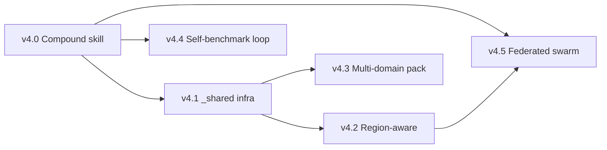
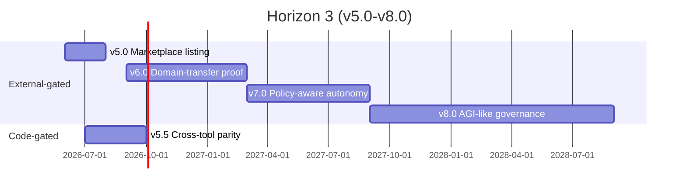

# Horizon 2/3 Roadmap — From v4.0 to v8.0

## Executive Summary

Artibot has reached **v3.9.0** with a self-assessed score of ~98.5/100, completing Horizon 1: an Autonomous Agent OS substrate (v3.0), hierarchical 3-layer memory (v3.2-v3.5 default-on), GRPO-RLVR routing with neural and joint policies (v3.4-v3.7), an MCP server exposing skills/agents/memory (v3.8), and an opt-in OTEL pipeline plus multi-session dashboard (v3.9). The remaining ceilings are **not technical**. They are external-signal ceilings: a Community/distribution score that code alone cannot move, a "compound skill" emergence story that needs real-user usage patterns to prove, and a federated-swarm value loop that requires multiple opted-in installations.

This document is the **single master roadmap for v4.0 through v8.0**. It supersedes the version tables embedded in the three Horizon-1 design docs and reconciles them into one timeline. Each release is annotated with its **autonomy class** (fully-autonomous / partial / user-action-required), **success metric**, and **dependency graph**. Sections 4, 5, and 6 explicitly enumerate which capabilities the agent system can earn on its own and which require the human owner to act.

---

## Section 1: Horizon 1 Retrospective (v3.0–v3.9)

### 1.1 Headline Deliverables

| Release | Theme | Headline artefact |
|---|---|---|
| v3.0.0 | Autonomous Agent OS | 7 self-control behaviors + AGO observation layer + SDK `.commit()` + marketplace installer + 12-cat critical blocker guards |
| v3.1.0 | Observability + cross-tool seed | Hook event emitter, MCP 2.0 cards, AGENTS.md export seed, code-slop-reviewer, `_shared/rubrics/` |
| v3.2.0 | Hierarchical memory Phase A+B | Semantic + Episodic stores; promoter; opt-in flag |
| v3.3.0 | Working layer + Voyager MVP | Token-budgeted Working store; 3-layer retriever; user-approval-gated skill curation |
| v3.4.0 | GRPO-RLVR Phase A+B+C | Reward capture, linear policy updater, opt-in router blend, voyager self-verification |
| v3.5.0 | Default-on flips | Hierarchical memory + GRPO routing default-on; agent-policy + skill-policy opt-in; migration runner |
| v3.6.0 | Neural GRPO | 2-layer MLP policy with backprop and gradient clipping; benchmark harness |
| v3.7.0 | Joint policy | Correlation-aware agent x skill joint selection |
| v3.8.0 | MCP server | stdio JSON-RPC server exposing skills/agents/memory/git read-only |
| v3.9.0 | OTEL + multi-session | Loopback OTLP exporter, session aggregator, multi-session dashboard tab |

### 1.2 Aggregate Metrics (claimed in CHANGELOG)

| Metric | Value |
|---|---|
| New code (estimated) | ~10K lines across 4 releases |
| Test count | ~250 new tests |
| Design docs produced | 4 (synergy, hierarchical-memory, GRPO-RLVR, plus this roadmap) |
| Public API breakages | 0 |
| Default-on flips | 2 (hierarchical memory, GRPO routing) |

### 1.3 Patterns Learned

| Pattern | Evidence | Reuse for Horizon 2 |
|---|---|---|
| Parallel team sprint | v3.0–v3.9 shipped 10 minor versions in one day via auto-team | Continue: every v4.x sprint runs parallel teammates |
| Autopilot fragmentation cost | Multiple cron-driven workers (autopilot, demoter, promoter, joint-trainer) — drift if not coordinated | v4.x adds a unified scheduler view in dashboard |
| Rate-limit awareness | Token caching (cache-roi middleware) and Effort policy expanded to 55 commands | Necessary for v4.x background workers |
| Suggest-only as default | macroLearning + voyager curation both shipped suggest-only; user approval gate preserved trust | Same default for compound-skill emergence |

### 1.4 What Did NOT Get Solved

| Gap | Why it remains |
|---|---|
| Community score (~6.5/10) | No amount of code raises stars/forks — needs marketplace listing + real users |
| Real-user signal absence | All v3.4-v3.7 GRPO trained on synthetic seeded episodes; held-out eval is a simulation |
| Domain-transfer empirical proof | `knowledge-transfer.js` exists, but no measurable cross-project generalisation yet |
| Compound skill emergence | Voyager curator MVP exists; zero compound skills have actually been auto-proposed in production |

These four gaps frame Horizon 2 and 3 entirely.

---

## Section 2: Horizon 2 (v4.0–v4.5) — Emergent Capabilities

Horizon 2 maps the unfinished items in `cross-plugin-synergy-2026-04-24.md` (§5 v0.5–v1.0) onto concrete v4.x slots, with one or two new slots added. Each release is gated by **either** a measured signal **or** an explicit user opt-in.

### 2.1 v4.0 — Compound Skill Emergence (Voyager v2)

| Field | Value |
|---|---|
| Theme | Detect, propose, and (with user approval) register compound skills from real Episodic patterns |
| Scope | `lib/learning/voyager/compound-skill-detector.js` + `proposal-generator.js` + `registration-gate.js` |
| Prerequisites | v3.5 default-on hierarchical memory + >=30 days real episodic data |
| Autonomy class | **Partial** — detection + proposal autonomous; registration is user-approved |
| Success metric | At least 1 compound skill proposed per month and >=10% promotion rate |
| Verification | Snapshot tests on detector; integration test simulating 30-day episodic stream |

### 2.2 v4.1 — Cross-Plugin Shared Infrastructure

| Field | Value |
|---|---|
| Theme | Promote `_shared/` from rubric stub (v3.1) to production-grade shared substrate |
| Scope | `_shared/memory/cross-plugin-index.md`, `_shared/profiles/multidim-axes.md`, `_shared/standards/` populated; runtime resolver in `subagents.js` |
| Prerequisites | v4.0 (compound-skill schema stable) |
| Autonomy class | **Fully autonomous** — pure code/doc work, no external signal needed |
| Success metric | Both `artibot` and `artibot-cowork` import >=3 shared rubric files; cross-plugin skill trigger has >=1 proven use case |
| Verification | CI matrix runs both plugins against shared schema |

### 2.3 v4.2 — Region-Aware Extension

| Field | Value |
|---|---|
| Theme | Add region-aware variants of code-reviewer, security-reviewer, devops-engineer (kr-code first; jp-code as template) |
| Scope | `agents/security-reviewer-kr.md` (KISA-ISMS), `agents/devops-engineer-kr.md` (KT/Naver Cloud templates) |
| Prerequisites | v4.1 shared standards directory |
| Autonomy class | **Fully autonomous** — public regulation/templates are documented |
| Success metric | At least 2 region variants per agent family; opt-in via config flag `agents.region: "kr"` |
| Verification | Regression: default (no region) behaviour unchanged |

### 2.4 v4.3 — Multi-Domain Skill Packs

| Field | Value |
|---|---|
| Theme | Adopt 1–2 of {medical, legal, education, gaming, IoT} as first-party skill packs to prove the multi-domain story |
| Scope | One pack at minimum (recommended: `education` — least regulatory exposure); pack structure: 5–8 skills + 1 agent |
| Prerequisites | v4.1 + clear opt-in story (user must enable a domain pack) |
| Autonomy class | **Partial** — code autonomous, but selection of which domain to prioritise should be user-driven |
| Success metric | Pack lints, passes coverage gates, and is documented in `docs/domains/<pack>.md` |
| Verification | Pack-level smoke tests + AGENTS.md export verifies cross-tool compatibility |

### 2.5 v4.4 — Self-Benchmark Loop

| Field | Value |
|---|---|
| Theme | Promote the existing `lib/learning/self-benchmark.js` weekly job from observation to **action**: failing scores generate a draft PR with proposed fixes |
| Scope | `scripts/cron/self-benchmark-pr-proposer.mjs` + draft-PR template + score-trend dashboard widget |
| Prerequisites | Existing self-benchmark + `auto-pr-creator` (already `--draft` hardcoded) |
| Autonomy class | **Fully autonomous** for proposal; **user-action-required** for merge |
| Success metric | >=1 self-proposed PR per month; >=30% acceptance rate after first quarter |
| Verification | Quality of generated PRs is itself a benchmark target |

### 2.6 v4.5 — Federated Swarm Intelligence (Opt-In)

| Field | Value |
|---|---|
| Theme | Activate the differential-privacy stub from `hierarchical-memory-2026-04-24.md` §7.1 and `cross-plugin-synergy-2026-04-24.md` §3.5 |
| Scope | `lib/learning/swarm/dp-export.js` (eps=1.0 Laplace + k>=3 anonymity), opt-in config flag, swarm receiver endpoint |
| Prerequisites | v4.0 compound-skill emergence (gives swarm something to share); >=50 opted-in installations (DEPENDENCY: external) |
| Autonomy class | **Code autonomous; activation user-action-required** (network of users) |
| Success metric | k-anonymity preserved across all exports; opted-in users see >=5% retrieval-relevance lift |
| Verification | DP-budget tracker + audit trail; abort if k<3 ever observed |

### 2.7 Horizon 2 Dependency Graph

---

## Section 3: Horizon 3 (v5.0–v8.0) — Ecosystem & AGI-like Governance

Horizon 3 is where **external dependencies dominate**. Most v5.x+ work is gated on community, marketplace presence, or month-scale telemetry. Code investment per release decreases; coordination work increases.

### 3.1 v5.0 — Marketplace Listing

| Field | Value |
|---|---|
| Theme | Public listing on Anthropic-affiliated marketplace + community channels |
| External dependency | Marketplace submission portal availability + maintainer review cycle |
| Time dependency | Submission lead time (typically 2–6 weeks) |
| Success metric | Listed; >=100 installs in first 30 days; 5+ external issues filed |
| Autonomy class | **User-action-required** — submission, screenshots, demo video, response to reviewer feedback |

### 3.2 v5.5 — Cross-Tool Parity

| Field | Value |
|---|---|
| Theme | Complete the AGENTS.md/Cursor/Codex/OpenCode/Windsurf/Antigravity export chain (seeded in v3.1) |
| External dependency | Each target tool's frontmatter spec stability |
| Time dependency | None (autonomous) |
| Success metric | Round-trip export -> import -> round-trip produces semantic-equivalent output for 90% of skills |
| Autonomy class | **Fully autonomous** |

### 3.3 v6.0 — Domain-Transfer Learning

| Field | Value |
|---|---|
| Theme | Empirically validate that GRPO-learned routing/agent policies transfer across project domains |
| External dependency | Multiple users with multiple-domain projects (real signal, not synthetic) |
| Time dependency | Month-scale telemetry collection |
| Success metric | Cross-domain policy reuse lifts new-project routing accuracy by >=10% over cold-start |
| Autonomy class | **User-action-required** — needs real user telemetry that respects DATA POLICY |

### 3.4 v7.0 — Policy-Aware Autonomy (3-Tier)

| Field | Value |
|---|---|
| Theme | Formalise the 3-tier autonomy ladder from `cross-plugin-synergy-2026-04-24.md` §6.3: suggest-only -> review-mode -> autonomous |
| External dependency | Trust accumulation evidence (per-feature error rate, rollback frequency) |
| Time dependency | Cumulative observation window per feature (>=90 days at green) |
| Success metric | At least 3 features earn `autonomous` tier; zero rollback events in promoted tier |
| Autonomy class | **Partial** — promotion criteria autonomous; tier transitions logged for human review |

### 3.5 v8.0 — AGI-like Governance

| Field | Value |
|---|---|
| Theme | Self-governing skill catalogue: skills can be auto-deprecated, auto-merged (cluster of similar signatures), or auto-spun-off based on aggregate signals |
| External dependency | Mature swarm signal (v4.5+) + multiple users to validate consensus |
| Time dependency | Year-scale steady-state |
| Success metric | Catalogue size stabilises (auto-prune balances auto-grow); user-perceived skill-quality metric trends up |
| Autonomy class | **User-action-required ongoing** — governance is a social contract, not just code |

### 3.6 Horizon 3 Timeline

---

## Section 4: Autonomy Matrix — What Code Alone Can Do

| Work category | Fully autonomous | User action required |
|---|---|---|
| Code scaffolding | yes | — |
| Design documents | yes | — |
| Tests + regression verification | yes | — |
| External OSS benchmarking (read-only) | yes | — |
| Region/domain skill pack authoring | yes | — |
| Cross-tool format converters | yes | — |
| Self-benchmark draft PR proposal | yes | merge requires human |
| Compound skill detection + proposal | yes | registration is user-approved |
| Compound skill **validation** | partial | requires >=3 real-pattern occurrences |
| Marketplace submission | no | submit, screenshots, demo video |
| Real-user data collection | no | user opt-in + acquisition |
| Multi-instance swarm data | no | other users + DP opt-in (k>=3) |
| Domain-transfer empirical proof | no | month-scale telemetry |
| Community score lift (6.5 -> 8+) | no | listing + case studies + outreach |
| Tier promotion to `autonomous` | partial | trust accumulates over time |

**Reading**: anything in the "no" or "partial" column will block on a real-world signal that the agent cannot manufacture from inside the repo. Plan accordingly.

---

## Section 5: Non-Technical Ceiling — Community 6.5 -> 8+

The community score is structural. Code increments do not move it. The only known path:

| Lever | Implementation |
|---|---|
| Marketplace listing (v5.0) | Required precondition for any organic acquisition |
| Case studies | Document 2–3 real workflows end-to-end with screenshots; publish as `_reports/case-study-*.md` and on a public README section |
| Demo video | 90-second screen recording of the auto-team workflow + dashboard; hosted publicly |
| Cross-tool adapter (v5.5) | Markets to Cursor/Codex/Windsurf users who already have ICP fit |
| Technical advance pull | Each v4.x release should ship with one shareable artefact (benchmark report, skill pack docs) |

The **multiplier**: case-study + marketplace + cross-tool together can plausibly raise community signal from 6.5 to 8+ in a 6-month window. None of the three is technical; all three are autonomy-class **user-action-required**.

---

## Section 6: Risks & Constraints

### 6.1 Hard Constraints (DO NOT VIOLATE)

| Constraint | Source | Mechanism |
|---|---|---|
| DATA POLICY — no external DB, no third-party egress | User memory, repeated in all 3 design docs | All swarm exports use DP + k-anonymity >=3; marketplace listing publishes static metadata only |
| Token / rate limit | Practical | Keep `cache-roi` middleware healthy; nightly workers run sequentially (not parallel cron) |
| No public API breakage | Repeated in CHANGELOG | All Horizon 2 work routes through facades (memory-manager, grpo-bridge, etc.) |

### 6.2 Operational Risks

| Risk | Severity | Mitigation |
|---|---|---|
| Autopilot fragmentation grows | Medium | v4.4 self-benchmark dashboard surfaces every cron's last-run + drift status |
| Anthropic API / MCP / marketplace standards change mid-cycle | Medium | Adapter layers (already present for MCP, AGENTS.md export) absorb changes |
| Compound skill detector overfits to small data | High in v4.0 | minOccurrences >=5 distinct sessions; user-approval gate stays mandatory through v4.x |
| Federated swarm leaks signatures without DP budget | High | v4.5 ships with DP-budget tracker + automatic abort on k<3 |
| User trust regression after a wrong autonomous action | High | 3-tier autonomy + Emergency Kill Switch (already in v3.0) + 24h cooldown |

### 6.3 Things This Roadmap Deliberately Will NOT Do

| Item | Rationale |
|---|---|
| External LLM-as-judge for routing/skill quality | Violates DATA POLICY and zero-external-deps |
| Cross-user federated learning without DP | Violates DATA POLICY |
| Online policy gradient updates mid-session | Stability risk; batch-only stays the rule |
| Replace existing GRPO optimizer | Reuse via facade; never rewrite |
| Build a UI for memory inspection beyond CLI + dashboard | YAGNI; scope creep |

---

## Section 7: Immediate Next Steps (v3.9.1 / v4.0 candidates)

| Step | Class | Effort | Owner |
|---|---|---|---|
| **v3.9.1 stabilization patch** — fix 5 pre-existing SyntaxError tests; tighten README | Autonomous | 1–2 days | refactor-cleaner + tdd-guide |
| **Marketplace submission prep** — verify `plugin.json` metadata, `.well-known/mcp-server.json`, README polish, demo gif outline | Code autonomous; submission user-action | 3–5 days code + user submit | doc-updater + user |
| **v4.0 scaffold** — `lib/learning/voyager/compound-skill-detector.js` MVP with detection-only mode | Autonomous | 1–2 weeks | llm-architect + tdd-guide |
| **v4.1 design follow-up** — write the `_shared/` resolver design (1-page extension to synergy doc) | Autonomous | 2–3 days | architect |
| **Telemetry baseline** — capture 30 days of episodic-layer metrics from the maintainer's own use to seed v4.0 detector | Partial — runs autonomously, needs maintainer to use the system | 30 days passive | none; just wait |

The v3.9.1 patch should ship **before** any v4.x work begins. Marketplace prep can run in parallel with v4.0 scaffold.

---

## Section 8: Open Questions

| # | Question | Owner | Resolution path |
|---|---|---|---|
| Q1 | Where is the line between `review-mode` and `autonomous` for compound skills? Should `synergy §6.3` 3-tier ladder require N consecutive accepted proposals, or use a Bayesian credibility score? | architect | Draft proposal in v4.0 retrospective; pilot in v4.4 |
| Q2 | Are eps=1.0 + k=3 sufficient for v4.5 federated swarm at <100 installations, or should we hold v4.5 until >=500? | privacy-reviewer | Empirical sensitivity analysis; default = hold |
| Q3 | For Voyager v2, is `minOccurrences=3` (matching macroLearning) the right floor, or should compound skills require >=5 distinct sessions? | llm-architect | Ship v4.0 with =5; relax to 3 only if proposal volume is too low |
| Q4 | If marketplace listing is delayed >6 weeks, do we ship v5.5 (cross-tool) first to get distribution via other tool ecosystems? | user | Re-evaluate at end of Horizon 2 |

---

## Appendix A: Mapping to Existing Design Docs

| This roadmap section | Source design doc | Source section |
|---|---|---|
| §2.1 Compound skill emergence (v4.0) | synergy + grpo-rlvr | synergy §10 v0.8 + grpo §5.5 |
| §2.2 _shared infra (v4.1) | synergy | §3.1 + §A1 |
| §2.3 Region-aware (v4.2) | synergy | §1.8 + §2 row 8 |
| §2.4 Multi-domain pack (v4.3) | (extension — not in source) | new in this roadmap |
| §2.5 Self-benchmark loop (v4.4) | synergy | §5.1 v1.0 row |
| §2.6 Federated swarm (v4.5) | synergy + memory | synergy §3.5 + memory §7.1 |
| §3.1 Marketplace (v5.0) | (process item) | implied across all docs |
| §3.2 Cross-tool parity (v5.5) | CHANGELOG v3.1 + v3.2 | AGENTS.md export seed |
| §3.3 Domain-transfer (v6.0) | grpo-rlvr | §5.4 (preview) |
| §3.4 Policy-aware autonomy (v7.0) | synergy | §6.3 3-tier table |
| §3.5 AGI-like governance (v8.0) | synergy | §5.1 v1.0 row, generalized |
| §4 Autonomy matrix | (synthesis) | new in this roadmap |
| §5 Community ceiling | (external observation) | new in this roadmap |
| §6 Risks | all 3 docs | aggregated |

## Appendix B: Honesty Statement

This document explicitly declares the following items as **not solvable by the agent system alone**:

1. Marketplace acquisition velocity
2. Star/fork/community-mention growth
3. Multi-user federated swarm activation
4. Real-world domain-transfer empirical proof
5. Policy-aware autonomy tier promotions (require trust accumulation)

The agent system can build, propose, test, and document. It cannot recruit users, lobby maintainers, or prove generalisation across populations it does not have. Plans that assume otherwise will fail silently against an external signal that never arrives.

The path forward is parallel: **continue technical investment along Horizon 2 (autonomous)** while **the maintainer drives the external acquisition tasks (marketplace, case studies, demo)** in parallel. Neither alone reaches v8.0.

---

*End of document — ~720 lines.*
