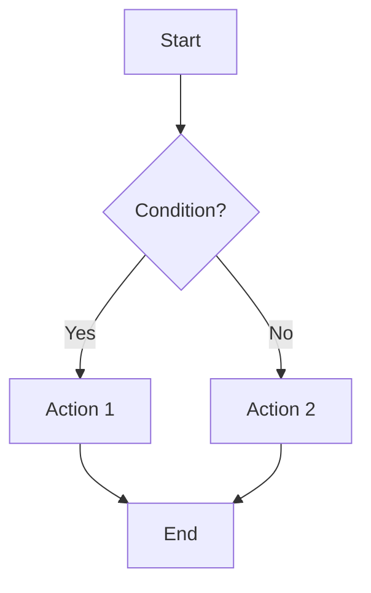
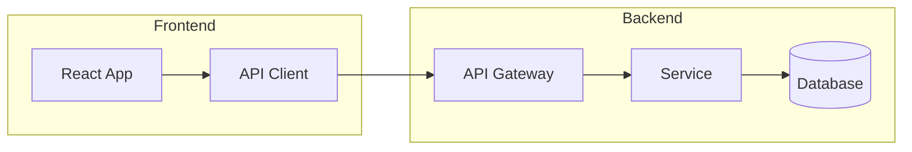
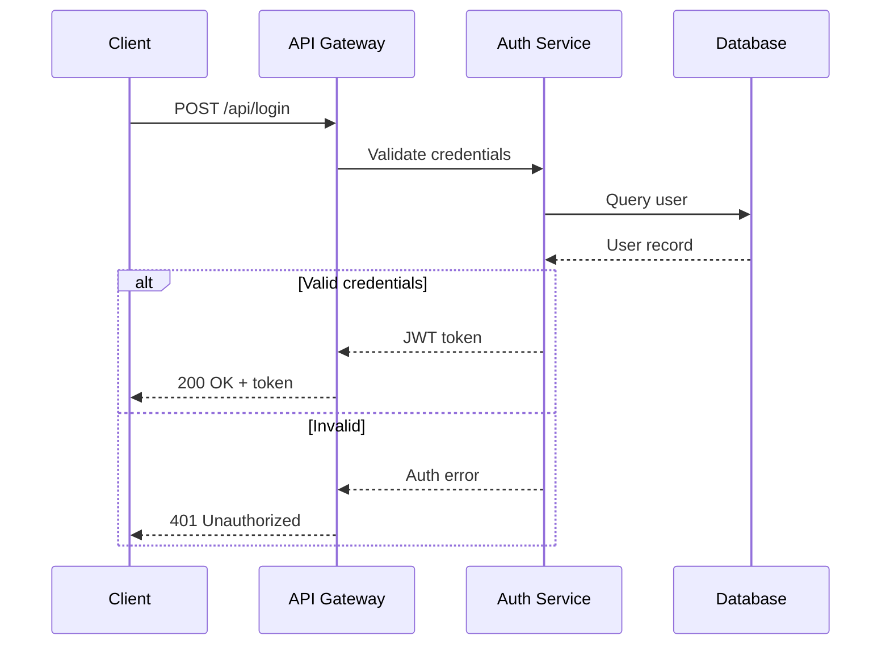
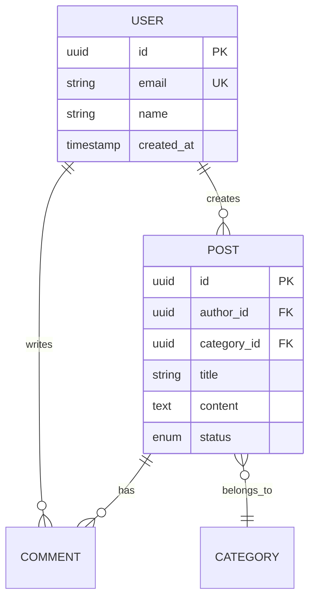
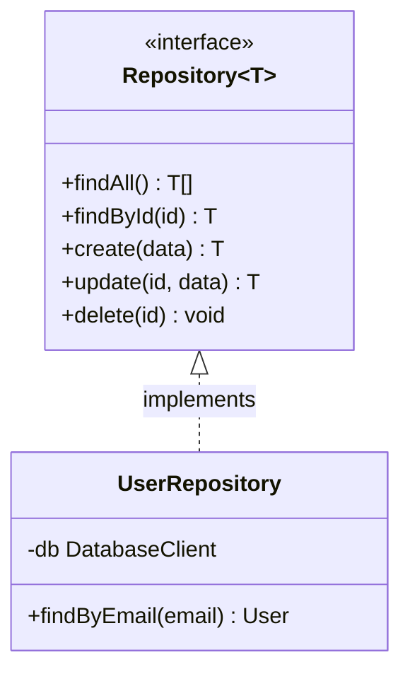
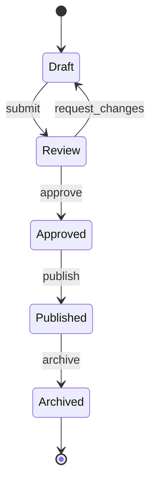
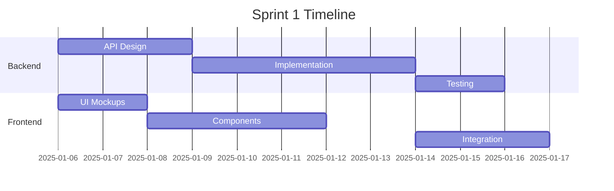
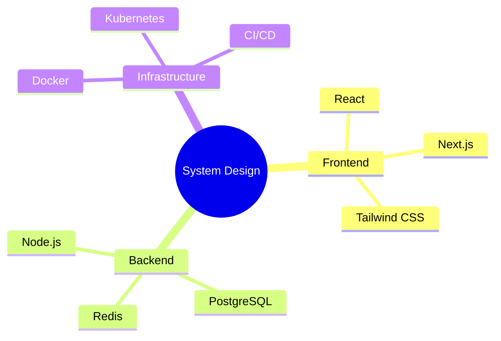

# Mermaid Diagramming Patterns

## When This Skill Applies
- Creating technical documentation with visual diagrams
- Illustrating system architecture, data flows, or state machines
- Generating entity-relationship diagrams for database design
- Documenting API sequences and interaction patterns
- Building project timelines with Gantt charts
- Creating knowledge maps and decision trees

## Core Guidance

### 1. Diagram Type Selection

| Diagram | Use For | Complexity |
|---------|---------|------------|
| Flowchart | Decision logic, process flows, system overview | Low-Medium |
| Sequence | API calls, service interactions, auth flows | Medium |
| ERD | Database schema, entity relationships | Medium |
| Class | OOP structure, interface hierarchy | Medium-High |
| State | State machines, lifecycle transitions | Medium |
| Gantt | Project timelines, sprint planning | Low |
| Mindmap | Brainstorming, topic exploration | Low |
| C4 (Context/Container) | Architecture overview, system boundaries | High |

### 2. Flowchart Patterns

**Basic Process Flow**:


**Subgraph for Grouping**:


**Node Shapes**:
- `[text]` - Rectangle (process)
- `{text}` - Diamond (decision)
- `([text])` - Stadium (terminal)
- `[(text)]` - Cylinder (database)
- `((text))` - Circle (connector)
- `>text]` - Flag (event)

### 3. Sequence Diagram Patterns

**API Request Flow**:


**Key Syntax**:
- `->>` solid arrow (request)
- `-->>` dashed arrow (response)
- `alt/else/end` conditional blocks
- `loop/end` repeated actions
- `par/and/end` parallel actions
- `Note over A,B: text` annotations
- `activate/deactivate` lifeline activation

### 4. Entity-Relationship Diagram



**Relationship Notation**:
- `||--||` one-to-one
- `||--o{` one-to-many
- `}o--o{` many-to-many
- `||--o|` one-to-zero-or-one

### 5. Class Diagram



### 6. State Diagram



### 7. Gantt Chart



### 8. Mindmap



### 9. Rendering Tips

**Markdown Integration**:
- Use fenced code blocks with `mermaid` language identifier
- GitHub, GitLab, Notion, and VS Code render natively
- For static sites, use `mermaid-cli` or `rehype-mermaid` plugin

**Performance**:
- Keep diagrams under 50 nodes for readability
- Split complex systems into multiple focused diagrams
- Use subgraphs to manage visual complexity
- Prefer left-to-right (`LR`) for wide diagrams, top-down (`TD`) for deep ones

**Accessibility**:
- Add descriptive text before or after diagrams
- Use consistent color themes via `%%{init: {'theme': 'neutral'}}%%`
- Provide alt-text descriptions for rendered images
- Label all edges and connections clearly

**Common Issues**:
- Special characters in labels: wrap in quotes `["Label with (parens)"]`
- Long labels: use line breaks with `<br/>`
- Rendering differences across platforms: test on target platform
- Syntax errors: validate with Mermaid Live Editor (mermaid.live)

## Quick Reference

**Diagram Selection**:
```
Process/logic flow? -> Flowchart
Service interactions? -> Sequence diagram
Database schema? -> ERD
Code structure? -> Class diagram
Lifecycle/states? -> State diagram
Timeline? -> Gantt chart
Brainstorm? -> Mindmap
Architecture? -> C4 with flowchart subgraphs
```

**Direction Options**: `TD` (top-down), `LR` (left-right), `BT` (bottom-top), `RL` (right-left)
